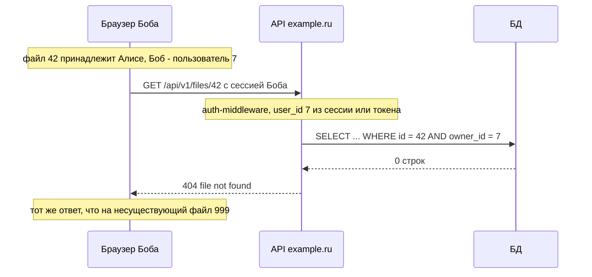

# Доступ к данным: владелец ресурса, IDOR, серверная валидация

Этот файл закрывает требования РК1 «страница файла, создание блоков в файле» и «список файлов
пользователя»: пользователь видит и меняет только свои файлы и блоки. Вторая половина файла —
серверная валидация входных данных, в том числе для входа и регистрации.

Два пункта обязательного минимума, которые здесь разбираются:

- Все входные данные валидируются на сервере; клиентская валидация — только UX.
- Каждая ручка с ресурсом проверяет владельца на бэке.

Примеры — на ручках `GET /api/v1/files/{id}`, `POST /api/v1/files/{id}/blocks` и
`GET /api/v1/files`, код бэка — на Go (`net/http`, `database/sql`, PostgreSQL).

## Аутентификация не равна авторизации

Сессия или access-токен отвечают на вопрос «кто пришёл». На вопрос «что ему можно» они не
отвечают. Боб вошёл честно, его токен настоящий — и с этим токеном он может попросить файл
Алисы. Отказать должен обработчик ручки, сверив владельца файла с тем, кто пришёл
([basics.md](basics.md#идентификация-аутентификация-авторизация)).

Откуда обработчик знает, кто пришёл:

- **Вариант A** — из `sub` в access-cookie, после проверки подписи и `exp`;
- **вариант B** — из `sub` в токене из заголовка `Authorization`, с теми же проверками;
- **вариант C** — из записи сессии в Redis или БД, найденной по `session_id`.

Auth-middleware кладёт id пользователя в контекст запроса
([variant-b.md](variant-b.md#бэк), [variant-c.md](variant-c.md#бэк)), обработчик берёт его
оттуда. Больше ниоткуда: ни из параметра запроса, ни из тела, ни из заголовка вроде
`X-User-Id`. Всё, что пришло в запросе, клиент мог подставить сам.

```go
type ctxKey struct{}

var userIDKey ctxKey // свой тип ключа: чужой пакет не перезапишет значение

// В auth-middleware: в контекст кладём int64. В JWT `sub` — строка, её разбирают сразу:
// id, err := strconv.ParseInt(claims.Subject, 10, 64); ошибка — 401.
// ctx := context.WithValue(r.Context(), userIDKey, id)

// userIDFrom достаёт id пользователя, который положил auth-middleware.
func userIDFrom(ctx context.Context) int64 {
	id, ok := ctx.Value(userIDKey).(int64)
	if !ok {
		// Ручку забыли обернуть в auth-middleware — это ошибка в коде, а не запрос клиента.
		panic("userIDFrom: no user id in context")
	}
	return id
}
```

Тип в контексте один на весь проект — `int64`, — поэтому приведение `.(int64)` в обработчиках
не падает. Паника возможна, только если ручку не обернули в auth-middleware. Такую ошибку
видно на первом же запросе: `net/http` перехватит панику, запишет стек в лог и оборвёт
запрос, а не отдаст чужие данные.

Защищённые маршруты на фронте — тоже не авторизация. Редирект на `/login`, скрытая кнопка
«Удалить» у чужого файла, неактивное поле — это удобство для пользователя. Запрос к API можно
отправить без нашего фронта: из `curl`, Postman или консоли DevTools. Что бы ни показывал
интерфейс, решение «можно или нельзя» принимает бэк.

Отсюда правило для бэка: **запрещено всё, что явно не разрешено** (deny by default). Проверку
владельца не добавляют «где вспомнили» — её делает каждая ручка с ресурсом. Проще всего этого
добиться, если функции доступа к БД вообще не умеют искать файл без владельца:
`GetFile(ctx, userID, fileID)`, а не `GetFile(ctx, fileID)`. Тогда вызов без id пользователя
просто не скомпилируется.

## IDOR на примере `GET /api/v1/files/{id}`

IDOR (insecure direct object reference) — ручка берёт `id` из запроса и отдаёт объект, не
проверив, чей он. Боб открывает свой файл `/files/41`, меняет в адресной строке `41` на `42` —
и читает файл Алисы.

Уязвимый обработчик:

```go
// УЯЗВИМО: любой вошедший пользователь читает любой файл.
func getFile(w http.ResponseWriter, r *http.Request) {
	id, err := strconv.ParseInt(r.PathValue("id"), 10, 64)
	if err != nil {
		http.Error(w, "bad file id", http.StatusBadRequest)
		return
	}
	var f File
	err = db.QueryRowContext(r.Context(),
		`SELECT id, title, created_at FROM files WHERE id = $1`, id,
	).Scan(&f.ID, &f.Title, &f.CreatedAt)
	// ...
}
```

Исправленный: владелец — часть условия запроса.

```go
type File struct {
	ID        int64     `json:"id"`
	Title     string    `json:"title"`
	CreatedAt time.Time `json:"created_at"`
}

// mux.Handle("GET /api/v1/files/{id}", authMiddleware(http.HandlerFunc(getFile)))
func getFile(w http.ResponseWriter, r *http.Request) {
	id, err := strconv.ParseInt(r.PathValue("id"), 10, 64) // в gorilla/mux — mux.Vars(r)["id"]
	if err != nil {
		http.Error(w, "bad file id", http.StatusBadRequest)
		return
	}
	var f File
	err = db.QueryRowContext(r.Context(),
		`SELECT id, title, created_at FROM files WHERE id = $1 AND owner_id = $2`,
		id, userIDFrom(r.Context()),
	).Scan(&f.ID, &f.Title, &f.CreatedAt)
	if errors.Is(err, sql.ErrNoRows) {
		// Нет такого файла или он чужой — ответ одинаковый.
		http.Error(w, "file not found", http.StatusNotFound)
		return
	}
	if err != nil {
		http.Error(w, "internal error", http.StatusInternalServerError)
		return
	}
	writeJSON(w, http.StatusOK, f)
}

func writeJSON(w http.ResponseWriter, status int, v any) {
	w.Header().Set("Content-Type", "application/json")
	w.WriteHeader(status)
	json.NewEncoder(w).Encode(v)
}
```

Один запрос с `AND owner_id = $2` лучше, чем «достать файл, потом сравнить владельца в Go»:
нельзя забыть сравнение, и ответ на чужой файл сам собой совпадает с ответом на
несуществующий. Если владельца всё же проверяют в коде после выборки, на чужой файл отвечают
тем же `404`, что и на отсутствующий.

Так же устроены изменение и удаление: условие на владельца входит в `UPDATE` и `DELETE`, а
ноль затронутых строк (`RowsAffected() == 0`) значит `404`.

```sql
UPDATE files SET title = $3 WHERE id = $1 AND owner_id = $2;
DELETE FROM files WHERE id = $1 AND owner_id = $2;
```

Что видит Боб, когда запрашивает файл Алисы:



### Угадываемые id и UUID

Числовые id из последовательности (`1`, `2`, `3`…) угадываются: соседний номер почти наверняка
существует, и перебрать их скриптом — дело минут. UUID (особенно случайный v4) угадать
практически нельзя, поэтому их часто советуют как дополнительный слой.

Но UUID — **не** контроль доступа. Id утекают: их видно в адресной строке, они остаются в
истории браузера, логах, ссылках, которые пользователь кому-то переслал. Получив чужой UUID,
Боб откроет файл, если ручка не проверяет владельца. OWASP прямо требует проверять доступ к
объекту, даже если id сложный. Для РК1 тип id не важен — важна проверка владельца в каждой
ручке.

## Вложенные ресурсы: блок → файл → пользователь

Блок принадлежит файлу, файл — пользователю. У блока владельца в отдельной колонке может и не
быть: он определяется через файл. Значит, каждая ручка с блоком проверяет **всю цепочку**:
блок принадлежит этому файлу, а файл — этому пользователю.

`POST /api/v1/files/{id}/blocks` — добавить блок в файл. `file_id` берётся **только из URL**.
Если в теле тоже есть `file_id`, сервер его не читает: иначе Боб отправит запрос на свой файл
`/files/41/blocks` с `"file_id": 42` в теле, проверка пройдёт по файлу 41, а блок появится у
Алисы. Поэтому в структуре тела поля `file_id` просто нет.

Проверку родителя и вставку удобно сделать одним запросом: `INSERT ... SELECT` вставит строку,
только если файл найден с нужным владельцем.

```go
type createBlockRequest struct {
	Type string `json:"type"` // необязательное, по умолчанию "text"
	Text string `json:"text"`
}

var blockTypes = map[string]bool{"text": true, "heading": true, "todo": true}

// mux.Handle("POST /api/v1/files/{id}/blocks", authMiddleware(http.HandlerFunc(createBlock)))
func createBlock(w http.ResponseWriter, r *http.Request) {
	fileID, err := strconv.ParseInt(r.PathValue("id"), 10, 64)
	if err != nil {
		http.Error(w, "bad file id", http.StatusBadRequest)
		return
	}
	var req createBlockRequest
	if !decodeJSON(w, r, &req) { // лимит размера и строгий JSON — ниже, в «Серверной валидации»
		return
	}
	if req.Type == "" {
		req.Type = "text"
	}
	if !blockTypes[req.Type] {
		http.Error(w, "type: text, heading или todo", http.StatusBadRequest)
		return
	}
	if n := utf8.RuneCountInString(req.Text); n > 10000 {
		http.Error(w, "text: не длиннее 10000 символов", http.StatusBadRequest)
		return
	}

	var blockID int64
	err = db.QueryRowContext(r.Context(), `
		INSERT INTO blocks (file_id, type, text)
		SELECT f.id, $3, $4 FROM files f
		WHERE f.id = $1 AND f.owner_id = $2
		RETURNING id`,
		fileID, userIDFrom(r.Context()), req.Type, req.Text,
	).Scan(&blockID)
	if errors.Is(err, sql.ErrNoRows) {
		http.Error(w, "file not found", http.StatusNotFound) // файла нет или он чужой
		return
	}
	if err != nil {
		http.Error(w, "internal error", http.StatusInternalServerError)
		return
	}
	writeJSON(w, http.StatusCreated, map[string]int64{"id": blockID})
}
```

Можно и в два шага: сначала `SELECT 1 FROM files WHERE id = $1 AND owner_id = $2`, при нуле
строк — `404`, потом `INSERT`. Главное — проверка родителя есть.

Типичная ошибка — в ручках с id блока: `PATCH /api/v1/files/{fileID}/blocks/{blockID}`
проверяет, что файл `fileID` принадлежит пользователю, а потом обновляет блок по одному
`blockID`. Боб указывает в URL свой файл и id блока из файла Алисы — проверка файла проходит,
блок меняется у Алисы. Условие должно связывать все звенья:

```sql
UPDATE blocks b
SET text = $4
FROM files f
WHERE b.id = $1
  AND b.file_id = $2
  AND f.id = b.file_id
  AND f.owner_id = $3;
```

Страница файла (`GET /api/v1/files/{id}` вместе с блоками) — то же самое. Проще в два шага:
сначала файл с условием на владельца (нет строки — `404`), затем блоки по `file_id` этого
файла. Если хочется одним запросом, выбирайте **от файла**, а блоки присоединяйте через
`LEFT JOIN`:

```sql
SELECT f.id, f.title, b.id, b.type, b.text
FROM files f
LEFT JOIN blocks b ON b.file_id = f.id
WHERE f.id = $1 AND f.owner_id = $2
ORDER BY b.id;
```

Ноль строк — файла нет или он чужой (`404`). Свой пустой файл даёт одну строку с `NULL` в
колонках блока. Запрос «от блоков» (`FROM blocks JOIN files`) этого не различит: и для
своего пустого файла, и для чужого он вернёт ноль строк.

Сводка по ручкам:

| Ручка | Условие в SQL |
|---|---|
| `GET /api/v1/files` | `owner_id = {user_id из сессии}` |
| `GET`, `PATCH`, `DELETE /api/v1/files/{id}` | `id = {id из URL} AND owner_id = {user_id}` |
| `POST /api/v1/files/{id}/blocks` | файл `{id из URL}` с `owner_id = {user_id}`, иначе `404` |
| `PATCH`, `DELETE /api/v1/files/{fileID}/blocks/{blockID}` | блок `blockID` в файле `fileID`, файл с `owner_id = {user_id}` |

## Список файлов: только свои

`GET /api/v1/files` отдаёт файлы того, кто пришёл, — фильтр по `user_id` из сессии или токена.
Параметр вроде `GET /api/v1/files?user_id=1` сервер не принимает: это тот же IDOR, только
для целого списка. Фронту свой id для списка и не нужен — сервер и так знает, кто пришёл.
Если в проекте понадобятся чужие файлы (например, общий доступ), это отдельная ручка со своими
правилами, а не параметр у списка.

Список ещё и ограничен по размеру. Без лимита пользователь с тысячами файлов (или скрипт,
который их насоздавал) получит гигантский ответ, а БД — тяжёлый запрос. Лимит и смещение
приходят от клиента, значит, их тоже валидирует сервер: число, в разумных пределах.

```go
// mux.Handle("GET /api/v1/files", authMiddleware(http.HandlerFunc(listFiles)))
func listFiles(w http.ResponseWriter, r *http.Request) {
	limit, offset := 20, 0
	q := r.URL.Query()
	if s := q.Get("limit"); s != "" {
		n, err := strconv.Atoi(s)
		if err != nil || n < 1 || n > 100 {
			http.Error(w, "limit: от 1 до 100", http.StatusBadRequest)
			return
		}
		limit = n
	}
	if s := q.Get("offset"); s != "" {
		n, err := strconv.Atoi(s)
		if err != nil || n < 0 {
			http.Error(w, "offset: целое от 0", http.StatusBadRequest)
			return
		}
		offset = n
	}

	rows, err := db.QueryContext(r.Context(), `
		SELECT id, title, created_at FROM files
		WHERE owner_id = $1
		ORDER BY created_at DESC, id DESC
		LIMIT $2 OFFSET $3`,
		userIDFrom(r.Context()), limit, offset)
	if err != nil {
		http.Error(w, "internal error", http.StatusInternalServerError)
		return
	}
	defer rows.Close()

	files := []File{} // пустой список — [], а не null
	for rows.Next() {
		var f File
		if err := rows.Scan(&f.ID, &f.Title, &f.CreatedAt); err != nil {
			http.Error(w, "internal error", http.StatusInternalServerError)
			return
		}
		files = append(files, f)
	}
	if err := rows.Err(); err != nil {
		http.Error(w, "internal error", http.StatusInternalServerError)
		return
	}
	writeJSON(w, http.StatusOK, files)
}
```

Поиск, фильтры и счётчик «всего файлов» — те же запросы с тем же `WHERE owner_id = $1`.

## Mass assignment: `owner_id` из тела игнорируется

Mass assignment — сервер раскладывает тело запроса прямо в модель, которая потом пишется в
БД. Клиент добавляет в JSON поля, которые разработчик менять не собирался: `owner_id`, `id`,
`created_at`.

```go
// УЯЗВИМО: тело ложится в модель БД целиком.
type FileRow struct {
	ID      int64  `json:"id"`
	OwnerID int64  `json:"owner_id"`
	Title   string `json:"title"`
}

var f FileRow
json.NewDecoder(r.Body).Decode(&f) // {"title":"x","owner_id":1} — файл окажется у пользователя 1
db.ExecContext(r.Context(), `INSERT INTO files (owner_id, title) VALUES ($1, $2)`, f.OwnerID, f.Title)
```

Защита — отдельная структура для входа (DTO), в которой есть только поля, которые клиенту
разрешено задавать. Владелец берётся из контекста, `id` и время создания назначает БД.

```go
type createFileRequest struct {
	Title string `json:"title"` // и всё: owner_id, id, created_at здесь нет
}

var req createFileRequest
if !decodeJSON(w, r, &req) {
	return
}
// проверка req.Title — длина, не пустой
db.QueryRowContext(r.Context(),
	`INSERT INTO files (owner_id, title) VALUES ($1, $2) RETURNING id, created_at`,
	userIDFrom(r.Context()), req.Title,
).Scan(&id, &createdAt)
```

Нюанс Go: `encoding/json` сопоставляет ключи JSON с полями без учёта регистра, поэтому
`"OWNER_ID"` тоже попадёт в поле с тегом `owner_id`. Перечислять запрещённые поля (block list)
ненадёжно — надёжно не иметь их во входной структуре вовсе.

Что значит «игнорируется» в ответе сервера — зависит от того, как разбирается JSON:

- без `DisallowUnknownFields` лишнее поле молча отбрасывается: файл создаётся, владелец —
  тот, кто пришёл;
- с `DisallowUnknownFields` (как в `decodeJSON` ниже) запрос с лишним полем получает `400`.

Оба ответа правильные. Неправильный один: файл появился у пользователя из тела запроса.

То же правило для `PATCH /api/v1/files/{id}` и `PATCH .../blocks/{blockID}`: в DTO только
редактируемые поля (`title`, `text`), а перенести блок в другой файл или файл другому
пользователю через `PATCH` нельзя.

## 404 на чужой ресурс

На запрос к чужому файлу или блоку сервер отвечает `404 Not Found` — так же, как на
несуществующий. Если отвечать `403 Forbidden`, сервер сообщает «такой файл есть, но не ваш»:
перебором id можно узнать, сколько файлов в системе и какие id заняты. RFC 9110 прямо
разрешает серверу ответить `404` вместо `403`, чтобы скрыть существование ресурса.

Правила:

- `404` одинаковый для «нет такого» и «чужой»: тот же код, то же тело. С условием на владельца
  в SQL это получается само.
- Так отвечают все ручки с ресурсом: `GET`, `PATCH`, `DELETE` файла и все ручки блоков. Одна
  ручка с `403` выдаст существование файла, даже если остальные отвечают `404`.
- `401` — другое: «не знаю, кто ты», сессии нет или access истёк. Проверка владельца идёт
  после аутентификации.

`403` на чужой ресурс тоже встречается: например, в API, где существование объекта не секрет
(пользователь видит файл в общем списке, но редактировать его не может). Это не ошибка
протокола, но в РК1 ожидается `404`. `403` в нашем API — отказ CSRF-проверки
([csrf.md](csrf.md#403-а-не-401)), и фронт отличает его от «файл не найден».

Фронт на `404` показывает «Файл не найден» и не делает refresh: refresh нужен только на `401`.

## Серверная валидация входных данных

Обязательный минимум: все входные данные валидируются на сервере; клиентская валидация — только UX.

Проверки в форме нужны, чтобы пользователь сразу видел ошибку, не дожидаясь ответа сервера.
Но форму можно обойти: отключить JS, отправить запрос из `curl`, поправить `maxlength` в
DevTools. Поэтому сервер проверяет всё заново, как будто фронта нет.

Что проверять — по белому списку: описываем, что допустимо, и отклоняем всё остальное, а не
ищем «опасные» символы.

| Что | Пример |
|---|---|
| Обязательные поля | `login`, `password` не пустые |
| Тип | `limit` — целое число, а не `"abc"` |
| Длина | `title` от 1 до 200 символов |
| Формат | `login` — `^[a-z0-9_]{3,32}$` |
| Перечисление | `type` блока — `text`, `heading` или `todo` |
| Диапазон | `limit` от 1 до 100 |
| Смысл | конец периода не раньше начала, блок добавляется в существующий файл |

Ошибка валидации — `400 Bad Request` (некоторые API отвечают `422`, выберите один код) с
понятным сообщением по полю. Внутренние детали — текст ошибки БД, стек — в ответ не попадают.

Валидация не заменяет параметризованные запросы: значения из запроса передаются в SQL только
через `$1`, `$2`, а не склейкой строк, даже если они прошли проверку.

### Тело запроса: размер, строгий JSON

Прежде чем проверять поля, сервер проверяет само тело:

- **`Content-Type: application/json`** на изменяющих ручках, иначе `415`
  ([csrf.md](csrf.md#настойчиво-рекомендуется), `jsonOnly`).
- **Размер.** `http.MaxBytesReader` обрезает чтение на лимите и возвращает ошибку
  `*http.MaxBytesError`; без лимита клиент может прислать тело в гигабайт.
- **Лишние поля.** `DisallowUnknownFields` превращает неизвестный ключ в ошибку. Опечатка
  фронта (`titel` вместо `title`) сразу видна, а не превращается в «поле молча пустое».
- **Одно значение.** `Decode` читает одно JSON-значение. Если после него в теле есть что-то,
  кроме пробелов, это ошибка клиента: второй `Decode` должен вернуть `io.EOF`.

```go
// Пакеты: encoding/json, errors, io, net/http.
const maxBody = 1 << 20 // 1 MiB; для загрузки картинок — отдельная ручка со своим лимитом

func decodeJSON(w http.ResponseWriter, r *http.Request, dst any) bool {
	r.Body = http.MaxBytesReader(w, r.Body, maxBody)
	dec := json.NewDecoder(r.Body)
	dec.DisallowUnknownFields()
	if err := dec.Decode(dst); err != nil {
		var tooBig *http.MaxBytesError
		if errors.As(err, &tooBig) {
			http.Error(w, "body too large", http.StatusRequestEntityTooLarge) // 413
		} else {
			http.Error(w, "invalid json", http.StatusBadRequest)
		}
		return false
	}
	// После объекта — только пробелы: {"a":1}{"b":2}, {"a":1}} и {"a":1}, отклоняются.
	if err := dec.Decode(&struct{}{}); !errors.Is(err, io.EOF) {
		http.Error(w, "invalid json", http.StatusBadRequest)
		return false
	}
	return true
}
```

После `decodeJSON` у полей правильные типы, но значения ещё не проверены: пустая строка,
строка в мегабайт, `null` вместо объекта — всё это проходит разбор. Проверку полей пишут
отдельно, как `validate()` ниже.

Длина строки в Go: `len(s)` — это **байты** UTF-8, а «символы» считает
`utf8.RuneCountInString(s)`. Кириллическая буква — 2 байта, поэтому `len("файл") == 8`.
Договоритесь, что именно ограничиваете, и считайте одинаково на фронте и бэке.

### Регистрация и вход: одни правила на фронте и бэке

Правила полей — контракт между фронтом и бэком. Фронт показывает их в форме, бэк их
применяет. Удобно описать их в одном месте (README API, OpenAPI) и сверить с кодом обеих
сторон.

Пример правил, которые может выбрать команда:

| Поле | Правило | Форма | Сервер (Go) |
|---|---|---|---|
| `login` | 3–32 символа: `a-z`, цифры, `_` | `minlength="3" maxlength="32" pattern="[a-z0-9_]+"` | `^[a-z0-9_]{3,32}$` |
| `password` | 8–72 печатных символа ASCII | `minlength="8" maxlength="72" pattern="[\x20-\x7E]+"` | `^[\x20-\x7E]{8,72}$` |

Почему пароль в примере — печатные ASCII и не длиннее 72. bcrypt учитывает только первые
72 байта пароля ([basics.md](basics.md#хеширование-паролей)), а `GenerateFromPassword` из
`golang.org/x/crypto/bcrypt` на более длинный пароль возвращает ошибку `ErrPasswordTooLong`.
В ASCII один символ — один байт, поэтому «72 символа» в форме и «72 байта» в bcrypt совпадают.
С кириллицей так не выйдет: `maxlength` считает единицы UTF-16, и 72 русские буквы — это 144
байта.

Это компромисс, а не единственно верное правило. OWASP советует разрешать в паролях любые
символы, включая Unicode и пробелы, и не ставить верхний предел ниже 64 символов. С bcrypt
это не сочетается: 72 байта — всего 36 русских букв, меньше 64. Если команда хочет длинные
пароли на любом языке, ей подходит argon2id с пределом побольше (например, 256 байт). Сервер
тогда проверяет длину в байтах (`len(password) > 256` в Go), а форма может подсказать заранее
(`new TextEncoder().encode(password).length`).

Минимальную длину команда тоже выбирает сама. 8 символов в примере — минимум курса; OWASP без
второго фактора считает слабыми пароли короче 15 символов.

Какое бы правило ни выбрала команда, его применяет **сервер**. Если ограничение есть только в
форме, `curl` с паролем в 200 символов его обойдёт.

```go
var (
	loginRe    = regexp.MustCompile(`^[a-z0-9_]{3,32}$`)
	passwordRe = regexp.MustCompile(`^[\x20-\x7E]{8,72}$`)
)

type registerRequest struct {
	Login    string `json:"login"`
	Password string `json:"password"`
}

// validate возвращает ошибки по полям; пустая карта — данные в порядке.
func (req registerRequest) validate() map[string]string {
	errs := map[string]string{}
	if !loginRe.MatchString(req.Login) {
		errs["login"] = "от 3 до 32 символов: латинские буквы в нижнем регистре, цифры, _"
	}
	if !passwordRe.MatchString(req.Password) {
		errs["password"] = "от 8 до 72 символов: латиница, цифры, пробел и знаки"
	}
	return errs
}
```

Ответ с ошибками — `400` и, например, `{"errors": {"password": "..."}}`; фронт показывает
сообщение у нужного поля. Сам пароль в ответ и в логи не попадает.

Нюансы:

- **Якоря в регулярке.** Атрибут `pattern` в HTML всегда проверяет значение целиком, как будто
  выражение обёрнуто в `^(?:` и `)$`. `regexp.MatchString` в Go ищет совпадение в любом месте
  строки: без `^` и `$` логин `Alice!` пройдёт проверку `[a-z0-9_]{3,32}` — в нём есть
  подстрока `lice`. На сервере якоря пишут явно.
- **Вход проверяется мягче регистрации.** На `POST /api/v1/auth/login` правила сложности не
  нужны (их могли поменять после регистрации), но верхние пределы нужны: пустые поля или пароль
  длиннее предела отклоняются `400` до похода в БД и bcrypt. Неверный логин или пароль — одна
  ошибка для обоих случаев ([basics.md](basics.md#хеширование-паролей)).
- **Нормализация.** Если логин без учёта регистра, приводите его к нижнему регистру на сервере
  перед проверкой и поиском, а не надейтесь на форму.

## Как проверить

Нужны два пользователя: Алиса (id `1`) с файлом `42` и Боб. Плейсхолдеры как в
[csrf.md](csrf.md#как-проверить): `{bob-auth}` — авторизационная cookie Боба целиком, с
именем (`access_token=...` в варианте A, `__Host-session=...` в варианте C), `{csrf}` —
значение `__Host-csrf` Боба. В варианте B вместо `-b '{bob-auth}'` —
`-H 'Authorization: Bearer {access}'`.

Боб читает файл Алисы — `404`:

```bash
curl -i https://example.ru/api/v1/files/42 -b '{bob-auth}'
```

Боб добавляет блок в файл Алисы — `404`, блок не создан:

```bash
curl -i -X POST https://example.ru/api/v1/files/42/blocks \
  -b '{bob-auth}; __Host-csrf={csrf}' -H 'X-CSRF-Token: {csrf}' \
  -H 'Content-Type: application/json' -d '{"text":"проверка"}'
```

Список с чужим `user_id` — только файлы Боба (или `400`, если параметр запрещён):

```bash
curl -i 'https://example.ru/api/v1/files?user_id=1' -b '{bob-auth}'
```

Файл с `owner_id` Алисы в теле — `201` с файлом у Боба или `400`; файла у Алисы не появилось:

```bash
curl -i -X POST https://example.ru/api/v1/files \
  -b '{bob-auth}; __Host-csrf={csrf}' -H 'X-CSRF-Token: {csrf}' \
  -H 'Content-Type: application/json' -d '{"title":"проверка","owner_id":1}'
```

Регистрация с паролем длиннее предела — `400`, хотя форма такой пароль не пропустила бы
(`{csrf}` — из `GET /api/v1/auth/csrf`):

```bash
curl -i -X POST https://example.ru/api/v1/auth/register \
  -b '__Host-csrf={csrf}' -H 'X-CSRF-Token: {csrf}' \
  -H 'Content-Type: application/json' \
  -d "{\"login\":\"carol\",\"password\":\"$(printf 'a%.0s' {1..100})\"}"
```

## Источники

- OWASP: [Authorization Cheat Sheet](https://cheatsheetseries.owasp.org/cheatsheets/Authorization_Cheat_Sheet.html) —
  deny by default, проверка прав на каждом запросе, проверки на клиенте не решают, сложные id
  сами по себе не защищают
- OWASP: [Insecure Direct Object Reference Prevention Cheat Sheet](https://cheatsheetseries.owasp.org/cheatsheets/Insecure_Direct_Object_Reference_Prevention_Cheat_Sheet.html) —
  проверка доступа к каждому объекту, пользователь из сессии, выборка только своих объектов,
  случайные id как дополнительный слой, одинаковый `404` для «нет» и «нельзя»
- OWASP: [API Security Top 10 2023, API1: Broken Object Level Authorization](https://owasp.org/API-Security/editions/2023/en/0xa1-broken-object-level-authorization/)
- OWASP: [Mass Assignment Cheat Sheet](https://cheatsheetseries.owasp.org/cheatsheets/Mass_Assignment_Cheat_Sheet.html) —
  DTO, белый список полей, block list не единственная защита
- OWASP: [Input Validation Cheat Sheet](https://cheatsheetseries.owasp.org/cheatsheets/Input_Validation_Cheat_Sheet.html) —
  серверная проверка, белый список, синтаксис и смысл, совпадение регулярки со всей строкой
- OWASP: [Authentication Cheat Sheet](https://cheatsheetseries.owasp.org/cheatsheets/Authentication_Cheat_Sheet.html) —
  длина пароля, любые символы, без молчаливого обрезания;
  [Password Storage Cheat Sheet](https://cheatsheetseries.owasp.org/cheatsheets/Password_Storage_Cheat_Sheet.html) —
  лимит bcrypt в 72 байта
- [RFC 9110: HTTP Semantics, 403 и 404](https://www.rfc-editor.org/rfc/rfc9110#section-15.5.4) —
  `404` вместо `403`, чтобы скрыть существование ресурса
- MDN: [404 Not Found](https://developer.mozilla.org/en-US/docs/Web/HTTP/Reference/Status/404),
  [403 Forbidden](https://developer.mozilla.org/en-US/docs/Web/HTTP/Reference/Status/403),
  [400 Bad Request](https://developer.mozilla.org/en-US/docs/Web/HTTP/Reference/Status/400),
  [413 Content Too Large](https://developer.mozilla.org/en-US/docs/Web/HTTP/Reference/Status/413)
- MDN: [Client-side form validation](https://developer.mozilla.org/en-US/docs/Learn_web_development/Extensions/Forms/Form_validation) —
  проверка в браузере легко обходится, сервер проверяет данные сам;
  [maxlength](https://developer.mozilla.org/en-US/docs/Web/HTML/Reference/Attributes/maxlength) —
  длина в единицах UTF-16;
  [pattern](https://developer.mozilla.org/en-US/docs/Web/HTML/Reference/Attributes/pattern) —
  выражение совпадает со всем значением
- Go: [http.MaxBytesReader](https://pkg.go.dev/net/http#MaxBytesReader),
  [json.Decoder.DisallowUnknownFields](https://pkg.go.dev/encoding/json#Decoder.DisallowUnknownFields),
  [json.Unmarshal](https://pkg.go.dev/encoding/json#Unmarshal) — ключи без учёта регистра;
  [golang.org/x/crypto/bcrypt](https://pkg.go.dev/golang.org/x/crypto/bcrypt) —
  `ErrPasswordTooLong` для паролей длиннее 72 байт
