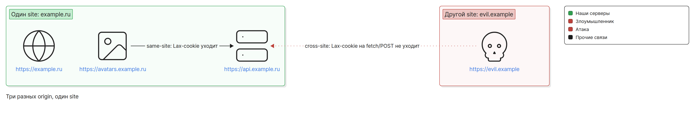

# Основы: аутентификация, сессия, cookie, site и origin

Этот файл — словарь и фундамент для остальных документов РК1. Здесь нет готовой схемы
авторизации: её команда выбирает из вариантов A, B и C (обзор — в [README.md](README.md#варианты-сессии), подробности —
в [variant-a.md](variant-a.md), [variant-b.md](variant-b.md), [variant-c.md](variant-c.md)). Здесь — понятия, без которых эти схемы
не понять: кто такой злоумышленник, что делают флаги cookie, чем site отличается от origin,
где можно хранить токен и как хранить пароли.

## Идентификация, аутентификация, авторизация

Три разных шага, которые часто называют одним словом «авторизация».

| Шаг | Вопрос | Пример в нашем проекте |
|---|---|---|
| Идентификация | Кем ты себя называешь? | пользователь вводит логин `alice` |
| Аутентификация (AuthN) | Докажи, что ты это ты | сервер сверяет пароль с хешем и выдаёт сессию или токены |
| Авторизация (AuthZ) | Что тебе можно? | сервер проверяет, что файл из `GET /api/v1/files/{id}` принадлежит `alice` |

Сессия связывает шаги между запросами: после входа браузер с каждым запросом предъявляет
cookie с `session_id` или токен, и сервер по ним понимает, кто пришёл, не спрашивая пароль
заново.

Аутентификация не заменяет авторизацию. Пользователь вошёл — значит, сервер знает, кто он.
Это ещё не значит, что ему можно читать чужой файл: проверку владельца делает каждая ручка с
ресурсом (подробно — [access-control.md](access-control.md#аутентификация-не-равна-авторизации)).

Коды ответа тоже разные: `401 Unauthorized` — «не знаю, кто ты» (нет сессии или токен
истёк), `403 Forbidden` — «знаю, кто ты, но нельзя». Для чужого ресурса в РК1 отвечаем
`404`, чтобы не раскрывать, что он существует ([access-control.md](access-control.md#404-на-чужой-ресурс)), а отказ CSRF-проверки —
`403` ([csrf.md](csrf.md#403-а-не-401)).

## Модель угроз

От чего защищаемся в РК1. Каждая угроза разобрана подробно в своём файле, здесь — суть.

| Угроза | Что происходит | Чем закрываем | Где подробно |
|---|---|---|---|
| XSS (cross-site scripting) | чужой JS выполняется на нашей странице, с нашим origin | в РК1 — ограничиваем ущерб: токены недоступны JS (`HttpOnly`), короткий срок жизни access; сама защита от XSS — тема следующих РК | ниже, раздел «Где можно хранить токен» |
| CSRF (cross-site request forgery) | чужой сайт заставляет браузер жертвы отправить запрос к нашему API; браузер сам прикладывает cookie | `SameSite`, Double Submit Cookie, проверка `Origin` | [csrf.md](csrf.md) |
| Кража токена | токен уходит злоумышленнику: через XSS, логи, URL, незашифрованный HTTP | `HttpOnly`, `Secure`, HTTPS, короткий срок жизни, отзыв refresh при logout | варианты A, B, C |
| IDOR (insecure direct object reference) | вошедший пользователь подставляет чужой `id` и получает чужие данные | проверка владельца на бэке в каждой ручке | [access-control.md](access-control.md) |
| Перебор паролей | бот перебирает пароли к логину или логины к популярному паролю | медленный хеш, лимит неудачных попыток на аккаунт и общий лимит на ручку входа, одинаковый ответ на неверный логин и пароль | ниже, раздел «Хеширование паролей» |

Главное про XSS: если чужой скрипт выполняется на нашем origin, он может всё, что может код
фронта, — читать DOM, вызывать `fetch` к нашему API, и браузер приложит к этим запросам
cookie. Никакая схема хранения токена этого не отменяет. Выбор хранилища решает другой
вопрос: сможет ли XSS **унести** токен и пользоваться им без нашей страницы.

## Флаги cookie

Сервер ставит cookie заголовком `Set-Cookie`, браузер возвращает её в заголовке `Cookie`
на подходящие запросы. Флаги решают три вещи: кто может прочитать cookie, на какие запросы
браузер её приложит и кто может её перезаписать.

```http
Set-Cookie: __Secure-refresh={значение}; HttpOnly; Secure; SameSite=Lax; Path=/api/v1/auth; Max-Age=2592000
```

Пример — refresh-cookie на 30 дней, которая уходит только на ручки `/api/v1/auth/...`.

| Флаг | Что делает | Что ставим для авторизационных cookie |
|---|---|---|
| `HttpOnly` | JS не видит cookie: её нет в `document.cookie`. Браузер всё равно прикладывает её к запросам, в том числе к `fetch` из JS | всегда |
| `Secure` | cookie уходит только по `https:` (кроме `localhost`); страница по `http:` не может поставить cookie с `Secure` | на проде всегда |
| `SameSite` | на какие запросы с **другого site** cookie уходит: `Strict` — ни на какие; `Lax` — только на переходы верхнего уровня безопасным методом (клик по ссылке, `GET`); `None` — на все, только вместе с `Secure` | `Lax` или `Strict` |
| `Path` | к запросам с каким путём приложить cookie: `Path=/api/v1/auth` подходит для `/api/v1/auth/refresh`, но не для `/api/v1/files` | узкий, где применимо (refresh-cookie — только на ручки продления) |
| `Domain` | без `Domain` cookie уходит только тому хосту, который её поставил (host-only). С `Domain=example.ru` — ещё и всем поддоменам | не ставить |
| `Max-Age` / `Expires` | срок жизни; без них cookie сессионная и живёт до закрытия браузера (а с восстановлением вкладок — и дольше) | по сроку жизни токена или сессии |

Несколько оговорок, на которых часто ошибаются:

- **`SameSite` лучше указывать явно.** Если флага нет, часть браузеров считает cookie `Lax`,
  но в смягчённом виде: первые две минуты после установки она уходит и на межсайтовый переход
  верхнего уровня небезопасным методом — например, отправку формы `POST` с `evil.example`.
  На `fetch` с чужого сайта она не уходит и в этом режиме. В остальных браузерах поведение без
  флага своё. С явным флагом поведение одинаковое.
- **`Path` — не граница безопасности.** Он только экономит трафик и сужает, к каким ручкам
  уходит cookie. Скрипт с того же origin может прочитать cookie с чужим `Path`, если у неё нет
  `HttpOnly`.
- **`Path` не прячет cookie по-настоящему.** В Application → Cookies DevTools показывает cookie,
  подходящие к адресам, которые страница уже загрузила. Поэтому cookie с `Path=/api/v1/auth`
  появится там после первого запроса на `/api/v1/auth/...`, а в Network → запрос → Cookies она
  видна у каждого запроса, к которому приложена. Если её не видно в Application — это
  особенность панели, а не защита.
  Все cookie домена сразу показывает расширение [«Все cookie»](../tools/cookie-viewer.md).
- **`Domain` расширяет, а не сужает.** Поставить `Domain=example.ru` — значит отдать cookie
  и `avatars.example.ru`, и любому будущему поддомену.
- **Cookie не различают порты.** `localhost:5173` и `localhost:8080` видят одни и те же cookie,
  хотя это разные origin.

### Префиксы `__Host-` и `__Secure-`

Префикс в имени cookie — обещание браузеру, которое он проверяет при установке: если
условия не выполнены, cookie отбрасывается.

| Префикс | Условия | Что даёт |
|---|---|---|
| `__Secure-` | `Secure`, ставится со страницы по HTTPS | cookie не поставит и не перезапишет страница по `http:` |
| `__Host-` | `Secure`, HTTPS, `Path=/`, **без** `Domain` | вдобавок cookie привязана к одному хосту: поддомен (`avatars.example.ru`) не может поставить или перезаписать её для `example.ru` |

Привязка к хосту у `__Host-` — защита от cookie tossing: поддомен ставит cookie с
`Domain=example.ru`, и браузер присылает её основному приложению вместе с нашей или вместо неё
(разбор — [csrf.md](csrf.md#cookie-tossing-как-его-останавливают-__host--и-подпись)).

`__Host-` требует `Path=/`. Поэтому для refresh-cookie с узким `Path` подходит только
`__Secure-`.

## Site и origin

Два понятия, которые браузер сравнивает в разных проверках. Их путают чаще всего.

- **Origin** = схема + хост + порт. `https://api.example.ru` и `https://example.ru` — разные
  origin, потому что разные хосты.
- **Site** = схема + регистрируемый домен (eTLD+1): публичный суффикс из
  [Public Suffix List](https://publicsuffix.org/) плюс одна метка перед ним. Для `.ru` суффикс —
  `ru`, поэтому у `api.example.ru` и `avatars.example.ru` регистрируемый домен один —
  `example.ru`. Порт для site не учитывается.

Схему при сравнении site учитывают по правилу schemeful same-site, которым пользуются правила
`SameSite`: `http://example.ru` и `https://example.ru` — **разные** site.



| Первый адрес | Второй адрес | Один origin? | Один site? |
|---|---|---|---|
| `https://example.ru` | `https://example.ru/files/1` | да (путь не важен) | да |
| `https://example.ru` | `https://api.example.ru` | нет | да |
| `https://api.example.ru` | `https://avatars.example.ru` | нет | да |
| `https://example.ru` | `https://example.ru:8443` | нет | да |
| `http://example.ru` | `https://example.ru` | нет | нет |
| `https://example.ru` | `https://evil.example` | нет | нет |
| `http://localhost:5173` | `http://localhost:8080` | нет | да |

Кто что сравнивает:

| Механизм | Сравнивает | Вопрос, на который отвечает |
|---|---|---|
| `SameSite` у cookie | site | приложить ли cookie к запросу, который начат на другом site |
| CORS и same-origin policy | origin | может ли JS со страницы одного origin прочитать ответ другого origin |
| `Domain` и `Path` у cookie | хост и путь | каким хостам и путям вообще отправлять cookie |

Что из этого следует для проекта:

- Запрос со страницы `https://avatars.example.ru` к `https://api.example.ru` — **same-site**.
  `SameSite=Lax` и даже `Strict` его не остановят: cookie уйдёт. Если на поддомене можно
  выполнить чужой JS (например, загруженный пользователем HTML или SVG), `SameSite` от него не
  защищает. Поэтому одного `SameSite` мало и нужна CSRF-защита ([csrf.md](csrf.md#почему-samesite-мало)).
- Запрос со страницы `https://evil.example` — **cross-site**. Cookie с `SameSite=Lax` не уйдёт
  ни с `fetch`, ни с формой `POST`; уйдёт только при переходе верхнего уровня методом `GET`
  (клик по ссылке, форма с `method="get"`). Поэтому `GET` не должен менять данные.
- Фронт на `https://example.ru` и API на `https://api.example.ru` — один site, но разные
  origin. `SameSite` cookie пропустит (фронт должен попросить её приложить:
  `credentials: 'include'`), а прочитать ответ API фронт сможет, только если API разрешит это
  CORS-заголовками.

CORS одним абзацем. Простой запрос на другой origin браузер отправляет, но не отдаёт ответ JS,
пока сервер не разрешит это заголовком `Access-Control-Allow-Origin` (с cookie — ещё и
`Access-Control-Allow-Credentials: true`). Для запросов с «непростыми» методами или заголовками
браузер сначала спрашивает разрешения preflight-запросом `OPTIONS` и без разрешения сам запрос
не отправляет. Такой запрос — любой `fetch` с `Content-Type: application/json`, с заголовком
`Authorization` или `X-CSRF-Token`, методом `PUT`, `PATCH` или `DELETE`. Подробности, заголовки и типичные ошибки — в [cors.md](cors.md).

CSRF одним абзацем. Запись на другой origin браузер по умолчанию разрешает: форма на
`evil.example` может отправить `POST` на наш API, а браузер приложит cookie, если её не
остановил `SameSite`. Ответ злоумышленнику не нужен — ему достаточно, что запрос выполнился.
CORS этого не запрещает: он закрывает только чтение ответа. Защита — в [csrf.md](csrf.md).

## Где можно хранить токен

Токен — то, что сервер принимает вместо пароля. Кто его держит, тот действует от имени
пользователя. Варианты хранения в браузере и то, что получает XSS на нашем origin:

| Где | Переживает перезагрузку | Что видит XSS | Можно ли |
|---|---|---|---|
| Память JS (переменная в модуле или замыкании) | нет — после F5 токен заново получают по refresh-cookie | пока страница открыта, скрипт может перехватить токен (например, подменив `fetch`) и отправить наружу; дальше токен работает у злоумышленника до истечения срока | только для короткого access-токена (вариант B) |
| `localStorage`, `sessionStorage` | `localStorage` — да, даже после перезапуска браузера; `sessionStorage` — до закрытия вкладки | любой скрипт на нашем origin читает хранилище одной строкой и уносит токен | **нет** — нарушение минимума |
| Cookie без `HttpOnly` | да | скрипт читает токен из `document.cookie` и уносит; вдобавок браузер сам прикладывает cookie к запросам | **нет** — нарушение минимума |
| `HttpOnly`-cookie | да | прочитать токен нельзя. Но браузер прикладывает cookie к запросам, поэтому XSS может делать запросы от имени пользователя, пока вкладка открыта | **да** — рекомендуемый способ (варианты A, C; refresh в B) |

Выводы:

- `HttpOnly` не спасает от XSS, но ограничивает ущерб: злоумышленник действует только через
  открытую вкладку жертвы и только пока она открыта. Украденный токен работал бы и после.
- За `HttpOnly`-cookie платим CSRF-защитой: браузер прикладывает cookie сам, значит, и к
  запросам, которые начал чужой сайт ([csrf.md](csrf.md#что-такое-csrf)).
- Токен в `localStorage` «чтобы пережить F5» не нужен: для этого есть refresh-cookie
  ([variant-a.md](variant-a.md#перезагрузка-страницы), [variant-b.md](variant-b.md#перезагрузка-страницы)).
- Единственная cookie без `HttpOnly` в вариантах A и C — CSRF-токен в Double Submit: фронт
  обязан его прочитать, а сам по себе он не даёт доступа к аккаунту.

## JWT

JWT (JSON Web Token) — строка из трёх частей через точку: заголовок, полезная нагрузка (claims)
и подпись. Заголовок и нагрузка — это JSON в base64url.

```text
base64url(заголовок).base64url(нагрузка).base64url(подпись)
```

```json
{ "alg": "HS256", "typ": "JWT" }
```

```json
{ "sub": "42", "exp": 1767225600 }
```

Первый JSON — заголовок (алгоритм подписи), второй — нагрузка: `sub` — id пользователя,
`exp` — момент истечения в секундах Unix-времени.

### Подпись не шифрует

base64url — кодирование, а не шифрование: нагрузку прочитает любой, у кого есть токен
(в консоли браузера хватит
`atob(part.replace(/-/g, '+').replace(/_/g, '/'))`: `atob` понимает обычный base64, поэтому
символы base64url `-` и `_` сначала заменяют на `+` и `/`). Подпись гарантирует другое — что нагрузку не меняли и
что токен выпустил владелец ключа. Поэтому:

- в JWT нет паролей, email и прочих лишних данных — только `sub` (id пользователя), `exp` и
  то, что нужно для проверки;
- сервер проверяет подпись и `exp` на каждом запросе;
- алгоритм подписи зафиксирован на сервере, `"alg": "none"` не принимается;
- ключ подписи лежит в переменной окружения, не в репозитории.

### Stateless и stateful

| | Stateless (JWT без хранилища) | Stateful (сессия в Redis или БД) |
|---|---|---|
| Как сервер проверяет | подпись и `exp`, без обращения к хранилищу | ищет `session_id` в хранилище |
| Отзыв | нельзя отозвать до `exp`: токен валиден, пока не истёк | удалил запись — сессия кончилась сразу |
| Цена | быстро, но выход и блокировка срабатывают с задержкой | обращение к хранилищу на каждый запрос |

Если JWT нужно отзывать досрочно, сервер заводит список отозванных токенов — и схема перестаёт
быть stateless. Вариант C — stateful целиком ([variant-c.md](variant-c.md)).

### Зачем пара access и refresh

Пара совмещает плюсы обоих подходов:

- **access-токен** — короткий (в РК1 не дольше 15 минут), stateless, проверяется по подписи
  на каждом запросе. Если его украли или пользователь вышел, окно для злоупотребления — до
  истечения срока;
- **refresh-токен** — долгий, живёт в `HttpOnly`-cookie с узким `Path` и уходит только на
  ручку продления. Сервер хранит его состояние, поэтому может отозвать при logout сразу.

Когда access истёк, API отвечает `401`, фронт вызывает refresh, получает новый access и
повторяет запрос. Как это выглядит по шагам — в [variant-a.md](variant-a.md#истёк-access-refresh-и-повтор) и [variant-b.md](variant-b.md#истёк-access-refresh-и-повтор).

## Хеширование паролей

Пароль не хранится ни открытым текстом, ни зашифрованным: в БД лежит только хеш, а при входе
сервер хеширует введённый пароль и сравнивает.

- **Алгоритм — bcrypt или argon2id.** Это намеренно медленные функции: перебор по украденной
  базе становится дорогим. SHA-256, MD5 и SHA-1 для паролей не подходят — они быстрые и
  позволяют перебирать огромное число вариантов на GPU. Параметры по OWASP: argon2id — не
  меньше 19 MiB памяти, 2 итерации, параллелизм 1; bcrypt — work factor 10 или больше.
- **Соль случайная для каждого пароля.** bcrypt сам создаёт соль и сохраняет её внутри строки
  хеша. У argon2id в Go (`golang.org/x/crypto/argon2`) функция `IDKey` принимает соль готовой:
  её генерирует сервер из `crypto/rand` и хранит рядом с хешем — обычно в одной строке вида
  `$argon2id$v=19$m=…,t=…,p=…$соль$хеш`, можно и в отдельной колонке. Одинаковые пароли дают
  разные хеши, радужные таблицы не работают.
- **Длина ограничена сверху.** bcrypt учитывает только первые 72 байта пароля (кириллическая
  буква в UTF-8 — 2 байта). Длинный пароль отклоняйте с понятной ошибкой, а не обрезайте молча.
  Верхний предел нужен и с argon2id: сервер не должен принимать пароль любого размера.
- **Пароль не логируется** — ни при входе, ни при регистрации, ни в теле запроса в
  access-логе.
- **Ответ на неудачный вход одинаковый**: «Неверный логин или пароль», с тем же кодом
  ответа, существует логин или нет. Иначе форма входа становится способом проверить, кто
  зарегистрирован. Время ответа тоже не должно выдавать: не выходите сразу, если логина нет.
- **Попытки входа ограничены, причём в двух разрезах.**
  - Счётчик неудачных попыток на аккаунт — против подбора пароля к одному логину. Он
    привязан к аккаунту, а не к IP-адресу: адреса легко менять. Блокировка не должна стать
    способом закрыть доступ чужому пользователю: лучше растущая задержка, чем вечный бан.
  - Общий лимит на ручку входа (с одного IP и в целом) — против перебора логинов к одному
    популярному паролю (password spraying): на каждый аккаунт там приходится одна-две попытки,
    и счётчик аккаунта не срабатывает. Блокировка по IP временная и не единственная защита:
    распределённый перебор идёт с многих адресов.
- **Валидация — на сервере.** Проверки формы на фронте — для удобства пользователя; сервер
  проверяет всё заново ([access-control.md](access-control.md#серверная-валидация-входных-данных)).

## Источники

- MDN: [Site](https://developer.mozilla.org/en-US/docs/Glossary/Site),
  [Origin](https://developer.mozilla.org/en-US/docs/Glossary/Origin),
  [Same-origin policy](https://developer.mozilla.org/en-US/docs/Web/Security/Defenses/Same-origin_policy)
- MDN: [Set-Cookie](https://developer.mozilla.org/en-US/docs/Web/HTTP/Reference/Headers/Set-Cookie) —
  флаги, `SameSite`, префиксы `__Host-` и `__Secure-`;
  [Using HTTP cookies](https://developer.mozilla.org/en-US/docs/Web/HTTP/Guides/Cookies)
- MDN: [401 Unauthorized](https://developer.mozilla.org/en-US/docs/Web/HTTP/Reference/Status/401),
  [403 Forbidden](https://developer.mozilla.org/en-US/docs/Web/HTTP/Reference/Status/403)
- [RFC 6265bis (draft-ietf-httpbis-rfc6265bis)](https://datatracker.ietf.org/doc/draft-ietf-httpbis-rfc6265bis/) —
  cookie, `SameSite` и режим Lax-allowing-unsafe, префиксы, общие cookie для всех портов хоста
- [Fetch Standard: CORS protocol](https://fetch.spec.whatwg.org/#http-cors-protocol)
- OWASP: [Authentication Cheat Sheet](https://cheatsheetseries.owasp.org/cheatsheets/Authentication_Cheat_Sheet.html) —
  одинаковые ошибки входа, ограничение попыток
- OWASP: [Credential Stuffing Prevention Cheat Sheet](https://cheatsheetseries.owasp.org/cheatsheets/Credential_Stuffing_Prevention_Cheat_Sheet.html) —
  password spraying, лимиты по IP и их ограничения
- OWASP: [Password Storage Cheat Sheet](https://cheatsheetseries.owasp.org/cheatsheets/Password_Storage_Cheat_Sheet.html) —
  argon2id, bcrypt, соль, лимит 72 байта
- Go: [golang.org/x/crypto/argon2](https://pkg.go.dev/golang.org/x/crypto/argon2) —
  `IDKey` принимает соль от вызывающего кода и возвращает только байты ключа
- OWASP: [HTML5 Security Cheat Sheet, Local Storage](https://cheatsheetseries.owasp.org/cheatsheets/HTML5_Security_Cheat_Sheet.html#local-storage) —
  почему не хранить идентификаторы сессии в `localStorage`
- OWASP: [JSON Web Token Cheat Sheet](https://cheatsheetseries.owasp.org/cheatsheets/JSON_Web_Token_Cheat_Sheet.html) —
  нагрузка не зашифрована, отзыв, `alg: none`
- OWASP: [Cross-Site Request Forgery Prevention Cheat Sheet](https://cheatsheetseries.owasp.org/cheatsheets/Cross-Site_Request_Forgery_Prevention_Cheat_Sheet.html)
- [RFC 7519: JSON Web Token](https://www.rfc-editor.org/rfc/rfc7519)
