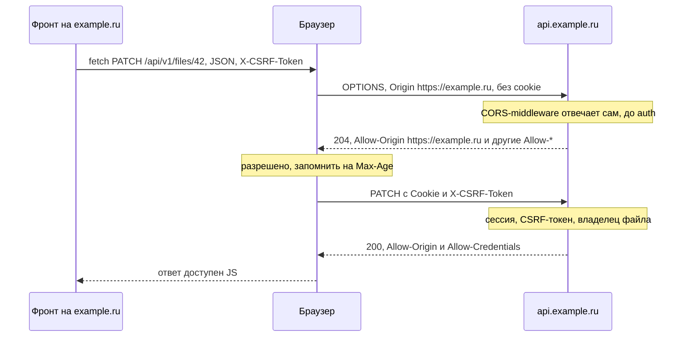
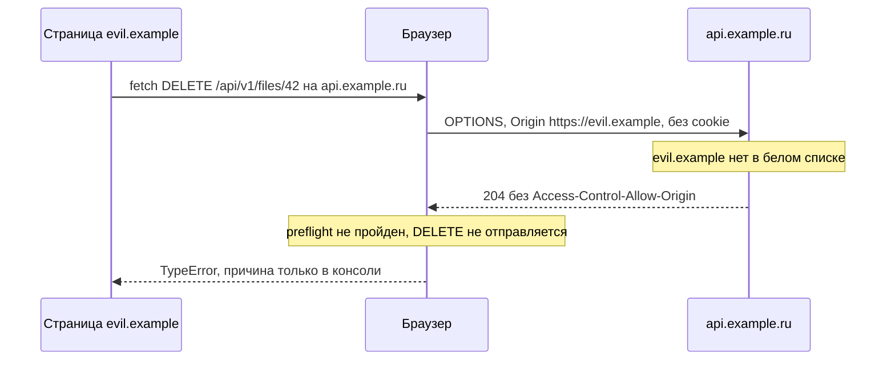

# CORS и preflight

Фронт живёт на `https://example.ru`, API — на `https://api.example.ru`. Это один site, но
разные origin (почему — в [basics.md](basics.md#site-и-origin)), поэтому каждый запрос фронта
к API браузер проверяет по правилам CORS. Здесь — как устроена эта проверка, какие заголовки
должен отдавать бэк, что делать фронту и почему CORS не защищает от CSRF.

Требование РК1 из обязательного минимума: «CORS: точный белый список origin, без `*` вместе с
credentials; preflight отвечает до авторизации». Ниже разобрано, что стоит за каждой его частью.

## Same-origin policy: запрос уходит, ответ не отдаётся

Same-origin policy — правило браузера: JS со страницы одного origin не может **прочитать**
ответ другого origin. Отправить запрос он часто может.

Типичная картина: фронт на `https://example.ru` делает простой `GET` на `https://api.example.ru`,
бэк не прислал CORS-заголовков. Запрос дошёл до сервера, сервер его выполнил и ответил `200`, но
браузер ответ JS не отдал: `fetch` завершается ошибкой `TypeError` (в Chrome —
`Failed to fetch`). Причину JS не узнает — её видно только в консоли браузера, например
`No 'Access-Control-Allow-Origin' header is present on the requested resource`.

CORS (cross-origin resource sharing) — способ, которым сервер ослабляет это правило: заголовками
ответа он говорит браузеру, какому origin можно читать ответ, с какими методами и заголовками
можно приходить и можно ли прикладывать cookie.

Две вещи, которые важно понять сразу:

- **CORS проверяет браузер, а не сервер.** `curl`, Postman и скрипт злоумышленника на своём
  компьютере CORS-заголовки игнорируют. CORS не закрывает API от посторонних — он решает,
  может ли чужая страница в браузере пользователя читать ответы нашего API.
- **Запросы с того же origin CORS не касаются.** Если фронт и API на одном origin, никаких
  CORS-заголовков не нужно (раздел «Когда CORS не нужен»).

## Простые запросы и preflight

Браузер делит запросы на другой origin на два вида.

**Простой запрос** (в спецификации Fetch — запрос с CORS-safelisted методом и заголовками)
браузер отправляет сразу, а ответ отдаёт JS только при разрешении в заголовках ответа.
Запрос простой, если выполнено всё сразу:

- метод `GET`, `HEAD` или `POST`;
- из заголовков, которые ставит сам код, есть только `Accept`, `Accept-Language`,
  `Content-Language`, `Content-Type` и `Range` (заголовки, которые браузер ставит сам, — `Cookie`,
  `Origin`, `User-Agent` — не в счёт);
- `Content-Type`, если он есть, — один из трёх: `application/x-www-form-urlencoded`,
  `multipart/form-data`, `text/plain`.

Есть ещё пара редких условий (потоковое тело запроса, обработчики загрузки у
`XMLHttpRequest`) — они перечислены на MDN.

По сути это то, что умеет отправить обычная HTML-форма. Логика спецификации: форму на чужой
сайт можно было отправить всегда, поэтому такие запросы браузер не спрашивает заранее.

**Запрос с preflight** — всё остальное. Перед ним браузер сам отправляет запрос `OPTIONS` на
тот же адрес и спрашивает: «можно ли прийти с таким origin, методом и заголовками?». Если
ответ не разрешает, основной запрос **не отправляется вообще**.

В нашем проекте preflight запускают:

| Что в запросе | Почему не простой |
|---|---|
| `Content-Type: application/json` | тип не из трёх разрешённых |
| `X-CSRF-Token` (варианты A и C) | свой заголовок |
| `Authorization: Bearer …` (вариант B) | заголовок не из списка |
| `PUT`, `PATCH`, `DELETE` | метод не из трёх разрешённых |

Значит, почти каждый запрос фронта к API на другом origin идёт с preflight.

Ловушка: `fetch` со строкой в `body` и без явного `Content-Type` браузер отправит с
`Content-Type: text/plain;charset=UTF-8` — это простой запрос, preflight не будет. Если бэк при
этом всё равно разбирает тело как JSON, такую же ручку сможет вызвать и чужой сайт обычной
формой с `text/plain` (`csrf.md`). Поэтому фронт всегда ставит
`Content-Type: application/json`, а бэк отклоняет изменяющие запросы с другим типом.

## Заголовки CORS

Все `Access-Control-Request-*` и `Origin` ставит браузер — код фронта их не задаёт и задать не
может. Бэк отвечает заголовками `Access-Control-Allow-*`.

**В запросе** (ставит браузер):

| Заголовок | Когда | Что значит |
|---|---|---|
| `Origin` | в каждом CORS-запросе и в preflight | с какого origin пришла страница: `https://example.ru` (без пути) |
| `Access-Control-Request-Method` | только в preflight | каким методом пойдёт основной запрос |
| `Access-Control-Request-Headers` | только в preflight, если есть «непростые» заголовки | какие заголовки будут в основном запросе: `content-type,x-csrf-token` |

**В ответе** (ставит бэк):

| Заголовок | Где нужен | Что значит |
|---|---|---|
| `Access-Control-Allow-Origin` | в ответе на preflight **и** на основной запрос | какому origin можно: ровно один origin или `*`. Список через запятую не работает |
| `Access-Control-Allow-Credentials: true` | там же, если запрос с cookie | можно прийти с cookie и прочитать ответ. Значение — ровно `true` |
| `Access-Control-Allow-Methods` | в ответе на preflight | разрешённые методы: `GET, POST, PUT, PATCH, DELETE` |
| `Access-Control-Allow-Headers` | в ответе на preflight | разрешённые заголовки: `Content-Type, X-CSRF-Token` (вариант B — ещё `Authorization`) |
| `Access-Control-Max-Age` | в ответе на preflight | сколько секунд браузер помнит разрешение и не повторяет preflight |
| `Access-Control-Expose-Headers` | в ответе на основной запрос | какие заголовки ответа JS сможет прочитать (раздел ниже) |
| `Vary: Origin` | во всех ответах, где `Allow-Origin` зависит от `Origin` | подсказка кешам: ответ разный для разных origin |

Как выглядит удачный preflight для `PATCH` с JSON и CSRF-токеном:

```http
OPTIONS /api/v1/files/42 HTTP/1.1
Host: api.example.ru
Origin: https://example.ru
Access-Control-Request-Method: PATCH
Access-Control-Request-Headers: content-type,x-csrf-token

HTTP/1.1 204 No Content
Access-Control-Allow-Origin: https://example.ru
Access-Control-Allow-Credentials: true
Access-Control-Allow-Methods: GET, POST, PUT, PATCH, DELETE
Access-Control-Allow-Headers: Content-Type, X-CSRF-Token
Access-Control-Max-Age: 600
Vary: Origin
```

Подробности, на которых спотыкаются:

- **`Allow-Origin` нужен дважды.** Preflight прошёл, основной запрос ушёл и выполнился — но если
  в его ответе нет `Access-Control-Allow-Origin` (и `Allow-Credentials` для запроса с cookie),
  JS ответ не получит.
- **Почему `Vary: Origin`.** Бэк выбирает значение `Allow-Origin` по `Origin` запроса. Без
  `Vary: Origin` кеш браузера или прокси может отдать ответ, сохранённый для другого origin или
  для запроса без `Origin`, — с чужим `Allow-Origin` или вовсе без него.
- **`Max-Age`.** Без заголовка браузер помнит разрешение 5 секунд; большие значения браузеры
  урезают (Chromium — до 2 часов, Firefox — до 24 часов). Разумно 600 секунд (10 минут).
  Разрешение запоминается для конкретного адреса: `/api/v1/files/1` и `/api/v1/files/2` получат
  по своему preflight.
- **Метод пишите заглавными.** `fetch` сам приводит к верхнему регистру только `GET`, `POST`,
  `PUT`, `DELETE`, `HEAD`, `OPTIONS`. С `method: 'patch'` браузер так и спросит `patch`, а
  `Access-Control-Allow-Methods: PATCH` сравнивается с учётом регистра — preflight не пройдёт.
  Пишите `method: 'PATCH'`.
- **Простые заголовки разрешены всегда.** `Accept` и `Content-Type` с простым значением
  перечислять не нужно. Но `Content-Type: application/json` — не простое значение, поэтому
  `Content-Type` в `Allow-Headers` обязателен.

## Preflight по шагам

Удачный случай: фронт на `https://example.ru` меняет файл, бэк разрешает этот origin.
Заголовки preflight и ответа на него — как в примере выше.



Отказ: страница `https://evil.example` пытается удалить файл. Origin не в белом списке, бэк
отвечает на preflight без разрешающих заголовков — и браузер не отправляет `DELETE`.



Код ответа на отклонённый preflight браузеру не важен: он смотрит на заголовки. Многие
middleware отвечают `204` и в этом случае, просто без `Access-Control-Allow-*`.

## Preflight отвечает до авторизации

Preflight браузер отправляет **без cookie** и без заголовков, которые ставит код, — значит, и
без `Authorization`. Если `OPTIONS` попадает в auth-middleware, тот видит запрос без сессии и
отвечает `401`. Для браузера это неудачный preflight (успешный — только с кодом `200`–`299`),
и основной запрос не уходит, хотя пользователь вошёл.

Поэтому:

- CORS-middleware стоит **снаружи** auth-middleware и отвечает на preflight сам: заголовки и
  `204` (или `200`), без вызова следующих обработчиков;
- preflight узнают по методу `OPTIONS` **и** заголовку `Access-Control-Request-Method`;
- ответ на preflight ничего не меняет и данных не отдаёт — поэтому ему и не нужна авторизация.

Пример на Go с библиотекой `rs/cors` (в других библиотеках идея та же):

```go
c := cors.New(cors.Options{
    AllowedOrigins:   cfg.AllowedOrigins, // из переменной окружения: []string{"https://example.ru"}
    AllowedMethods:   []string{"GET", "POST", "PUT", "PATCH", "DELETE"},
    AllowedHeaders:   []string{"Content-Type", "X-CSRF-Token"},
    AllowCredentials: true,
    MaxAge:           600,
})

// CORS снаружи: preflight получает ответ и не доходит до authMiddleware.
handler := c.Handler(authMiddleware(router))
```

Если роутер — `gorilla/mux`, не вешайте CORS через `router.Use(...)`: middleware роутера
вызываются, только когда нашёлся маршрут, а маршрута с методом `OPTIONS` у вас, скорее всего,
нет. Оборачивайте весь роутер, как в примере.

## Credentials: точный origin и `credentials: 'include'`

Cookie — это credentials. Чтобы запрос на другой origin пошёл с cookie, нужно согласие обеих
сторон.

**Фронт** просит приложить cookie:

```js
const res = await fetch('https://api.example.ru/api/v1/files', {
  method: 'POST',
  credentials: 'include',
  headers: { 'Content-Type': 'application/json', 'X-CSRF-Token': csrfToken },
  body: JSON.stringify({ title: 'Конспект' }),
});
```

По умолчанию у `fetch` стоит `credentials: 'same-origin'`: на другой origin cookie не уходят, а
`Set-Cookie` из ответа браузер **игнорирует**. Частая ошибка: вход «проходит», `200` пришёл, а
следующий запрос к API уходит без cookie и получает `401` — потому что в запросе на
`/api/v1/auth/login` забыли `credentials: 'include'`, и браузер не сохранил cookie из ответа.
Ставьте его во всех запросах к API в одной обёртке над `fetch`.

**Бэк** отвечает на такие запросы:

- `Access-Control-Allow-Credentials: true`;
- `Access-Control-Allow-Origin` — **конкретный** origin из белого списка. Со звёздочкой браузер
  ответ на запрос с cookie не отдаст;
- `Allow-Methods`, `Allow-Headers` и `Expose-Headers` — явные списки: для запросов с cookie `*` в
  них означает не «всё», а заголовок с именем `*`. `Authorization` звёздочка не покрывает
  никогда — его перечисляют явно.

Как правильно собрать белый список:

- Список точных строк вида `https://example.ru` и **сравнение на равенство** с `Origin`.
  Не проверка «начинается с `https://example.ru`» или «содержит `example.ru`»: обеим подходит
  `https://example.ru.evil.example`.
- Не «отражать» любой `Origin` обратно в `Allow-Origin` без проверки. Это то же, что `*`, только
  браузер ещё и разрешит cookie: любой сайт сможет читать ответы API от имени пользователя.
- Не добавлять `null`: такой `Origin` у страниц из sandbox-iframe, `data:`- и `file:`-адресов —
  злоумышленник легко сделает страницу с `Origin: null`.
- Список — из переменной окружения, свой для каждого окружения. `http://localhost:5173` нужен
  разработке, но не проду (`pitfalls.md`).

Про `SameSite`: `example.ru` и `api.example.ru` — один site, поэтому cookie API с
`SameSite=Lax` или `Strict` к запросам фронта браузер приложит. `SameSite` решает, уйдёт ли
cookie, а CORS — сможет ли JS прочитать ответ (подробнее —
[basics.md](basics.md#site-и-origin)).

## `Expose-Headers`: какие заголовки ответа видит JS

Даже когда CORS разрешил чтение ответа, JS видит не все его заголовки. Без дополнительных
разрешений доступны только `Cache-Control`, `Content-Language`, `Content-Length`,
`Content-Type`, `Expires`, `Last-Modified` и `Pragma`. Для остальных
`res.headers.get(...)` вернёт `null`, хотя в Network заголовок виден.

Чтобы открыть заголовок, бэк перечисляет его в `Access-Control-Expose-Headers` ответа на
основной запрос.

Это важно для **варианта B**: если сервер отдаёт access-токен в заголовке ответа
`Authorization`, без строки

```http
Access-Control-Expose-Headers: Authorization
```

фронт токен не прочитает и будет считать, что вход не удался.

`Set-Cookie` JS не прочитает никогда, даже если перечислить его в `Expose-Headers`: это
запрещённый заголовок ответа. Cookie браузер обрабатывает сам.

## CORS не защищает от CSRF

CORS ограничивает **чтение** ответа, а не **отправку** запроса. Простой запрос браузер
отправляет без preflight, сервер его выполняет — и только потом браузер решает, отдавать ли
ответ JS. Для CSRF ответ не нужен: злоумышленнику достаточно, что запрос выполнился.

Что может сделать страница на `https://evil.example` без всякого разрешения CORS:

- отправить HTML-форму `POST` на `https://api.example.ru/api/v1/files` — это вообще не CORS, а
  обычная навигация;
- вызвать `fetch` с `POST`, `Content-Type: text/plain` и `credentials: 'include'` — простой
  запрос уйдёт, ответ JS не получит, но действие уже совершено.

Cookie к такому запросу приложатся, если их не остановит `SameSite`. С `evil.example` (другой
site) cookie с явным `SameSite=Lax` к `POST` не уйдёт. Но с соседнего поддомена того же site,
например `avatars.example.ru`, `SameSite` не помогает, а белый список CORS простой запрос не
останавливает.

Где preflight всё-таки помогает: запрос с `Content-Type: application/json` или
`X-CSRF-Token` чужая страница без preflight не отправит, а preflight с чужого origin бэк не
пропустит. На этом держится пункт усиления, который **настойчиво рекомендуется**: «Только
`Content-Type: application/json` на изменяющих ручках». Работает он, только если бэк
действительно отклоняет запросы с другим `Content-Type`, а не разбирает тело как JSON при
любом типе.

Итог: CORS — не CSRF-защита. Защита — `SameSite`, Double Submit Cookie и проверка `Origin`
(`csrf.md`).

## Когда CORS не нужен

Если фронт и API на **одном origin**, CORS не участвует: нет preflight, не нужны
`Access-Control-*`, а cookie уходят и без `credentials: 'include'` (значение по умолчанию
`same-origin` их отправляет).

**Прод.** Фронт и API отдаются с одного адреса через reverse proxy: `https://example.ru/` —
статика фронта, `https://example.ru/api/` — бэк. В nginx это одна `location`:

```nginx
location /api/ {
    proxy_pass http://backend:8080;
}
```

Тогда CORS-middleware на бэке не нужен. Не включайте его «на всякий случай» со `*`: лишнее
разрешение — лишняя поверхность атаки.

**Разработка.** Dev-сервер фронта (`http://localhost:5173`) и бэк (`http://localhost:8080`) —
разные origin, порты различаются. Вместо CORS можно проксировать API через dev-сервер, тогда
браузер видит один origin. В Vite это `server.proxy`:

```js
// vite.config.js
import { defineConfig } from 'vite';

export default defineConfig({
  server: {
    proxy: {
      '/api': 'http://localhost:8080',
    },
  },
});
```

Фронт ходит на `/api/v1/...` относительным путём, Vite пересылает запросы на бэк. Прокси
работает только в dev-режиме, на проде его роль играет nginx. Заголовок `Origin` прокси
передаёт как есть — `http://localhost:5173`. Если бэк проверяет `Origin` (`csrf.md`), этот
адрес нужен в белом списке dev-окружения.

## Как проверить

- **Консоль браузера** пишет точную причину отказа: нет `Access-Control-Allow-Origin`, метод не
  разрешён, `*` вместе с credentials. JS видит только `TypeError`.
- **DevTools → Network**: preflight — отдельная строка с методом `OPTIONS` к тому же адресу
  перед основным запросом. Смотрите её код ответа и заголовки `Access-Control-Allow-*`.
- **`curl` без `Origin` CORS-заголовков не получит.** Middleware (например, `rs/cors`) добавляет
  их, только если в запросе есть `Origin`. «Нет заголовков в `curl`» — не баг: передайте
  `Origin` явно, а для preflight — ещё метод `OPTIONS` и `Access-Control-Request-Method`.
  Готовые команды с разрешённым и чужим `Origin` — в `checklist.md`.

## Источники

- MDN: [Cross-Origin Resource Sharing (CORS)](https://developer.mozilla.org/en-US/docs/Web/HTTP/Guides/CORS) —
  простые запросы, preflight, credentials, `*` с credentials, `Vary: Origin`
- MDN: [Same-origin policy](https://developer.mozilla.org/en-US/docs/Web/Security/Defenses/Same-origin_policy),
  [Preflight request](https://developer.mozilla.org/en-US/docs/Glossary/Preflight_request),
  [CORS-safelisted request header](https://developer.mozilla.org/en-US/docs/Glossary/CORS-safelisted_request_header)
- MDN: [Access-Control-Max-Age](https://developer.mozilla.org/en-US/docs/Web/HTTP/Reference/Headers/Access-Control-Max-Age) —
  5 секунд по умолчанию, пределы Chromium и Firefox;
  [Access-Control-Allow-Headers](https://developer.mozilla.org/en-US/docs/Web/HTTP/Reference/Headers/Access-Control-Allow-Headers) —
  `Authorization` не покрывается `*`;
  [Access-Control-Expose-Headers](https://developer.mozilla.org/en-US/docs/Web/HTTP/Reference/Headers/Access-Control-Expose-Headers) —
  заголовки ответа, видимые по умолчанию
- MDN: [RequestInit: credentials](https://developer.mozilla.org/en-US/docs/Web/API/RequestInit#credentials) —
  `same-origin` по умолчанию, `Set-Cookie` из ответа;
  [Access-Control-Allow-Origin](https://developer.mozilla.org/en-US/docs/Web/HTTP/Reference/Headers/Access-Control-Allow-Origin) —
  почему не `null`
- [Fetch Standard: CORS protocol](https://fetch.spec.whatwg.org/#http-cors-protocol) —
  CORS check, `Set-Cookie` без `credentials: 'include'` игнорируется,
  [CORS-preflight fetch](https://fetch.spec.whatwg.org/#cors-preflight-fetch) (успех — статус
  200–299, сравнение методов и заголовков, кеш по адресу),
  [CORS protocol and HTTP caches](https://fetch.spec.whatwg.org/#cors-protocol-and-http-caches) (`Vary: Origin`),
  [normalize a method](https://fetch.spec.whatwg.org/#concept-method-normalize)
- OWASP: [HTML5 Security Cheat Sheet, Cross Origin Resource Sharing](https://cheatsheetseries.owasp.org/cheatsheets/HTML5_Security_Cheat_Sheet.html#cross-origin-resource-sharing) —
  белый список вместо `*` и отражения `Origin`, CORS не заменяет CSRF-защиту
- OWASP: [Cross-Site Request Forgery Prevention Cheat Sheet](https://cheatsheetseries.owasp.org/cheatsheets/Cross-Site_Request_Forgery_Prevention_Cheat_Sheet.html)
- [rs/cors](https://github.com/rs/cors) — CORS-middleware для Go;
  [gorilla/mux, Middleware](https://github.com/gorilla/mux#middleware) — middleware вызываются
  только при найденном маршруте
- Vite: [server.proxy](https://vite.dev/config/server-options#server-proxy)
