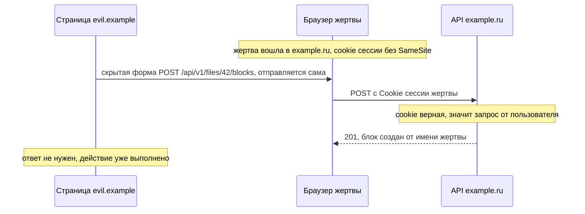
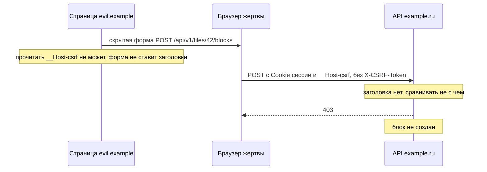
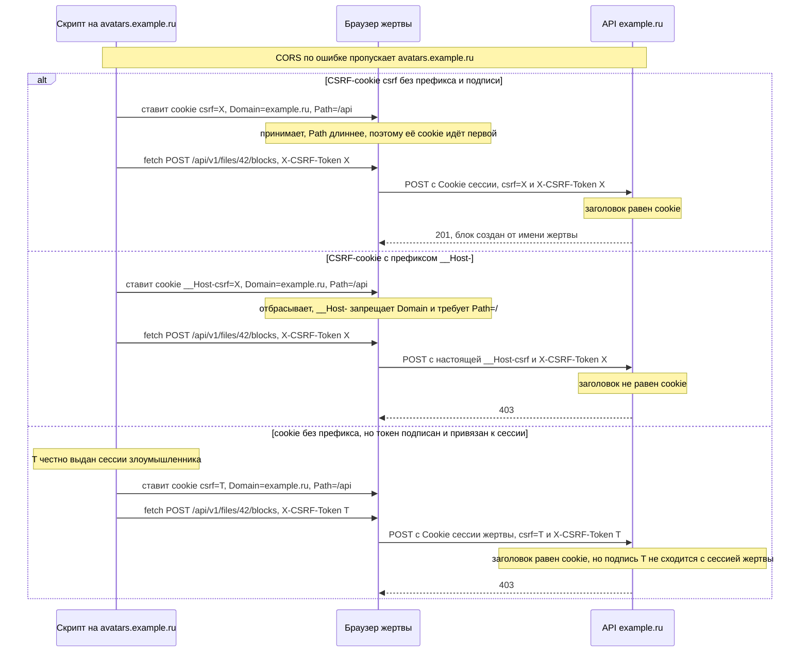

# CSRF: зачем нужна защита и как её сделать

Этот файл — для команд с вариантами A и C, а в части login CSRF — и для варианта B. Здесь
разобрано, откуда берётся CSRF, почему `SameSite` его закрывает не до конца и что именно
требуется в РК1: минимум, настойчиво рекомендуемое и опции по желанию.

Понятия, на которых всё держится (флаги cookie, префиксы, site и origin), — в
[basics.md](basics.md); почему CORS не защищает от CSRF — в
[cors.md](cors.md#cors-не-защищает-от-csrf). Как CSRF-защита встроена в потоки входа и
запросов — в [variant-a.md](variant-a.md) и [variant-c.md](variant-c.md).

## Что такое CSRF

CSRF (cross-site request forgery, подделка межсайтового запроса) — атака, при которой чужая
страница заставляет браузер жертвы отправить запрос к нашему API, а сервер принимает его за
запрос самого пользователя.

Корень проблемы — cookie. Браузер прикладывает cookie к запросу **сам**: ему всё равно, кто
начал запрос — наш фронт, ссылка в письме или скрытая форма на чужом сайте. Такие учётные
данные называют фоновыми (ambient credentials): пользователь и код страницы их не передают
явно, они просто «едут» с каждым подходящим запросом. Если сервер узнаёт пользователя только
по cookie, он не может отличить запрос нашего фронта от запроса, который подстроил
злоумышленник.

Злоумышленнику не нужно читать ответ — ему достаточно, чтобы запрос выполнился: блок
создался, файл удалился, пароль сменился. Поэтому CORS тут не помогает: он запрещает чужой
странице **читать** ответ, а не **отправлять** запрос
([cors.md](cors.md#cors-не-защищает-от-csrf)).

Как выглядит атака, если защиты нет:



Здесь cookie ушла на межсайтовый `POST`, потому что у неё нет `SameSite`, а этот браузер не
считает такую cookie `Lax` (без флага браузеры ведут себя по-разному —
[basics.md](basics.md#флаги-cookie)). То же будет с `SameSite=None` или в браузере, который
`SameSite` не знает. Как это закрыть по-настоящему — ниже.

Форма — не единственный способ: страница может вызвать `fetch` с `credentials: 'include'` и
`Content-Type: text/plain`. Это простой запрос, он уходит без preflight
([cors.md](cors.md#простые-запросы-и-preflight)).

## Когда CSRF актуален

CSRF возможен там, где браузер сам прикладывает то, по чему сервер узнаёт пользователя.

| Вариант | Что браузер прикладывает сам | CSRF |
|---|---|---|
| A — access и refresh в `HttpOnly`-cookie | обе cookie | нужна защита на всех изменяющих ручках |
| B — access в памяти JS, refresh в cookie | только refresh-cookie | только для refresh-cookie |
| C — `session_id` в `HttpOnly`-cookie | cookie сессии | нужна защита на всех изменяющих ручках |

Почему так:

- **A и C.** Переход на cookie-авторизацию и порождает CSRF. Мы убрали токен из JS, чтобы XSS
  не мог его унести ([basics.md](basics.md#где-можно-хранить-токен)), — и за это платим: раз
  токен прикладывает браузер, он приложит его и к чужому запросу.
- **B.** Access-токен фронт ставит в `Authorization` сам. Чужая страница его не знает, а браузер
  этот заголовок сам не добавит: подделанный запрос придёт без токена и получит `401`.
  Остаётся refresh-cookie. Узкий `Path=/api/v1/auth` сужает поверхность до ручек продления и
  выхода, а закрывает её `SameSite`; на refresh, а также на login и register настойчиво
  рекомендуется проверка `Origin` / `Sec-Fetch-Site`. Login CSRF в варианте B тоже
  возможен — см. [Login CSRF](#login-csrf) и
  [variant-b.md](variant-b.md#что-может-xss-и-что-может-csrf).

## Почему `SameSite` мало

`SameSite` решает, приложить ли cookie к запросу, который начат на **другом site**
([basics.md](basics.md#флаги-cookie)). С `SameSite=Lax` это закрывает большую часть
классических атак:

| Запрос с `https://evil.example` | Cookie с `SameSite=Lax` | Cookie с `SameSite=Strict` |
|---|---|---|
| форма `POST` | не уходит | не уходит |
| `fetch` любым методом | не уходит | не уходит |
| ``, `<iframe>` | не уходит | не уходит |
| переход по ссылке, форма с `method="get"` (переход верхнего уровня) | **уходит** | не уходит |

Минимум требует `SameSite=Lax` или `Strict` у авторизационных cookie. Но одного `SameSite`
мало — по четырём причинам.

**1. Поддомены с пользовательским контентом.** `SameSite` сравнивает site, а не origin.
`avatars.example.ru` и `example.ru` — один site ([basics.md](basics.md#site-и-origin)).
Допустим, на `avatars.example.ru` пользователи загружают аватарки, и сервер отдаёт загруженный
SVG как документ. SVG может содержать `<script>`: злоумышленник загружает такой файл и
присылает жертве ссылку. Скрипт выполняется на origin `https://avatars.example.ru` и шлёт
запросы на `example.ru` — для браузера это **same-site**, и cookie уходят даже со `Strict`.

**2. Cookie tossing.** Поддомен может поставить cookie для всего домена: ответ
`avatars.example.ru` с `Set-Cookie: csrf=…; Domain=example.ru` (или скрипт там же через
`document.cookie`) — и браузер начнёт присылать эту cookie на `example.ru`. Прочитать наши
cookie поддомен не может, а **записать** свою рядом с нашей — может. Это ломает наивный Double
Submit, если CSRF-cookie без префикса `__Host-`
([разбор ниже](#cookie-tossing-как-его-останавливают-__host--и-подпись)).

**3. `GET` с побочными эффектами.** `Lax` пропускает cookie на переход верхнего уровня методом
`GET`. Если `GET /api/v1/files/42/delete` удаляет файл, хватит ссылки на чужой странице. С
поддомена `GET` уходит с cookie даже как ``. Поэтому `GET` не меняет
данные — это пункт минимума, и CSRF-проверка `GET` не проверяет.

**4. Старые браузеры.** Браузер, который не знает `SameSite`, просто игнорирует атрибут и
отправляет cookie на любые запросы. Без явного флага поведение тоже разное
([basics.md](basics.md#флаги-cookie)).

Итог: `SameSite` — хороший первый слой, но не защита сама по себе. Защита — CSRF-токен
(Double Submit), а `__Host-` и проверка `Origin` закрывают то, что `SameSite` пропускает с
поддоменов.

## CSRF и XSS

Две атаки часто путают. Разница — где выполняется чужой код.

| | XSS | CSRF |
|---|---|---|
| Где чужой код | на **нашем** origin, внутри нашей страницы | на **чужой** странице или поддомене |
| Что может | всё, что наш фронт: читать DOM и не-`HttpOnly` cookie, вызывать `fetch` и читать ответы | только отправить запрос вслепую: не читает ни cookie, ни ответ |
| Чем закрывается | экранирование, CSP — тема следующих РК | `SameSite`, Double Submit, `Origin`, `__Host-` |

**XSS на основном origin не закрывает никакая CSRF-защита.** Скрипт на `example.ru` читает
`__Host-csrf` из `document.cookie` так же, как наш фронт, ставит `X-CSRF-Token`, и запрос
приходит с правильным `Origin`. Для сервера он неотличим от настоящего. CSRF-защита — не
замена защиты от XSS.

**XSS на соседнем поддомене — другое дело.** Скрипт на `avatars.example.ru` выполняется на
**другом** origin. Пока авторизация в cookie, он может слать запросы на `example.ru`
(same-site, cookie уходят), то есть уязвимость в загрузке аватарок превращается в действия в
основном приложении. Но:

- прочитать `__Host-csrf` он не может: cookie без `Domain` принадлежит только хосту
  `example.ru`;
- подложить свою CSRF-cookie для `example.ru` не может, если у неё префикс `__Host-`;
- его запрос несёт `Origin: https://avatars.example.ru` и `Sec-Fetch-Site: same-site`. Там,
  где стоит проверка `Origin`, его отклонит она; на остальных ручках остановит Double Submit:
  без токена запрос не пройдёт, а заголовок `X-CSRF-Token` с чужого origin не пропустит
  preflight.

Это и отсекают `Origin` и `__Host-`: XSS на поддомене остаётся проблемой поддомена и не
становится проблемой основного приложения.

## Double Submit Cookie

### Как это работает

Сервер выдаёт случайный токен в cookie **без** `HttpOnly`. Фронт читает её и повторяет значение
в заголовке `X-CSRF-Token`. На каждом изменяющем запросе сервер сравнивает заголовок с cookie:
совпали — запрос от нашего фронта.

Почему чужая страница не подделает: cookie браузер приложит, но **прочитать** её значение
чужая страница не может (cookie принадлежит `example.ru`), а без значения не поставить
заголовок. Обычная форма вообще не умеет ставить заголовки, а `fetch` с `X-CSRF-Token` на
чужой origin требует preflight, который бэк чужому origin не разрешит
([cors.md](cors.md#простые-запросы-и-preflight)).

Сервер ничего не хранит: проверка — сравнение двух копий в одном запросе.



Здесь худший случай: cookie ушли (старый браузер или cookie без `SameSite`). С `SameSite=Lax`
с `evil.example` они не ушли бы вовсе, но Double Submit на это не рассчитывает и отклоняет
запрос в любом случае.

Фронт получает токен ещё до входа: `POST /api/v1/auth/login` — изменяющий запрос, и он
проверяется так же, как остальные. Поэтому сначала `GET /api/v1/auth/csrf` ставит
`__Host-csrf`, а после входа сервер выдаёт новый токен. Потоки целиком —
[variant-a.md](variant-a.md#вход) и [variant-c.md](variant-c.md#вход).

```ts
// До входа: сервер ставит __Host-csrf.
await fetch('/api/v1/auth/csrf', { credentials: 'include' });

// Читаем перед каждым запросом: после входа токен меняется.
function csrfToken(): string {
  const row = document.cookie.split('; ').find((c) => c.startsWith('__Host-csrf='));
  return row ? row.slice('__Host-csrf='.length) : '';
}

await fetch('/api/v1/auth/login', {
  method: 'POST',
  credentials: 'include',
  headers: { 'Content-Type': 'application/json', 'X-CSRF-Token': csrfToken() },
  body: JSON.stringify({ login, password }),
});
```

Если API на отдельном origin (`api.example.ru`), фронт на `example.ru` не прочитает
`__Host-csrf` из `document.cookie`: она принадлежит хосту API. Тогда сервер отдаёт токен ещё и
в теле `GET /api/v1/auth/csrf`, а фронт держит его в памяти
([variant-a.md](variant-a.md#если-api-на-отдельном-origin)).

Проверка на бэке — `csrfMiddleware` из [variant-a.md](variant-a.md#бэк): на `POST`, `PUT`,
`PATCH`, `DELETE` сравнить `X-CSRF-Token` с cookie за постоянное время, иначе `403`.

Сервер не хранит токен, поэтому `curl` с любыми одинаковыми значениями в cookie и заголовке
проверку пройдёт. Это не дыра: CSRF — атака через браузер жертвы, а у `curl` нет её cookie.

### Минимум

**Минимум** — Double Submit Cookie:

- токен генерирует сервер криптостойким генератором, не меньше 128 бит;
- CSRF-cookie без `HttpOnly`; фронт отправляет её значение в заголовке `X-CSRF-Token`;
- проверка на POST, PUT, PATCH, DELETE; отказ — 403 (не 401: на 401 фронт делает refresh и повторяет запрос);
- GET не меняет данные;
- авторизационные cookie с `SameSite=Lax` или `Strict`.

Пояснения:

- **Криптостойкий генератор** — `crypto/rand` в Go, не `math/rand`: значения `math/rand`
  предсказуемы. 128 бит — 16 случайных байт; в примерах РК1 — 32 байта в base64url.
- **Проверка на всех изменяющих методах**, включая `/api/v1/auth/login`, `/register`,
  `/refresh` и `/logout`. Забытая ручка — открытая ручка.
- **CSRF-cookie без `HttpOnly`** — единственная такая cookie в вариантах A и C. Это не
  нарушает минимум про токены: CSRF-токен сам по себе не даёт доступа к аккаунту.

### Настойчиво рекомендуется

**Настойчиво рекомендуется** (ожидается для хорошей оценки):

| Опция | Что закрывает |
|---|---|
| Префикс `__Host-` у CSRF-cookie (`Secure`, `Path=/`, без `Domain`) | поддомен не может поставить или перезаписать cookie (cookie tossing) |
| Проверка `Origin` / `Sec-Fetch-Site` на login, register, refresh | login CSRF: вход жертвы в аккаунт злоумышленника |
| Только `Content-Type: application/json` на изменяющих ручках | форма и `text/plain` отклоняются; JSON требует preflight, который CORS не пропустит с чужого origin |
| Сравнение за постоянное время (`hmac.Equal`, `subtle.ConstantTimeCompare`) | подбор токена по времени ответа |

**Префикс `__Host-`.** Браузер примет cookie `__Host-csrf`, только если у неё `Secure`,
`Path=/` и нет `Domain`, и она пришла по HTTPS. Поэтому поддомен не может ни поставить, ни
перезаписать её для `example.ru` ([basics.md](basics.md#префиксы-__host--и-__secure-)).
Как это останавливает cookie tossing — [схема ниже](#cookie-tossing-как-его-останавливают-__host--и-подпись).

Оговорка: `__Host-` требует `Path=/`, поэтому для refresh-cookie с узким `Path` подходит
только `__Secure-`. У CSRF-cookie узкий `Path` не нужен — фронт читает её на любой странице.

**Проверка `Origin` / `Sec-Fetch-Site`.** Оба заголовка ставит браузер, и код страницы их
подделать не может. `Origin` браузер добавляет к любому `POST`, `PUT`, `PATCH`, `DELETE`, в
том числе к запросам на свой origin. `Sec-Fetch-Site` говорит, откуда запрос относительно
адресата:

| Значение | Откуда запрос |
|---|---|
| `same-origin` | с того же origin (схема, хост, порт) |
| `same-site` | с того же site, но другого origin — например, с поддомена |
| `cross-site` | с другого site |
| `none` | пользователь сам: ввёл адрес, открыл закладку |

Нюанс: запрос со страницы `avatars.example.ru` приходит с `Sec-Fetch-Site: same-site`, а не
`cross-site`. Поэтому:

- **фронт и API на одном origin** — требуйте `same-origin`. Отсекать только `cross-site`
  мало: поддомен пройдёт;
- **отдельный API** (`example.ru` → `api.example.ru`) — свой фронт тоже приходит как
  `same-site`, и по `Sec-Fetch-Site` его не отличить от `avatars.example.ru`. Отличает только
  сравнение `Origin` с белым списком.

Заголовков может не быть. `Sec-Fetch-*` браузер шлёт только на HTTPS-адреса (и `localhost`),
старые браузеры не шлют их совсем; `curl` и Postman не шлют ни `Sec-Fetch-Site`, ни `Origin`.
`Origin: null` приходит из песочниц (`<iframe sandbox>`), с `data:`-страниц и при некоторых
`Referrer-Policy` — это не доказательство, что запрос свой, `null` в белый список не
добавляют. Если заголовков нет, решение оставляют проверке токена: OWASP допускает такой
вариант, а для чувствительных ручек советует отклонять.

```go
var allowedOrigins = map[string]bool{"https://example.ru": true} // из переменной окружения

// Порядок: originCheck на login, register, refresh, затем csrfMiddleware.
func originCheck(next http.Handler) http.Handler {
	return http.HandlerFunc(func(w http.ResponseWriter, r *http.Request) {
		switch r.Method {
		case http.MethodGet, http.MethodHead, http.MethodOptions:
			next.ServeHTTP(w, r) // проверяем только изменяющие методы
			return
		}
		// Один origin: свой фронт всегда same-origin. При отдельном API эту проверку уберите.
		if site := r.Header.Get("Sec-Fetch-Site"); site != "" && site != "same-origin" {
			http.Error(w, "cross-origin request", http.StatusForbidden)
			return
		}
		// Белый список отсекает и чужой сайт, и поддомен, и "null".
		if origin := r.Header.Get("Origin"); origin != "" && !allowedOrigins[origin] {
			http.Error(w, "origin not allowed", http.StatusForbidden)
			return
		}
		next.ServeHTTP(w, r) // заголовков нет: решает CSRF-токен
	})
}
```

На login, register и refresh проверка закрывает login CSRF ([ниже](#login-csrf)) и
страхует, если в логике токена ошибка. При разработке через прокси Vite `Origin` равен
`http://localhost:5173` — его добавляют в белый список dev-окружения
([cors.md](cors.md#когда-cors-не-нужен)).

**Только `Content-Type: application/json`.** HTML-форма умеет отправить только три типа:
`application/x-www-form-urlencoded`, `multipart/form-data` и `text/plain`. `fetch` с
`application/json` на чужой origin требует preflight, а его бэк чужому origin не разрешит. Если
сервер отклоняет изменяющие запросы с другим типом, у подделанного запроса с чужого origin не
остаётся способа дойти до обработчика. Проверять надо именно заголовок: тело `text/plain` бывает
похоже на JSON, и парсер его примет.

```go
func jsonOnly(next http.Handler) http.Handler {
	return http.HandlerFunc(func(w http.ResponseWriter, r *http.Request) {
		switch r.Method {
		case http.MethodPost, http.MethodPut, http.MethodPatch, http.MethodDelete:
			mt, _, err := mime.ParseMediaType(r.Header.Get("Content-Type"))
			if err != nil || mt != "application/json" {
				http.Error(w, "expected application/json", http.StatusUnsupportedMediaType)
				return
			}
		}
		next.ServeHTTP(w, r)
	})
}
```

Значит, фронт ставит `Content-Type: application/json` на **всех** изменяющих запросах — и
на logout и refresh без тела тоже, иначе сервер их отклонит. Если в проекте есть загрузка
файлов через `multipart/form-data`, эта ручка — осознанное исключение: её закрывает
CSRF-токен.

**Сравнение за постоянное время.** Обычное `==` над строками останавливается на первом
несовпавшем байте, и по времени ответа можно в теории подбирать токен байт за байтом.
`subtle.ConstantTimeCompare` и `hmac.Equal` тратят одинаковое время при любом несовпадении
(при разной длине `ConstantTimeCompare` сразу возвращает 0, но длина токена и так не секрет).
Пример — `csrfMiddleware` в [variant-a.md](variant-a.md#бэк).

### По желанию

**По желанию:**

| Опция | Что закрывает |
|---|---|
| Подпись токена HMAC с привязкой к пользователю или сессии | подложенный с поддомена честно выданный токен чужого аккаунта не проходит |
| Проверка `Origin` / `Sec-Fetch-Site` на всех изменяющих запросах | второй слой до проверки токена |
| Новый CSRF-токен при login, refresh, logout | token fixation между пользователями |
| `SameSite=Strict` у авторизационных cookie | переходы с чужих сайтов приходят без cookie; SPA не ломает, если HTML не требует авторизации |
| Нет пользовательского HTML/SVG на поддоменах (`Content-Type` загрузок, CSP) | источник атак с того же сайта |

**Подпись токена HMAC.** Наивный Double Submit проверяет только, что две копии совпали, — но не
то, кому токен выдан. Злоумышленник может войти в **свой** аккаунт, получить честный токен и
подложить его жертве с поддомена (cookie tossing). Подписанный токен — это случайная часть
плюс HMAC от неё и идентификатора сессии на секретном ключе сервера. Чужой токен подписан для
чужой сессии, и проверка не сойдётся.

```go
// sessionKey — session_id (вариант C) или id сессии из refresh-записи (вариант A).
// csrfSecret — из переменной окружения.
func signCSRF(sessionKey string) string {
	random := newToken() // 256 бит в base64url, как в variant-a.md
	return random + "." + csrfMAC(sessionKey, random)
}

func csrfMAC(sessionKey, random string) string {
	m := hmac.New(sha256.New, csrfSecret)
	fmt.Fprintf(m, "%d!%s!%d!%s", len(sessionKey), sessionKey, len(random), random)
	return base64.RawURLEncoding.EncodeToString(m.Sum(nil))
}

func validCSRF(sessionKey, header, cookie string) bool {
	if header == "" || subtle.ConstantTimeCompare([]byte(header), []byte(cookie)) != 1 {
		return false // обычный Double Submit
	}
	random, mac, ok := strings.Cut(header, ".")
	return ok && hmac.Equal([]byte(mac), []byte(csrfMAC(sessionKey, random)))
}
```

Длины в подписываемой строке — чтобы пары «сессия, случайная часть» нельзя было склеить
по-другому. В варианте A access проверяется без БД, поэтому id сессии кладут в access-токен
отдельным claim. Привязка к id пользователя (`sub` в варианте A) тоже допустима, но слабее: такой
токен годится для всех сессий пользователя, а не для одной. OWASP советует привязку к сессии.

Токен **до входа** привязать к пользователю невозможно — пользователя ещё нет. Поэтому login и
register проверяют обычный Double Submit (плюс рекомендуемую проверку `Origin`), а после входа
сервер выдаёт новый, уже подписанный токен.

Где стоит проверка подписи. Ей нужен id сессии, поэтому она идёт **после** разбора сессии:
access-токена в варианте A, `__Host-session` в варианте C. Порядок «CSRF → access» из
[variant-a.md](variant-a.md#бэк) подходит для минимума, где сравниваются две копии и id не
нужен. С подписью порядок такой: CSRF-сравнение копий → разбор сессии → проверка подписи. На
`/api/v1/auth/refresh` access может быть уже истёкшим, поэтому id сессии берут из
refresh-записи в БД, а подпись проверяют внутри обработчика refresh.

**Проверка `Origin` / `Sec-Fetch-Site` на всех изменяющих запросах** — тот же `originCheck`,
но подключённый ко всем ручкам. `GET`, `HEAD` и `OPTIONS` он пропускает (первый `switch` в
примере): переход по ссылке приходит с `Sec-Fetch-Site: none` или `cross-site`, и его
отклонять нельзя, а preflight обрабатывает CORS. Запрос с чужого
origin или поддомена отсекается до проверки токена, даже если в ней ошибка.

**Новый CSRF-токен при login, refresh, logout.** Token fixation — злоумышленник заранее
знает токен жертвы (подложил его или увидел на общем компьютере до её входа), и токен
продолжает работать после смены пользователя. Новый токен при каждой смене состояния сессии
обрывает эту связь. В вариантах A и C при входе это делается всегда
([variant-a.md](variant-a.md#вход)).

**`SameSite=Strict` у авторизационных cookie.** Со `Strict` cookie не уходят даже на переход
по ссылке с чужого сайта — `GET`-дыра из [раздела про `SameSite`](#почему-samesite-мало)
закрыта. Цена: пользователь пришёл по ссылке из мессенджера, и первый запрос страницы пришёл
без cookie. Для SPA это не проблема: HTML и статика отдаются без авторизации, а запросы к API
делает уже наша страница — они same-site, и cookie уходят. Ломается, только если сервер сам
решает по cookie, какой HTML отдать.

**Нет пользовательского HTML/SVG на поддоменах.** Убирает сам источник атак с того же site:
загруженный файл не выполняется как страница. Загрузки отдают так, чтобы браузер не открыл их
как документ: `Content-Disposition: attachment`, `X-Content-Type-Options: nosniff`, HTML — не
как `text/html`, при необходимости CSP. SVG безопасен в `` — там его скрипты не
выполняются, — но опасен, если открыть его по прямой ссылке. Подробности — тема следующих РК.

### Cookie tossing: как его останавливают `__Host-` и подпись

Cookie tossing ломает наивный Double Submit: защита опирается на то, что чужая страница не
знает значение cookie, а поддомен может само значение **задать**. Чтобы атака сработала,
скрипту на поддомене нужно ещё отправить запрос с заголовком `X-CSRF-Token`. Свой заголовок
требует preflight, поэтому атака проходит, если CORS пропускает поддомен: белый список по
маске `*.example.ru`, отражение любого `Origin` — или если бэк принимает токен ещё и из поля
формы. Это частые ошибки, и `__Host-` с подписью закрывают атаку независимо от них.



Префикс закрывает подмену cookie, подпись — подмену владельца токена. Префикс входит в
настойчиво рекомендуемое, подпись — по желанию.

## Login CSRF

Login CSRF — подделка не действия, а **входа**: чужая страница отправляет форму входа с
логином и паролем **злоумышленника**. Жертва оказывается в его аккаунте и не замечает
подмены. Дальше она работает как обычно: загружает файлы, пишет заметки — всё это ложится в
аккаунт злоумышленника, и он потом читает это у себя.

Почему `SameSite` тут не спасает:

- злоумышленнику не нужны cookie жертвы: он отправляет свои логин и пароль, и `SameSite`
  нечего задерживать;
- отправка формы — переход верхнего уровня, и cookie из ответа на него браузер сохраняет при
  любом `SameSite`.

Как это закрыто в РК1:

- **Double Submit на `POST /api/v1/auth/login` и `/register`** (минимум). Фронт заранее
  получает `__Host-csrf` через `GET /api/v1/auth/csrf`. У чужой страницы этого токена нет, а
  форма не ставит заголовки — `403`.
- **Проверка `Origin` / `Sec-Fetch-Site` на login, register, refresh** (настойчиво
  рекомендуется) — второй слой: отсекает запрос с чужого сайта или поддомена, даже если с
  токеном что-то не так. В варианте B CSRF-токена нет, и эта проверка вместе с
  `Content-Type: application/json` — основная защита входа
  ([variant-b.md](variant-b.md#что-может-xss-и-что-может-csrf)).
- **Новый токен после входа.** Токен до входа не привязан к пользователю, поэтому после входа
  сервер выдаёт новый.

## 403, а не 401

Отказ CSRF-проверки — `403 Forbidden`, не `401 Unauthorized`.

На `401` фронт в вариантах A и B делает refresh и повторяет запрос
([variant-a.md](variant-a.md#фронт)). Если CSRF-отказ тоже `401`, refresh причину не
устраняет, и повтор снова получает `401`. Обёртка без ограничения повторов зацикливается:
refresh, повтор, `401`, refresh… (в `pitfalls.md` это «бесконечный refresh»). Обёртка с одним
повтором не зациклится, но сделает лишний refresh и покажет непонятную ошибку. А refresh —
сам изменяющий запрос и тоже проходит CSRF-проверку: если и он получит `401`, фронт решит, что
сессия кончилась, и выкинет пользователя на страницу входа. В варианте C refresh нет, но
довод тот же: на `401` фронт открывает страницу входа, хотя сессия жива.

Смысл кодов это и подсказывает: `401` — «не знаю, кто ты», `403` — «знаю, но этот запрос не
выполню» ([basics.md](basics.md#идентификация-аутентификация-авторизация)). Фронт на `403` не
делает refresh, а показывает ошибку.

## Как проверить

Значения берите в DevTools → Application → Cookies. Плейсхолдеры:

- `{auth-cookie}` — авторизационная cookie целиком, с именем: в варианте A
  `access_token={access}`, в варианте C `__Host-session={session}`;
- `{csrf}` — значение `__Host-csrf`.

Без `X-CSRF-Token` — `403`:

```bash
curl -i -X POST https://example.ru/api/v1/files/42/blocks \
  -b '{auth-cookie}; __Host-csrf={csrf}' \
  -H 'Content-Type: application/json' -d '{"text":"проверка"}'
```

С заголовком — проходит (`201`, если файл ваш):

```bash
curl -i -X POST https://example.ru/api/v1/files/42/blocks \
  -b '{auth-cookie}; __Host-csrf={csrf}' \
  -H 'X-CSRF-Token: {csrf}' \
  -H 'Content-Type: application/json' -d '{"text":"проверка"}'
```

Вход без токена — `403` (CSRF проверяется и на login):

```bash
curl -i -X POST https://example.ru/api/v1/auth/login \
  -H 'Content-Type: application/json' -d '{"login":"alice","password":"secret"}'
```

С чужим `Origin` — `403`, даже с верным токеном (если сделана проверка `Origin`):

```bash
curl -i -X POST https://example.ru/api/v1/auth/login \
  -b '__Host-csrf={csrf}' -H 'X-CSRF-Token: {csrf}' \
  -H 'Origin: https://evil.example' \
  -H 'Content-Type: application/json' -d '{"login":"alice","password":"secret"}'
```

`GET` без токена проходит (`200`):

```bash
curl -i https://example.ru/api/v1/files -b '{auth-cookie}'
```

## Источники

- OWASP: [Cross-Site Request Forgery Prevention Cheat Sheet](https://cheatsheetseries.owasp.org/cheatsheets/Cross-Site_Request_Forgery_Prevention_Cheat_Sheet.html) —
  XSS обходит любую CSRF-защиту; Signed Double-Submit Cookie с привязкой к сессии и строкой с
  длинами; наивный Double Submit и cookie tossing с поддомена; Fetch Metadata и что делать без
  заголовков; `Origin: null`; login CSRF; ограничения `SameSite`; свой заголовок и preflight;
  `GET` без изменений
- MDN: [Cross-site request forgery (CSRF)](https://developer.mozilla.org/en-US/docs/Web/Security/Attacks/CSRF) —
  `SameSite` защищает от другого site, а не origin; `Lax` и переходы `GET`; Fetch Metadata;
  `Content-Type: application/json` против простых запросов
- MDN: [Set-Cookie](https://developer.mozilla.org/en-US/docs/Web/HTTP/Reference/Headers/Set-Cookie) —
  `SameSite`, `Domain`, префиксы `__Host-` и `__Secure-`;
  [Document: cookie](https://developer.mozilla.org/en-US/docs/Web/API/Document/cookie)
- MDN: [Origin](https://developer.mozilla.org/en-US/docs/Web/HTTP/Reference/Headers/Origin) —
  когда браузер ставит `Origin` и когда он `null`;
  [Sec-Fetch-Site](https://developer.mozilla.org/en-US/docs/Web/HTTP/Reference/Headers/Sec-Fetch-Site) —
  значения и отправка только на потенциально безопасные адреса
- MDN: [401 Unauthorized](https://developer.mozilla.org/en-US/docs/Web/HTTP/Reference/Status/401),
  [403 Forbidden](https://developer.mozilla.org/en-US/docs/Web/HTTP/Reference/Status/403)
- [RFC 6265bis (draft-ietf-httpbis-rfc6265bis)](https://datatracker.ietf.org/doc/draft-ietf-httpbis-rfc6265bis/) —
  атрибут `Domain` и cookie для родительского домена, порядок cookie по длине `Path`,
  `SameSite` и cookie из ответа на навигацию, проверка префиксов при установке
- [Fetch Standard](https://fetch.spec.whatwg.org/) — заголовок `Origin` на запросах кроме
  `GET` и `HEAD`, CORS-safelisted методы и заголовки, preflight
- [Fetch Metadata Request Headers](https://w3c.github.io/webappsec-fetch-metadata/) —
  `Sec-Fetch-Site`
