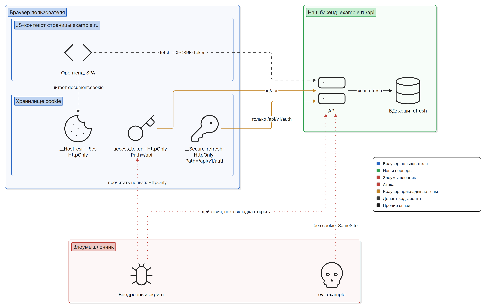
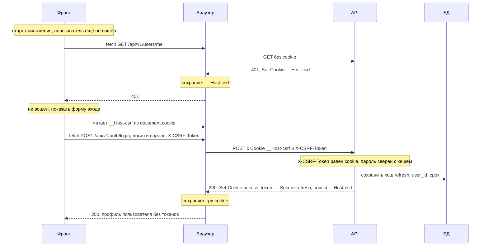
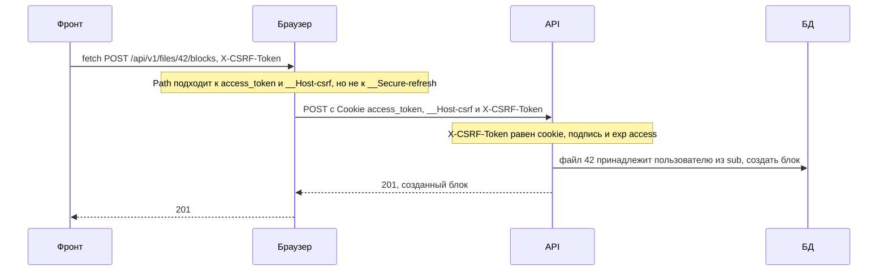
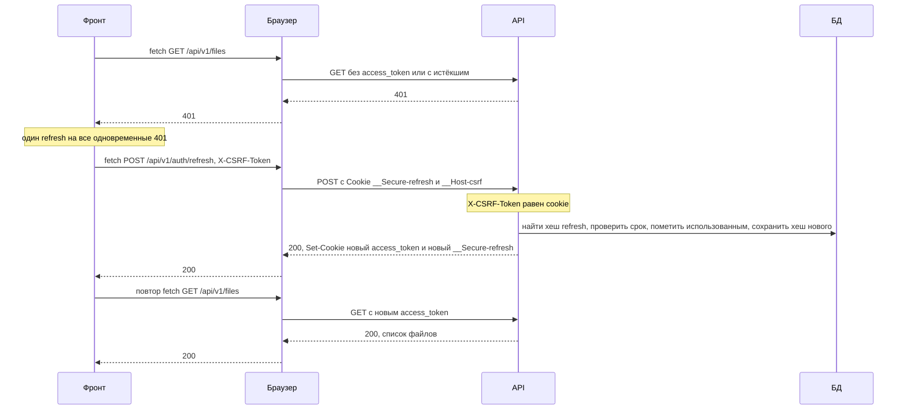
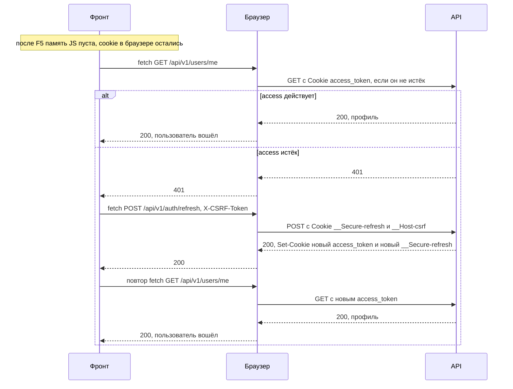
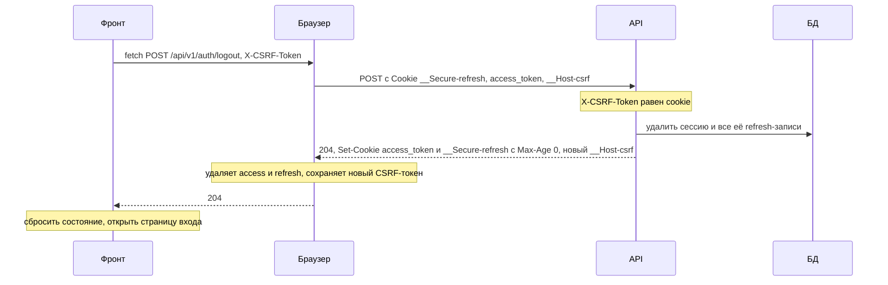
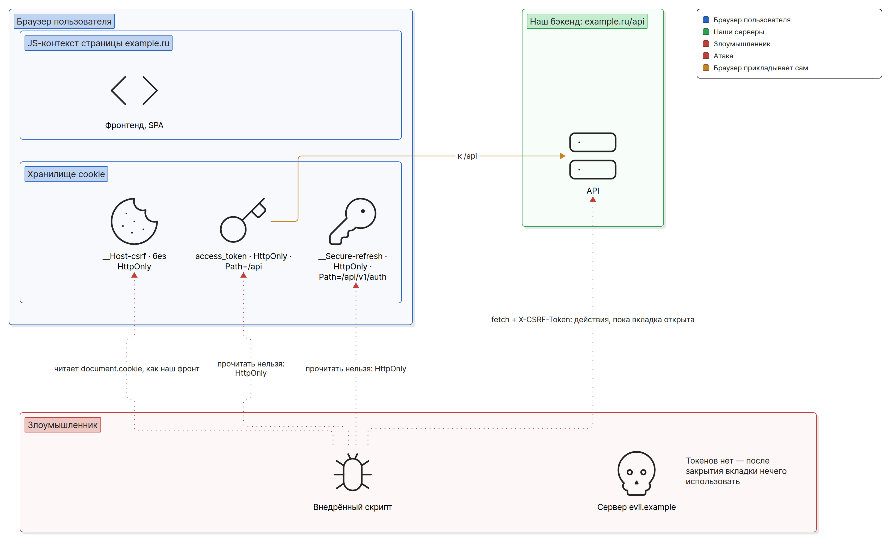

# Вариант A: access и refresh в HttpOnly-cookie + CSRF

Рекомендуемый вариант РК1. Оба токена живут в cookie с `HttpOnly`: код фронта их не видит и не
хранит, браузер сам прикладывает их к запросам. Цена — обязательная CSRF-защита: раз браузер
прикладывает cookie сам, он приложит их и к запросу, который начал чужой сайт.

Понятия, на которых всё держится (флаги cookie, site и origin, зачем пара токенов), разобраны в
[basics.md](basics.md); здесь они только применяются.

## Схема

Фронт и API отдаются с одного origin `https://example.ru`: статика — с `/`, API — с `/api/`
через reverse proxy (как это настроить — [cors.md](cors.md#когда-cors-не-нужен)). При входе
сервер ставит три cookie: короткий access-токен, который уходит на все ручки `/api`; долгий
refresh-токен, который уходит только на ручки `/api/v1/auth`; и CSRF-токен без `HttpOnly`,
который фронт читает и повторяет в заголовке `X-CSRF-Token` каждого изменяющего запроса. Access —
подписанный JWT, сервер проверяет его без обращения к БД. Refresh — случайная строка, в БД лежит
её хеш, поэтому refresh можно отозвать сразу. Внедрённый скрипт (XSS) не может прочитать ни
access, ни refresh, но может слать запросы из открытой вкладки. Чужой сайт не получает ни cookie,
ни CSRF-токена и ничего не может сделать от имени пользователя.



## Cookie

| Имя | Что внутри | `HttpOnly` | `Secure` | `SameSite` | `Path` | Срок жизни |
|---|---|---|---|---|---|---|
| `access_token` | JWT: `sub` (id пользователя), `exp` | да | да | `Lax` | `/api` | `Max-Age=900` — не больше 15 минут, как `exp` в токене |
| `__Secure-refresh` | случайная строка, не меньше 128 бит | да | да | `Lax` | `/api/v1/auth` | срок жизни сессии, например `Max-Age=2592000` (30 дней) |
| `__Host-csrf` | случайная строка, не меньше 128 бит | **нет** — фронт её читает | да | `Lax` | `/` (требует префикс) | как у refresh |

Те же cookie в заголовках ответа на вход:

```http
Set-Cookie: access_token={jwt}; HttpOnly; Secure; SameSite=Lax; Path=/api; Max-Age=900
Set-Cookie: __Secure-refresh={refresh}; HttpOnly; Secure; SameSite=Lax; Path=/api/v1/auth; Max-Age=2592000
Set-Cookie: __Host-csrf={csrf}; Secure; SameSite=Lax; Path=/; Max-Age=2592000
```

Почему так:

- **`Path=/api` у access.** HTML и статика с `/` идут без токена — он нужен только API.
- **`Path=/api/v1/auth` у refresh.** Долгий токен уходит только на ручки продления и выхода
  (`/api/v1/auth/refresh`, `/api/v1/auth/logout`), а не с каждым запросом к API. Это экономия
  и сужение, а не граница безопасности
  (оговорки — [basics.md](basics.md#флаги-cookie)).
- **Префикс `__Secure-` у refresh, `__Host-` у CSRF.** `__Host-` требует `Path=/`, поэтому для
  refresh с узким `Path` подходит только `__Secure-`
  ([basics.md](basics.md#префиксы-__host--и-__secure-)). У CSRF-cookie `__Host-` не даёт
  поддомену подложить свой токен (cookie tossing). К access префикс `__Secure-` тоже можно
  добавить; в примерах РК1 его нет, чтобы имя было короче.
- **Без `Domain` у всех трёх.** Cookie остаётся у хоста `example.ru` и не уходит поддоменам.
- **`Secure` и `localhost`.** По MDN требование `https:` для `Secure` не действует, если cookie
  ставит `localhost`, поэтому флаг обычно не мешает локальной разработке. Если какой-то браузер
  всё же не сохраняет cookie на `http://localhost`, включите HTTPS у dev-сервера, а не убирайте
  флаги.
- **`SameSite=Lax` или `Strict`.** Минимум допускает оба. `Strict` у авторизационных cookie —
  опция «по желанию» ([csrf.md](csrf.md#по-желанию)).

### Если API на отдельном origin

Если фронт на `https://example.ru`, а API на `https://api.example.ru`, схема та же, но меняются
две вещи:

- **Нужен CORS с credentials:** точный origin фронта в белом списке, `credentials: 'include'`
  в каждом запросе, `X-CSRF-Token` в `Access-Control-Allow-Headers`
  ([cors.md](cors.md#credentials-точный-origin-и-credentials-include)). `SameSite` cookie не
  помешает: `example.ru` и `api.example.ru` — один site.
- **Фронт не прочитает `__Host-csrf` из `document.cookie`.** Cookie без `Domain` принадлежит
  хосту `api.example.ru`, а `document.cookie` на странице `example.ru` показывает только cookie,
  которые подходят к хосту и пути самой страницы. Поэтому `ensureCSRFCookie` (раздел
  [«Бэк»](#бэк)) на каждом ответе кладёт текущее значение токена ещё и в заголовок ответа
  `X-CSRF-Token`: из cookie запроса или только что выданное, а после входа и выхода обработчик
  ставит туда новое. Сервер перечисляет этот заголовок в `Access-Control-Expose-Headers`
  ([cors.md](cors.md#expose-headers-какие-заголовки-ответа-видит-js)). Фронт держит последнее
  увиденное значение в памяти; после перезагрузки его вернёт стартовый `GET /api/v1/users/me`.
  Прочитать заголовок может только origin из белого списка CORS — так же, как тело любого
  ответа API. Проверка на бэке не меняется: заголовок запроса сравнивается с cookie.

Дальше в файле — вариант с одним origin.

## Потоки

Во всех диаграммах `Фронт` — код SPA, `Браузер` — сетевой слой и хранилище cookie. Токены
ходят только между браузером и API, код фронта их не видит.

### Вход

Регистрация устроена так же: если после неё пользователь сразу входит, `POST
/api/v1/auth/register` ставит те же три cookie.



CSRF-cookie нужна ещё до входа: `POST /api/v1/auth/login` — изменяющий запрос, и Double
Submit проверяет его так же, как остальные. Её ставит middleware `ensureCSRFCookie` на любой
ответ API, если в запросе cookie ещё нет, — даже на `401`, как здесь. Отдельная ручка за
токеном не нужна: это лишний запрос и лишний шаг на фронте, а стартовый запрос всё равно есть.
Если cookie всё же не оказалось (её удалили в другой вкладке), вход ответит `403`, но этот же
ответ принесёт новую cookie — фронт один раз повторяет запрос. После входа сервер выдаёт новый
CSRF-токен («новый __Host-csrf» в диаграмме): токен, полученный до входа, не переживает смену
пользователя. В требованиях это опция «по желанию» («Новый CSRF-токен при login, refresh,
logout»), в варианте A делаем её при входе и выходе всегда — это одна строка. Проверка
`Origin` / `Sec-Fetch-Site` на login, register, refresh — второй слой (настойчиво
рекомендуется).

### Обычный запрос



`GET` идёт так же, только без `X-CSRF-Token`: сервер его не проверяет, поэтому `GET` не должен
менять данные.

### Истёк access: refresh и повтор



Детали:

- Через 15 минут (`Max-Age=900`) браузер сам удаляет `access_token`, поэтому запрос может
  прийти вообще без него. Для сервера это тот же случай: `401`.
- **Один refresh на всех.** Если страница отправила пять запросов и все получили `401`, фронт
  делает один `POST /api/v1/auth/refresh`, а остальные запросы ждут его и повторяются после.
  Пять параллельных refresh — лишняя нагрузка, а с ротацией (ниже) — ложная тревога о краже.
- **Refresh не удался (`401`)** — сессии нет: фронт показывает страницу входа. Запрос на
  `/api/v1/auth/refresh` после `401` не повторяется, иначе выйдет бесконечный цикл.
- **Ротация refresh — хорошая практика (в требованиях РК1 её нет).** Каждый успешный refresh
  выдаёт новый refresh-токен. Старый сервер не удаляет, а помечает использованным и оставляет
  привязанным к той же сессии (`session_id`), рядом сохраняет хеш нового. Если использованный
  токен пришёл повторно, его, скорее всего, украли: сервер отзывает всю сессию, и пользователь
  входит заново. Несколько
  вкладок могут отправить refresh почти одновременно; чтобы это не выглядело как кража, сервер
  может несколько секунд принимать только что заменённый токен.

### Перезагрузка страницы



Фронт ничего не хранит, чтобы «пережить F5»: состояние «вошёл» он узнаёт у сервера через
`GET /api/v1/users/me`. CSRF-токен после перезагрузки он заново читает из `document.cookie`.
Если refresh тоже не удался — показывает страницу входа.

### Выход



Logout завершает сессию **на сервере**: записи refresh удалены, и старый refresh-токен больше не
продлит сессию, даже если его скопировали. Только почистить cookie — нарушение минимума.
`__Host-csrf` logout не стирает, а заменяет новым анонимным токеном: следующий вход сразу
пройдёт Double Submit.

Access-токен до своего `exp` формально остаётся валидным: сервер проверяет его по подписи и не
знает о выходе. Это и есть «отзыв access — по истечении TTL» из сравнения вариантов; поэтому
access живёт не больше 15 минут. Ручка logout находит сессию по refresh-cookie и не требует
живого access: выйти можно и через час простоя.

## Что делает бэк, что делает фронт

### Бэк

Ручки:

| Ручка | Что делает |
|---|---|
| `POST /api/v1/auth/register`, `POST /api/v1/auth/login` | проверяет данные, при успехе ставит три cookie, сохраняет хеш refresh |
| `POST /api/v1/auth/refresh` | проверяет refresh по хешу в БД, выдаёт новые access и refresh; старый помечает использованным, повтор использованного — отзыв всей сессии |
| `POST /api/v1/auth/logout` | удаляет сессию и её refresh-записи, стирает access и refresh, ставит новый `__Host-csrf` |
| `GET /api/v1/users/me` | профиль текущего пользователя по access |

Порядок middleware: CORS (если API на другом origin) → `ensureCSRFCookie` на всех ручках API →
CSRF на `POST`, `PUT`, `PATCH`, `DELETE` → проверка access на защищённых ручках → обработчик,
который проверяет владельца ресурса ([access-control.md](access-control.md)). `ensureCSRFCookie`
стоит раньше проверок, поэтому cookie приходит и с ответом `401`, `403` или `404`.

- **Access.** JWT с `sub` и `exp`, подпись проверяется на каждом запросе, алгоритм зафиксирован,
  ключ — в переменной окружения ([basics.md](basics.md#подпись-не-шифрует)). Нет cookie,
  неверная подпись или истёк `exp` — `401`.
- **Refresh.** Случайная строка из криптостойкого генератора. В БД — не сам токен, а его хеш
  (SHA-256 достаточно: токен случайный и длинный, подбирать его по хешу бессмысленно, в отличие
  от пароля), `user_id`, `session_id`, срок и отметка «использован» для ротации. Утечка
  таблицы тогда не даёт рабочих токенов.
- **Срок сессии.** У новой refresh-cookie при ротации можно оставить исходный срок сессии, а не
  продлевать его заново: тогда сессия не живёт вечно, даже если пользователь заходит каждый
  день.
- **CSRF.** Отказ — `403`, не `401`: на `401` фронт делает refresh и повторяет запрос, а
  отказ CSRF-проверки так зациклится.
- **Удаление cookie.** `Set-Cookie` с тем же именем, тем же `Path` и `Max-Age=0`. Cookie с
  префиксом браузер примет, только если выполнены условия префикса, поэтому `Secure` (а у
  `__Host-` ещё и `Path=/`) нужен и в стирающем заголовке. С другим `Path` стирающий заголовок
  не совпадёт ни с одной cookie: браузер ничего не удалит, и старая останется.

Пример на Go (`net/http`):

```go
func setAuthCookies(w http.ResponseWriter, access, refresh, csrf string) {
	http.SetCookie(w, &http.Cookie{
		Name: "access_token", Value: access, Path: "/api", MaxAge: 15 * 60,
		HttpOnly: true, Secure: true, SameSite: http.SameSiteLaxMode,
	})
	http.SetCookie(w, &http.Cookie{
		Name: "__Secure-refresh", Value: refresh, Path: "/api/v1/auth", MaxAge: 30 * 24 * 60 * 60,
		HttpOnly: true, Secure: true, SameSite: http.SameSiteLaxMode,
	})
	http.SetCookie(w, &http.Cookie{
		Name: "__Host-csrf", Value: csrf, Path: "/", MaxAge: 30 * 24 * 60 * 60,
		Secure: true, SameSite: http.SameSiteLaxMode, // без HttpOnly: фронт читает
	})
}

func newToken() string {
	b := make([]byte, 32) // 256 бит
	if _, err := rand.Read(b); err != nil { // crypto/rand
		panic(err)
	}
	return base64.RawURLEncoding.EncodeToString(b)
}

func ensureCSRFCookie(next http.Handler) http.Handler {
	return http.HandlerFunc(func(w http.ResponseWriter, r *http.Request) {
		if _, err := r.Cookie("__Host-csrf"); err != nil && r.Method != http.MethodOptions {
			http.SetCookie(w, &http.Cookie{
				Name: "__Host-csrf", Value: newToken(), Path: "/", MaxAge: 30 * 24 * 60 * 60,
				Secure: true, SameSite: http.SameSiteLaxMode, // без HttpOnly: фронт читает
			})
		}
		next.ServeHTTP(w, r)
	})
}

func csrfMiddleware(next http.Handler) http.Handler {
	return http.HandlerFunc(func(w http.ResponseWriter, r *http.Request) {
		switch r.Method {
		case http.MethodPost, http.MethodPut, http.MethodPatch, http.MethodDelete:
			c, err := r.Cookie("__Host-csrf")
			h := r.Header.Get("X-CSRF-Token")
			if err != nil || h == "" || subtle.ConstantTimeCompare([]byte(c.Value), []byte(h)) != 1 {
				http.Error(w, "csrf token mismatch", http.StatusForbidden)
				return
			}
		}
		next.ServeHTTP(w, r)
	})
}
```

Ловушка Go: чтобы стереть cookie, нужен `MaxAge: -1` — он даёт `Max-Age=0` в заголовке.
`MaxAge: 0` в структуре означает «атрибута нет», и cookie станет сессионной, а не удалится.

### Фронт

- **Токенов не касается.** Ни access, ни refresh код фронта не видит, в `localStorage`,
  `sessionStorage` и стор ничего не кладёт.
- **Одна обёртка над `fetch`** для всех запросов к API: `credentials: 'include'` (при одном
  origin cookie уходят и без него, но с ним обёртка работает и при отдельном API), заголовки
  `Content-Type: application/json` и `X-CSRF-Token` на изменяющих методах, один refresh на все
  `401` и повтор запроса.
- **`403` — не повод для refresh.** Это отказ CSRF-проверки или доступа: показать ошибку.
  Исключение — вход без CSRF-cookie: его повторяют один раз ([«Вход»](#вход)).
- **Состояние «вошёл»** — из ответа `GET /api/v1/users/me` при старте приложения.

```js
let refreshing = null;

function csrfToken() {
  const row = document.cookie.split('; ').find((c) => c.startsWith('__Host-csrf='));
  return row ? row.slice('__Host-csrf='.length) : '';
}

function refreshOnce() {
  // Все одновременные 401 ждут один и тот же запрос.
  refreshing ??= fetch('/api/v1/auth/refresh', {
    method: 'POST',
    credentials: 'include',
    headers: { 'Content-Type': 'application/json', 'X-CSRF-Token': csrfToken() },
  }).finally(() => {
    refreshing = null;
  });
  return refreshing;
}

export async function api(path, options = {}) {
  const method = (options.method ?? 'GET').toUpperCase();
  const send = () => {
    const headers = { ...options.headers };
    if (!['GET', 'HEAD'].includes(method)) {
      // У FormData заголовок с boundary ставит браузер.
      if (!(options.body instanceof FormData)) headers['Content-Type'] ??= 'application/json';
      headers['X-CSRF-Token'] = csrfToken();
    }
    return fetch(path, { ...options, headers, credentials: 'include' });
  };

  let res = await send();
  if (res.status === 401 && !path.startsWith('/api/v1/auth/')) {
    const refreshed = await refreshOnce();
    if (!refreshed.ok) {
      onSessionLost(); // своя функция: сбросить состояние, открыть страницу входа
      return res;
    }
    res = await send(); // повтор с новым access
  }
  return res;
}
```

Ручки `/api/v1/auth/...` обёртка после `401` не продлевает: `401` на входе — неверный пароль, а
`401` на refresh — конец сессии.

`Content-Type: application/json` обёртка ставит на всех изменяющих методах, кроме загрузки файлов
через `FormData` — для таких ручек сервер осознанно принимает `multipart/form-data` (см.
[csrf.md, «только JSON» и исключение](csrf.md#настойчиво-рекомендуется)), — и у `logout` без
тела: если сервер принимает на изменяющих ручках только JSON (настойчиво рекомендуется), запрос
без этого заголовка он отклонит.

## Что может XSS и что может CSRF



| Атака | Что может | Что не может | Чем закрыто |
|---|---|---|---|
| XSS на `example.ru` | слать запросы к API из открытой вкладки: браузер приложит cookie, а CSRF-токен скрипт прочитает из `document.cookie` так же, как наш фронт | прочитать access и refresh; пользоваться сессией после закрытия вкладки | `HttpOnly` ограничивает ущерб; сама защита от XSS — тема следующих РК |
| CSRF с `evil.example` | отправить форму или `fetch` на наш API | приложить cookie: с `SameSite=Lax` браузер не отправит их на межсайтовый `POST` и `fetch`; прочитать или поставить `__Host-csrf` для `example.ru` | `SameSite`, Double Submit (`403` без верного `X-CSRF-Token`) |
| Скрипт на поддомене `avatars.example.ru` | запрос к `example.ru` — same-site, `SameSite` cookie пропустит | прочитать `__Host-csrf`: она принадлежит только хосту `example.ru`; подложить свою CSRF-cookie для `example.ru` | Double Submit и префикс `__Host-`; подпись токена — по желанию |
| Login CSRF с `evil.example` | отправить форму входа с логином и паролем злоумышленника, чтобы жертва работала в его аккаунте и сохраняла туда свои данные | пройти Double Submit: CSRF-токена у чужого сайта нет | Double Submit на `POST /api/v1/auth/login`; проверка `Origin` / `Sec-Fetch-Site` на login, register, refresh |

Главное: CSRF-защита не спасает от XSS на нашем origin. Скрипт на странице делает всё, что делает
наш фронт, включая чтение CSRF-cookie. `HttpOnly` не останавливает действия, а не даёт унести
токены: без открытой вкладки у злоумышленника ничего нет
([basics.md](basics.md#где-можно-хранить-токен)).

### CSRF-защита в варианте A

Подробный разбор — в [csrf.md](csrf.md). Коротко, что требуется.

**Минимум** — Double Submit Cookie:

- токен генерирует сервер криптостойким генератором, не меньше 128 бит;
- CSRF-cookie без `HttpOnly`; фронт отправляет её значение в заголовке `X-CSRF-Token`;
- проверка на POST, PUT, PATCH, DELETE; отказ — 403 (не 401: на 401 фронт делает refresh и повторяет запрос);
- GET не меняет данные;
- авторизационные cookie с `SameSite=Lax` или `Strict`.

**Настойчиво рекомендуется** (ожидается для хорошей оценки):

- Префикс `__Host-` у CSRF-cookie (`Secure`, `Path=/`, без `Domain`)
- Проверка `Origin` / `Sec-Fetch-Site` на login, register, refresh
- Только `Content-Type: application/json` на изменяющих ручках
- Сравнение за постоянное время (`hmac.Equal`, `subtle.ConstantTimeCompare`)

**По желанию:**

- Подпись токена HMAC с привязкой к пользователю или сессии
- Проверка `Origin` / `Sec-Fetch-Site` на всех изменяющих запросах
- Новый CSRF-токен при login, refresh, logout (в варианте A — при входе и выходе всегда)
- `SameSite=Strict` у авторизационных cookie
- Нет пользовательского HTML/SVG на поддоменах (`Content-Type` загрузок, CSP)

Примеры кода выше уже закрывают минимум и часть рекомендуемого: `__Host-` и сравнение за
постоянное время. Проверку `Origin` и `Content-Type` добавьте сами.

## Плюсы и минусы

Плюсы:

- **Токены недоступны JS.** XSS не унесёт ни access, ни refresh — только действует через
  открытую вкладку, пока она открыта.
- **Перезагрузка и новая вкладка работают без хранилищ в JS**: cookie остаются в браузере,
  сессию продлевает refresh.
- **Refresh отзывается сразу**: logout удаляет его сессию в БД.
- **Access проверяется без БД** — по подписи, на каждом запросе.
- **Фронту не нужно управлять токенами**: ни хранить, ни подставлять `Authorization`.

Минусы:

- **CSRF-защита обязательна** — на каждой изменяющей ручке, и её легко сломать: забыть ручку,
  ответить `401` вместо `403`, менять данные на `GET`.
- **После logout access живёт до `exp`** — до 15 минут. Мгновенный отзыв всего — в варианте C
  ([variant-c.md](variant-c.md)).
- **Refresh и повтор запроса на фронте** — та же логика, что в варианте B.
- **Привязка к cookie браузера.** С отдельным origin API нужны CORS с credentials и CSRF-токен в
  теле ответа; клиентам без браузера (мобильное приложение, скрипт) cookie неудобны.

Сравнение с вариантами B и C — в [README.md](README.md#варианты-сессии).

## Источники

- MDN: [Set-Cookie](https://developer.mozilla.org/en-US/docs/Web/HTTP/Reference/Headers/Set-Cookie) —
  `HttpOnly`, `Secure` и `localhost`, `SameSite`, `Path`, `Max-Age=0` удаляет cookie, префиксы
  `__Host-` и `__Secure-`;
  [Using HTTP cookies](https://developer.mozilla.org/en-US/docs/Web/HTTP/Guides/Cookies)
- MDN: [Document: cookie](https://developer.mozilla.org/en-US/docs/Web/API/Document/cookie) —
  что видит JS, недоступность `HttpOnly`-cookie
- MDN: [RequestInit: credentials](https://developer.mozilla.org/en-US/docs/Web/API/RequestInit#credentials),
  [401 Unauthorized](https://developer.mozilla.org/en-US/docs/Web/HTTP/Reference/Status/401),
  [403 Forbidden](https://developer.mozilla.org/en-US/docs/Web/HTTP/Reference/Status/403)
- [RFC 6265bis (draft-ietf-httpbis-rfc6265bis)](https://datatracker.ietf.org/doc/draft-ietf-httpbis-rfc6265bis/) —
  host-only cookie без `Domain`, сопоставление по `Path`, `SameSite`, проверка префиксов при
  каждой установке, замена cookie с тем же именем, хостом и путём
- [Fetch Standard: CORS protocol](https://fetch.spec.whatwg.org/#http-cors-protocol) —
  credentials при API на отдельном origin
- OWASP: [Cross-Site Request Forgery Prevention Cheat Sheet](https://cheatsheetseries.owasp.org/cheatsheets/Cross-Site_Request_Forgery_Prevention_Cheat_Sheet.html) —
  Double Submit Cookie, токен в своём заголовке, login CSRF, Fetch Metadata
- OWASP: [Session Management Cheat Sheet](https://cheatsheetseries.owasp.org/cheatsheets/Session_Management_Cheat_Sheet.html) —
  атрибуты cookie, абсолютный срок сессии, завершение сессии на сервере при logout
- OWASP: [JSON Web Token Cheat Sheet](https://cheatsheetseries.owasp.org/cheatsheets/JSON_Web_Token_Cheat_Sheet.html) —
  короткий срок access, отзыв
- [RFC 9700: Best Current Practice for OAuth 2.0 Security, §4.14](https://www.rfc-editor.org/rfc/rfc9700#section-4.14) —
  ротация refresh-токена и обнаружение повторного использования
