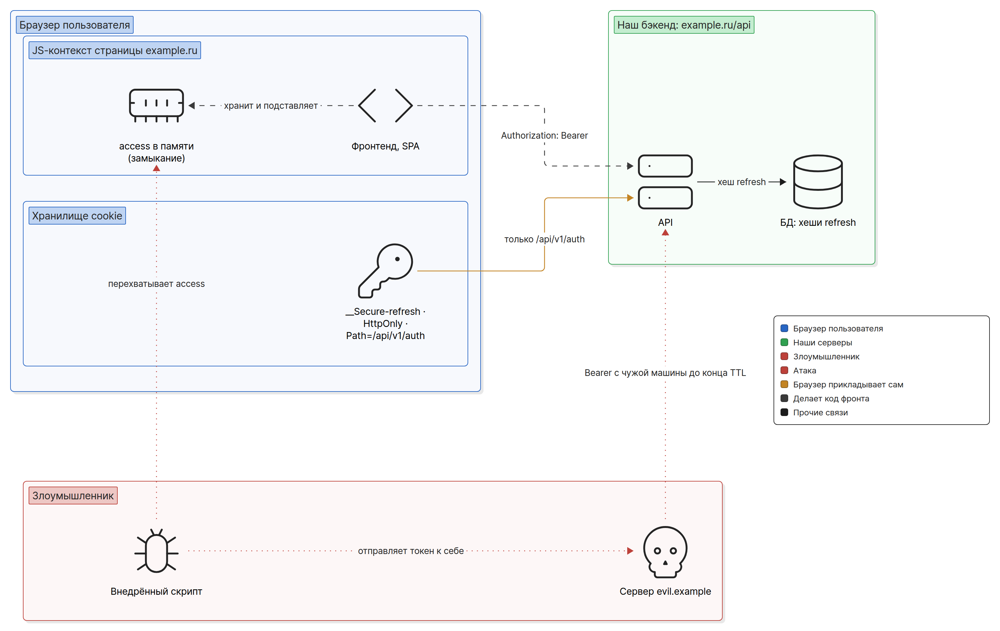
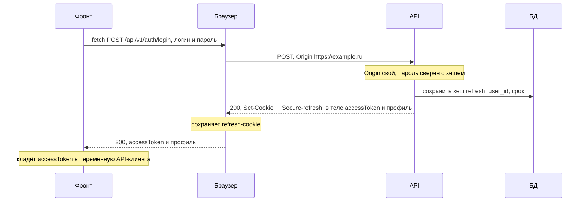
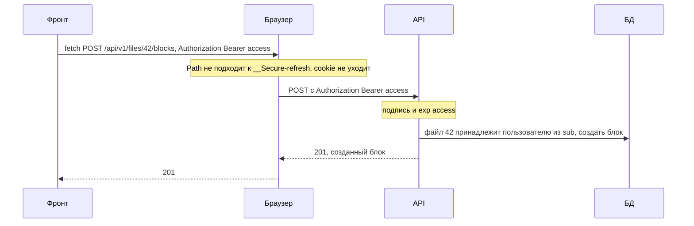
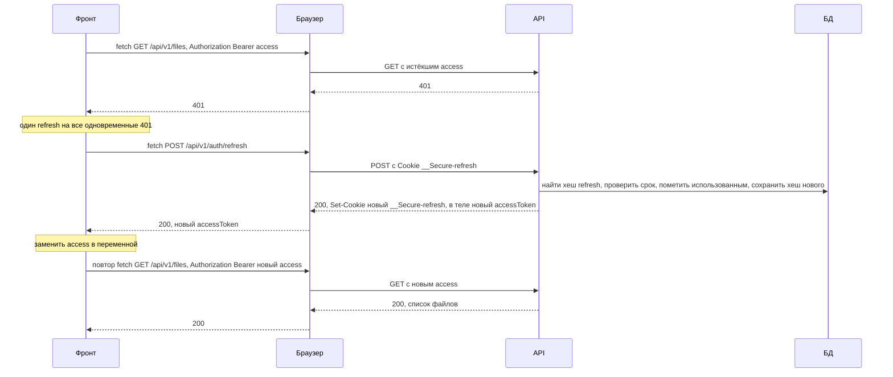
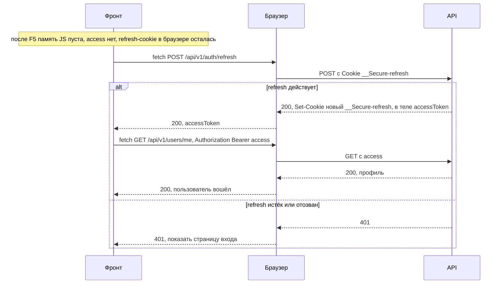
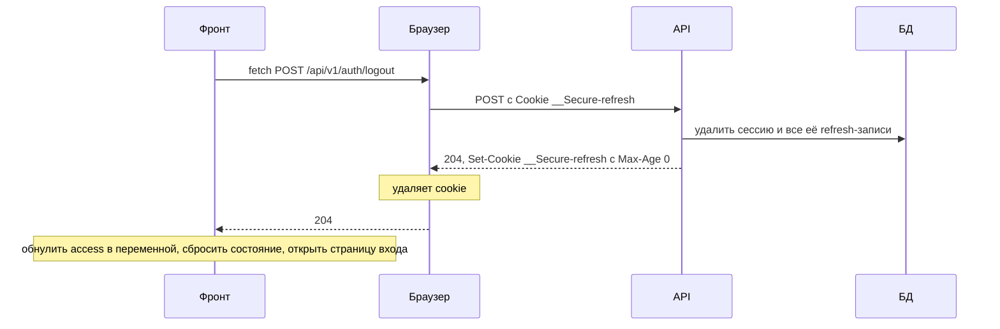

# Вариант B: access (Bearer) в памяти JS + refresh в HttpOnly-cookie

Допустимый, но не рекомендуемый вариант РК1. Короткий access-токен фронт держит в переменной
JS и сам ставит в заголовок `Authorization: Bearer ...` каждого запроса к API. Долгий
refresh-токен живёт в `HttpOnly`-cookie, код фронта его не видит. Плюс варианта — запросам к
API не нужна CSRF-защита: заголовок `Authorization` браузер сам не приложит. Минус — при XSS
внедрённый скрипт может унести access-токен и пользоваться им со своей машины до конца срока
жизни. Почему из-за этого вариант не рекомендуется — в разделе
[«Почему B не рекомендуется»](#почему-b-не-рекомендуется-access-в-памяти-и-xss).

Понятия (флаги cookie, site и origin, зачем пара токенов, где можно хранить токен) разобраны в
[basics.md](basics.md); здесь они только применяются. Структура файла та же, что у
[variant-a.md](variant-a.md), — удобно сравнивать раздел с разделом.

## Схема

Фронт и API отдаются с одного origin `https://example.ru`: статика — с `/`, API — с `/api/`
через reverse proxy ([cors.md](cors.md#когда-cors-не-нужен)). При входе сервер возвращает
access-токен в теле ответа, а refresh-токен ставит в cookie, которая уходит только на ручки
`/api/v1/auth`. Фронт кладёт access в переменную модуля API-клиента и подставляет его в
`Authorization` каждого запроса. Access — подписанный JWT, сервер проверяет его без обращения к
БД. Refresh — случайная строка, в БД лежит её хеш, поэтому refresh можно отозвать сразу. После
перезагрузки страницы память JS пуста, и фронт получает новый access по refresh-cookie.
Внедрённый скрипт (XSS) не прочитает refresh, но может перехватить access и отправить его к себе
— дальше злоумышленник ходит в API со своей машины, пока токен не истечёт.



## Cookie

Cookie одна — refresh. Access-токен в cookie не кладётся вообще.

| Имя | Что внутри | `HttpOnly` | `Secure` | `SameSite` | `Path` | Срок жизни |
|---|---|---|---|---|---|---|
| `__Secure-refresh` | случайная строка, не меньше 128 бит | да | да | `Lax` | `/api/v1/auth` | срок жизни сессии, например `Max-Age=2592000` (30 дней) |

Access-токен — JWT с `sub` и `exp`, живёт не больше 15 минут. Хранится только в памяти вкладки:
в замыкании или переменной модуля API-клиента.

Ответ на вход:

```http
HTTP/1.1 200 OK
Set-Cookie: __Secure-refresh={refresh}; HttpOnly; Secure; SameSite=Lax; Path=/api/v1/auth; Max-Age=2592000
Content-Type: application/json
Cache-Control: no-store

{"accessToken": "{jwt}", "expiresIn": 900, "user": {"id": 42, "login": "alice"}}
```

Почему так:

- **`Path=/api/v1/auth` у refresh.** Долгий токен уходит только на ручки продления и выхода
  (`/api/v1/auth/refresh`, `/api/v1/auth/logout`), а не с каждым запросом к API. Это экономия
  и сужение, а не граница безопасности ([basics.md](basics.md#флаги-cookie)).
- **Префикс `__Secure-`, а не `__Host-`.** `__Host-` требует `Path=/`, поэтому для cookie с
  узким `Path` подходит только `__Secure-`
  ([basics.md](basics.md#префиксы-__host--и-__secure-)).
- **`SameSite=Lax` или `Strict`.** Минимум допускает оба. Именно `SameSite` и узкий `Path`
  закрывают единственную cookie варианта от CSRF (раздел
  [«Что может XSS и что может CSRF»](#что-может-xss-и-что-может-csrf)).
- **CSRF-cookie нет.** Double Submit в варианте B не нужен: запросы к API несут токен в
  заголовке, который ставит наш код, а не браузер.
- **`Cache-Control: no-store`** у ответов с access-токеном: тело с токеном не должно оседать в
  кешах.

### Если API на отдельном origin

Если фронт на `https://example.ru`, а API на `https://api.example.ru`, добавляется CORS
([cors.md](cors.md#credentials-точный-origin-и-credentials-include)):

- **Preflight на каждый запрос с `Authorization`.** Заголовок `Authorization` не входит в
  безопасный список, поэтому браузер сначала отправляет `OPTIONS`. Бэк перечисляет
  `Authorization` в `Access-Control-Allow-Headers` явно: `*` его не покрывает.
- **Ручки `/api/v1/auth/...` — с `credentials: 'include'`.** На login, register, refresh и
  logout фронт отправляет запрос с cookie, иначе браузер не сохранит refresh-cookie из ответа и
  не приложит её к refresh. Бэк отвечает `Access-Control-Allow-Credentials: true` и точным
  origin в `Access-Control-Allow-Origin`. `SameSite` не помешает: `example.ru` и
  `api.example.ru` — один site ([basics.md](basics.md#site-и-origin)). Запросам с Bearer
  cookie не нужны.
- **Как фронт прочитает access из ответа.** Если сервер отдаёт токен в теле JSON, как здесь,
  ничего добавлять не нужно. Если в заголовке ответа (например, `Authorization`), то без
  `Access-Control-Expose-Headers: Authorization` фронт на другом origin получит `null` из
  `res.headers.get('Authorization')`
  ([cors.md](cors.md#expose-headers-какие-заголовки-ответа-видит-js)). При одном origin
  `Expose-Headers` не нужен: браузер фильтрует так только ответы на запросы к другому origin.

Дальше в файле — вариант с одним origin.

## Потоки

Во всех диаграммах `Фронт` — код SPA вместе с переменной, где лежит access, `Браузер` — сетевой
слой и хранилище cookie. Access ходит между фронтом и API в теле ответа и в заголовке запроса,
refresh — только между браузером и API.

### Вход

Регистрация устроена так же: если после неё пользователь сразу входит, `POST
/api/v1/auth/register` возвращает access и ставит refresh-cookie.



CSRF-токена здесь нет: в варианте B он не обязателен. Но проверка `Origin` / `Sec-Fetch-Site`
на login, register и refresh настойчиво рекомендуется: без неё возможен login CSRF (разбор — в
разделе [«Что может XSS и что может CSRF»](#что-может-xss-и-что-может-csrf)).

### Обычный запрос



`GET` идёт так же. Никаких cookie в запросах к API нет: токен в заголовке поставил наш код.

### Истёк access: refresh и повтор



Детали — как в варианте A
([variant-a.md](variant-a.md#истёк-access-refresh-и-повтор)):

- **Один refresh на всех.** Пять запросов получили `401` — фронт делает один
  `POST /api/v1/auth/refresh`, остальные ждут его и повторяются после.
- **Refresh не удался (`401`)** — сессии нет: фронт обнуляет access и показывает страницу
  входа. Запрос на `/api/v1/auth/refresh` после `401` не повторяется.
- **Ротация refresh — хорошая практика (в требованиях РК1 её нет)**: старый токен помечается
  использованным, его повтор — признак кражи, сервер отзывает всю сессию.
- **Можно не ждать `401`.** Фронт знает `expiresIn` и может обновить access заранее, за минуту
  до истечения. Обработка `401` всё равно нужна: часы, сон ноутбука, отзыв на сервере.

### Перезагрузка страницы



Это главное отличие от варианта A: после F5 и в каждой новой вкладке access нет — память JS
своя у каждой вкладки и пропадает при перезагрузке. Поэтому при старте приложения фронт сначала
вызывает refresh и только потом запрашивает профиль. Класть access в `localStorage` или
`sessionStorage`, «чтобы пережить F5», — нарушение минимума: для этого и есть refresh-cookie.

Несколько вкладок стартуют независимо и каждая делает свой refresh. Cookie у вкладок общие, так
что refresh-запросы один за другим проходят спокойно. Повтором использованного токена при ротации
выглядят только почти одновременные: обе вкладки успели отправить старую cookie, пока браузер не
сохранил новую. Как с этим жить — в [variant-a.md](variant-a.md#истёк-access-refresh-и-повтор)
(короткое окно для только что заменённого токена).

### Выход



Logout завершает сессию **на сервере**: refresh-записи удалены, и старый refresh-токен больше не
продлит сессию. Только обнулить переменную на фронте — нарушение минимума: refresh-cookie
осталась бы, и следующий старт приложения молча вошёл бы снова.

Access-токен до своего `exp` остаётся валидным: сервер проверяет его по подписи и о выходе не
знает. Это «отзыв access — по истечении TTL», как в варианте A. В варианте B это важнее: если
access унесли до выхода, злоумышленник пользуется им и после logout, пока не наступит `exp`.

## Что делает бэк, что делает фронт

### Бэк

Ручки:

| Ручка | Что делает |
|---|---|
| `POST /api/v1/auth/register`, `POST /api/v1/auth/login` | проверяет данные; при успехе ставит refresh-cookie, сохраняет её хеш, в теле отдаёт `accessToken`, `expiresIn` и профиль |
| `POST /api/v1/auth/refresh` | проверяет refresh по хешу в БД, ставит новую refresh-cookie, в теле отдаёт новый `accessToken`; старый refresh помечает использованным, повтор использованного — отзыв всей сессии |
| `POST /api/v1/auth/logout` | находит сессию по refresh-cookie, удаляет её и её refresh-записи, стирает cookie |
| `GET /api/v1/users/me` | профиль текущего пользователя по access из `Authorization` |

Порядок middleware: CORS (если API на другом origin) → проверка `Origin` / `Sec-Fetch-Site` на
login, register, refresh (настойчиво рекомендуется) → проверка `Authorization: Bearer` на
защищённых ручках → обработчик, который проверяет владельца ресурса ([access-control.md](access-control.md)).

- **Access.** JWT с `sub` и `exp` (не больше 15 минут), подпись проверяется на каждом запросе,
  алгоритм зафиксирован, ключ — в переменной окружения
  ([basics.md](basics.md#подпись-не-шифрует)). Нет заголовка, неверная подпись или истёк
  `exp` — `401`.
- **Access берётся только из заголовка `Authorization`.** Не из cookie и не из параметра URL:
  адреса попадают в логи сервера, прокси и историю браузера.
- **Refresh** — как в варианте A: случайная строка из криптостойкого генератора, в БД — хеш,
  `user_id`, `session_id`, срок и отметка «использован».
- **Удаление cookie.** `Set-Cookie` с тем же именем, тем же `Path=/api/v1/auth`, с `Secure` и
  `Max-Age=0`. С другим `Path` браузер ничего не удалит
  ([variant-a.md](variant-a.md#бэк) — там же ловушка Go с `MaxAge: -1`).
- **CSRF-токен не обязателен** (минимум требует CSRF-защиту только в вариантах A и C). На
  login, register и refresh настойчиво рекомендуется проверка `Origin` / `Sec-Fetch-Site`:
  браузер ставит `Origin` на любой `POST`, и у своего фронта он равен `https://example.ru`.
  Отказ — `403`, не `401`: на `401` фронт делает refresh, и отказ зациклится.

Пример на Go (`net/http`):

```go
type tokenResponse struct {
	AccessToken string `json:"accessToken"`
	ExpiresIn   int    `json:"expiresIn"` // секунды
}

func writeTokens(w http.ResponseWriter, access, refresh string) {
	http.SetCookie(w, &http.Cookie{
		Name: "__Secure-refresh", Value: refresh, Path: "/api/v1/auth", MaxAge: 30 * 24 * 60 * 60,
		HttpOnly: true, Secure: true, SameSite: http.SameSiteLaxMode,
	})
	w.Header().Set("Content-Type", "application/json")
	w.Header().Set("Cache-Control", "no-store")
	json.NewEncoder(w).Encode(tokenResponse{AccessToken: access, ExpiresIn: 15 * 60})
}

func authMiddleware(next http.Handler) http.Handler {
	return http.HandlerFunc(func(w http.ResponseWriter, r *http.Request) {
		token, ok := strings.CutPrefix(r.Header.Get("Authorization"), "Bearer ")
		if !ok || token == "" {
			http.Error(w, "unauthorized", http.StatusUnauthorized)
			return
		}
		userID, err := parseAccess(token) // своя функция: алгоритм, подпись, exp
		if err != nil {
			http.Error(w, "unauthorized", http.StatusUnauthorized)
			return
		}
		ctx := context.WithValue(r.Context(), userIDKey, userID)
		next.ServeHTTP(w, r.WithContext(ctx))
	})
}
```

### Фронт

- **Access — только в памяти API-клиента**: переменная модуля или замыкание, доступ к ней —
  только через функции клиента. Не в `localStorage` и `sessionStorage` (нарушение минимума) и не
  в сторе с persist: `persist` в Zustand по умолчанию пишет в `localStorage`, а
  `redux-persist` обычно подключают с `redux-persist/lib/storage` — это тоже `localStorage`,
  то есть то же нарушение. Обычный стор без persist — тоже память, но токен
  оттуда легко утечёт в логи, DevTools стора и отчёты об ошибках; держите его в клиенте.
- **Одна обёртка над `fetch`** для всех запросов к API: ставит `Authorization: Bearer ...`,
  делает один refresh на все `401` и повторяет запрос.
- **При старте приложения** — refresh, затем `GET /api/v1/users/me`.
- **`403` — не повод для refresh.** Это отказ проверки `Origin` или доступа: показать ошибку.

```js
// api.js — единственное место, где живёт access-токен
let accessToken = null;
let refreshing = null;

async function readToken(res) {
  if (!res.ok) {
    accessToken = null;
    return null;
  }
  const body = await res.json();
  accessToken = body.accessToken;
  return body;
}

function refreshOnce() {
  // Все одновременные 401 ждут один и тот же запрос.
  refreshing ??= fetch('/api/v1/auth/refresh', {
    method: 'POST',
    credentials: 'include',
    headers: { 'Content-Type': 'application/json' },
  })
    .then(readToken)
    .finally(() => {
      refreshing = null;
    });
  return refreshing;
}

export async function login(username, password) {
  const res = await fetch('/api/v1/auth/login', {
    method: 'POST',
    credentials: 'include',
    headers: { 'Content-Type': 'application/json' },
    body: JSON.stringify({ login: username, password }),
  });
  return readToken(res); // тело ответа с профилем или null
}

export async function api(path, options = {}) {
  const send = () => {
    const headers = { ...options.headers };
    if (accessToken) headers.Authorization = `Bearer ${accessToken}`;
    return fetch(path, { ...options, headers });
  };

  let res = await send();
  if (res.status === 401 && !path.startsWith('/api/v1/auth/')) {
    if (!(await refreshOnce())) {
      onSessionLost(); // своя функция: сбросить состояние, открыть страницу входа
      return res;
    }
    res = await send(); // повтор с новым access
  }
  return res;
}

export async function restoreSession() {
  // При старте приложения: память пуста, access берём по refresh-cookie.
  if (!(await refreshOnce())) return null;
  const res = await api('/api/v1/users/me');
  return res.ok ? res.json() : null;
}

export async function logout() {
  const res = await fetch('/api/v1/auth/logout', {
    method: 'POST',
    credentials: 'include',
    headers: { 'Content-Type': 'application/json' },
  });
  // 401 — сессии уже нет (истекла, «выйти со всех устройств», повтор refresh): чистим, как после
  // выхода. Другие отказы (403, 415, 503): выход не случился — показать ошибку, access не трогать.
  if (!res.ok && res.status !== 401) return false;
  accessToken = null;
  return true;
}
```

`credentials: 'include'` нужен только на ручках `/api/v1/auth/...` и только при отдельном API:
на одном origin cookie уходят и так. С ним обёртка работает в обоих случаях.

## Что может XSS и что может CSRF

| Атака | Что может | Что не может | Чем закрыто |
|---|---|---|---|
| XSS на `example.ru` | всё, что в варианте A: слать запросы к API из открытой вкладки. Плюс **унести access**: перехватить его в запросах нашего фронта или самому вызвать refresh и прочитать новый токен из ответа. Дальше злоумышленник ходит в API со своей машины до `exp` | прочитать refresh: он в `HttpOnly`-cookie; получать новые access после закрытия вкладки | `HttpOnly` у refresh, срок access не больше 15 минут; сама защита от XSS — тема следующих РК |
| CSRF на API с `evil.example` | отправить форму или `fetch` на наш API | приложить access: `Authorization` браузер сам не ставит, а токена у чужого сайта нет — запрос придёт без него и получит `401` | схема Bearer сама по себе |
| CSRF на refresh и logout с `evil.example` | отправить `POST` на `/api/v1/auth/refresh` или `/logout` | приложить refresh-cookie: с `SameSite=Lax` браузер не отправит её на межсайтовый `POST` и `fetch`; прочитать ответ с access: CORS не разрешает чужой origin | `SameSite`, узкий `Path`, CORS |
| Скрипт на поддомене `avatars.example.ru` | запрос к `example.ru` — same-site, `SameSite` cookie пропустит: можно дёрнуть refresh или logout | прочитать ответ refresh с access: `avatars.example.ru` — другой origin, его нет в белом списке CORS | проверка `Origin` / `Sec-Fetch-Site` на refresh; только `Content-Type: application/json` |
| Login CSRF с `evil.example` | отправить форму входа с логином и паролем злоумышленника. Отправка формы — навигация верхнего уровня, а из ответа на неё браузер сохраняет cookie с любым `SameSite`: у жертвы окажется refresh от аккаунта злоумышленника, и следующий старт приложения войдёт в него | — | проверка `Origin` / `Sec-Fetch-Site` на login, register, refresh; сервер принимает только `Content-Type: application/json`: форма не может отправить такой заголовок (тело `text/plain` бывает похоже на JSON, поэтому проверяют именно заголовок) |

Главное: в варианте B CSRF касается только refresh-cookie — единственного, что браузер
прикладывает сам. Её закрывают `SameSite` и узкий `Path`; на ручках входа и продления к ним
настойчиво рекомендуется проверка `Origin` / `Sec-Fetch-Site` (из той же таблицы требований —
и «Только `Content-Type: application/json` на изменяющих ручках»). Подробно про CSRF и login
CSRF — в [csrf.md](csrf.md).

## Почему B не рекомендуется: access в памяти и XSS

Частый вопрос: «Токен же в памяти, а не в `localStorage`. Что не так?»

**Память сама по себе — не утечка.** Другой сайт до переменной на нашей странице не дотянется:
это запрещает same-origin policy. Браузер сам токен никуда не отправляет, поэтому и CSRF на API
нет. После закрытия вкладки токена нет нигде.

**Проблема — XSS.** Внедрённый скрипт выполняется на нашем origin, с теми же правами, что наш
фронт. Достать переменную из замыкания по имени он не может, но это и не нужно:

- **Перехватить в запросах.** Наш клиент вызывает глобальный `fetch` и передаёт в него
  заголовок `Authorization`. Скрипт подменяет `window.fetch` своей обёрткой и видит заголовки
  каждого запроса. То же с `XMLHttpRequest`.
- **Попросить новый.** Скрипт сам вызывает `POST /api/v1/auth/refresh`. Для браузера это
  обычный запрос с нашей страницы: refresh-cookie уйдёт, и ответ с новым access-токеном скрипт
  прочитает так же, как наш фронт. Поэтому никакое «спрятать переменную получше» не помогает.
- **Прочитать из стора**, если токен лежит в глобальном сторе или попал в логи.

Дальше скрипт отправляет токен на `evil.example` — одним `fetch` или картинкой с токеном в
адресе. Злоумышленник ставит у себя `Authorization: Bearer <украденный токен>` и ходит в наш API
**со своей машины**: читает и меняет данные пользователя без его браузера, пока не наступит
`exp`. Пока вкладка жертвы открыта, скрипт может повторять refresh и присылать свежие токены.

**Сравнение с вариантом A.** Та же XSS в варианте A тоже действует от имени пользователя — но
только через открытую вкладку: токенов скрипт не видит, `HttpOnly` их не отдаёт. Закрыл
пользователь вкладку — у злоумышленника ничего нет. В варианте B окно больше: пока вкладка
открыта **плюс до 15 минут после**, и с машины злоумышленника, где ему удобно автоматизировать
что угодно. Logout это окно не закрывает: access отзывается только по истечении TTL. Вариант A
исключает вынос токена ценой обязательной CSRF-защиты.

**Почему всё же допустим.** Ущерб ограничен: refresh в `HttpOnly`-cookie не уносится, access
живёт не больше 15 минут, refresh отзывается при logout сразу. Запросы к API не требуют
CSRF-защиты. Схема с Bearer удобна при отдельном API и для клиентов без браузера.

Если выбрали B:

- access живёт не больше 15 минут — это минимум, а не пожелание;
- токен только в памяти API-клиента: не в `localStorage`, не в `sessionStorage`, не в сторе с
  persist, не в `console.log` и не в отчётах об ошибках;
- на защите будьте готовы объяснить, чем B хуже A при XSS и почему вы на это пошли.

## Плюсы и минусы

Плюсы:

- **Нет CSRF на запросах к API**: заголовок `Authorization` ставит только наш код. CSRF-токен не
  обязателен.
- **Refresh недоступен JS** и уходит только на `/api/v1/auth`; отзывается сразу при logout.
- **Access проверяется без БД** — по подписи, на каждом запросе.
- **Удобно при отдельном API и не только для браузера**: мобильное приложение или скрипт шлют
  тот же `Authorization: Bearer`.

Минусы:

- **XSS может унести access** и пользоваться им со своей машины до конца TTL — главный довод
  против (раздел выше).
- **Фронт управляет токеном**: хранит, подставляет, обновляет до или после истечения, получает
  заново после каждой перезагрузки и в каждой новой вкладке.
- **После logout access живёт до `exp`** — до 15 минут, как в варианте A; мгновенный отзыв всего
  — в варианте C ([variant-c.md](variant-c.md)).
- **При отдельном API — preflight на каждый запрос** с `Authorization` (смягчается
  `Access-Control-Max-Age`).
- **Login CSRF не закрыт сам собой**: без проверки `Origin` и требования JSON на ручках входа
  чужой сайт может войти жертвой в свой аккаунт.

Сравнение с вариантами A и C — в [README.md](README.md#варианты-сессии).

## Источники

- MDN: [Set-Cookie](https://developer.mozilla.org/en-US/docs/Web/HTTP/Reference/Headers/Set-Cookie) —
  `HttpOnly`, `Secure`, `SameSite`, `Path`, `Max-Age=0` удаляет cookie, префикс `__Secure-`;
  [Using HTTP cookies](https://developer.mozilla.org/en-US/docs/Web/HTTP/Guides/Cookies)
- MDN: [Authorization](https://developer.mozilla.org/en-US/docs/Web/HTTP/Reference/Headers/Authorization),
  [Origin](https://developer.mozilla.org/en-US/docs/Web/HTTP/Reference/Headers/Origin) —
  `Origin` на `POST` и same-origin, и cross-origin;
  [Sec-Fetch-Site](https://developer.mozilla.org/en-US/docs/Web/HTTP/Reference/Headers/Sec-Fetch-Site)
- MDN: [Access-Control-Expose-Headers](https://developer.mozilla.org/en-US/docs/Web/HTTP/Reference/Headers/Access-Control-Expose-Headers),
  [Access-Control-Allow-Headers](https://developer.mozilla.org/en-US/docs/Web/HTTP/Reference/Headers/Access-Control-Allow-Headers) —
  `Authorization` перечисляется явно;
  [RequestInit: credentials](https://developer.mozilla.org/en-US/docs/Web/API/RequestInit#credentials)
- [RFC 6265bis (draft-ietf-httpbis-rfc6265bis)](https://datatracker.ietf.org/doc/draft-ietf-httpbis-rfc6265bis/) —
  сопоставление по `Path`, `SameSite`, префикс `__Secure-`; §5.7: ответ на навигацию верхнего
  уровня может сохранить cookie с любым `SameSite`
- [Fetch Standard: CORS protocol](https://fetch.spec.whatwg.org/#http-cors-protocol) —
  CORS-safelisted request headers (`Authorization` в них не входит), фильтрация заголовков ответа
  и `Access-Control-Expose-Headers`
- OWASP: [Cross-Site Request Forgery Prevention Cheat Sheet](https://cheatsheetseries.owasp.org/cheatsheets/Cross-Site_Request_Forgery_Prevention_Cheat_Sheet.html) —
  login CSRF, проверка `Origin`, Fetch Metadata
- OWASP: [JSON Web Token Cheat Sheet](https://cheatsheetseries.owasp.org/cheatsheets/JSON_Web_Token_Cheat_Sheet.html) —
  хранение токена на клиенте, короткий срок access, отзыв
- OWASP: [HTML5 Security Cheat Sheet: Local Storage](https://cheatsheetseries.owasp.org/cheatsheets/HTML5_Security_Cheat_Sheet.html#local-storage) —
  почему не хранить токены в `localStorage`
- [RFC 6750: Bearer Token Usage](https://www.rfc-editor.org/rfc/rfc6750) — заголовок
  `Authorization: Bearer`, токен не в URL
- [RFC 6749 §5.1](https://www.rfc-editor.org/rfc/rfc6749#section-5.1) —
  `Cache-Control: no-store` в ответе с токеном
- [RFC 9700: Best Current Practice for OAuth 2.0 Security, §4.14](https://www.rfc-editor.org/rfc/rfc9700#section-4.14) —
  ротация refresh-токена и обнаружение повторного использования
