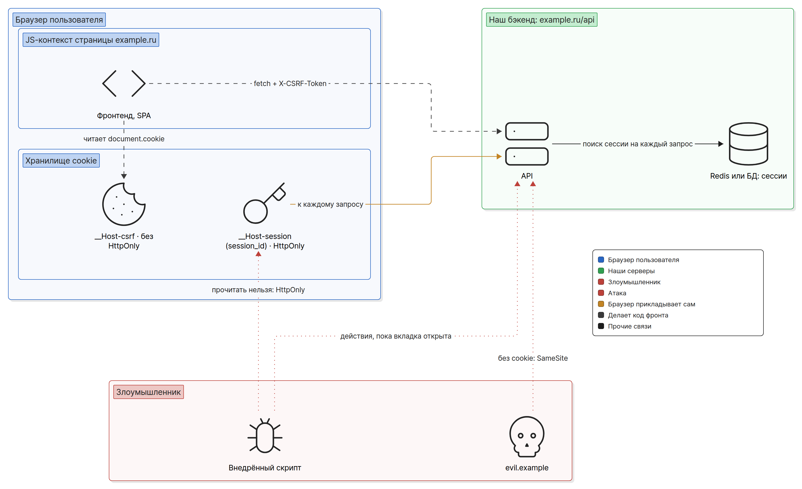
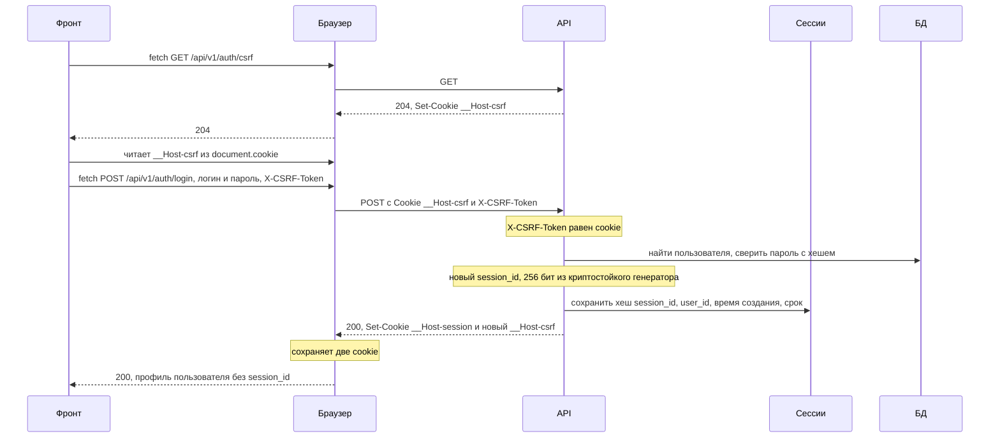
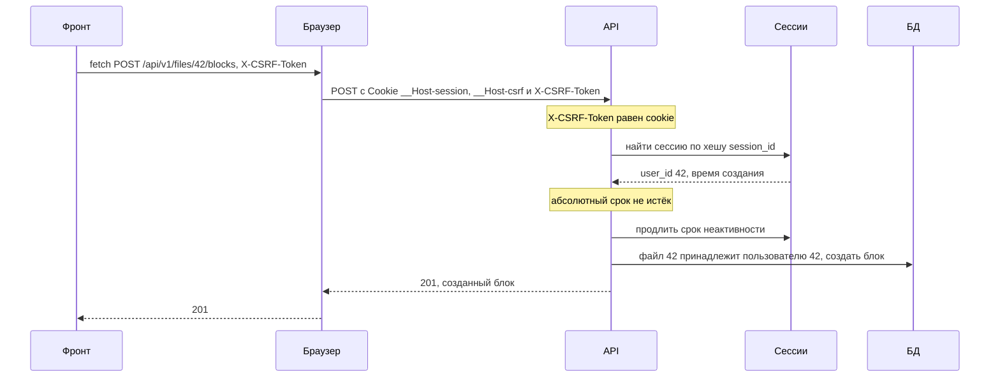
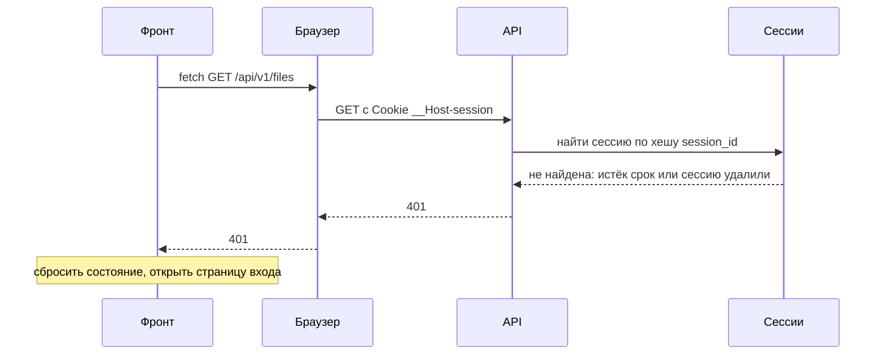
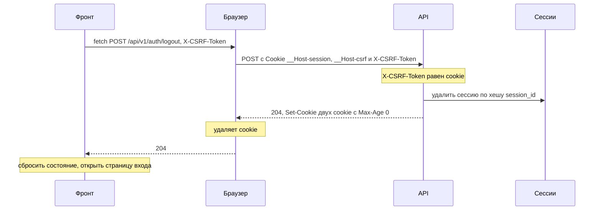

# Вариант C: `session_id` в HttpOnly-cookie, сессии в Redis или БД + CSRF

Допустимый вариант РК1 — классическая серверная сессия. При входе сервер создаёт запись о сессии
в хранилище (Redis или таблица в БД) и отдаёт браузеру только её случайный идентификатор
`session_id` в `HttpOnly`-cookie. На каждом запросе сервер ищет сессию по этому идентификатору и
так узнаёт пользователя. Токенов, JWT и refresh нет. Плюс — сессию можно завершить сразу: удалил
запись, и следующий запрос уже получит `401`. Цена — обращение к хранилищу на каждый запрос и,
как в варианте A, обязательная CSRF-защита.

Понятия (флаги cookie, site и origin, stateless и stateful) разобраны в
[basics.md](basics.md); здесь они только применяются. Структура файла та же, что у
[variant-a.md](variant-a.md), — удобно сравнивать раздел с разделом.

## Схема

Фронт и API отдаются с одного origin `https://example.ru`: статика — с `/`, API — с `/api/`
через reverse proxy ([cors.md](cors.md#когда-cors-не-нужен)). При входе сервер создаёт сессию в
хранилище и ставит две cookie: `__Host-session` с `session_id` и CSRF-токен `__Host-csrf` без
`HttpOnly`, который фронт читает и повторяет в заголовке `X-CSRF-Token` каждого изменяющего
запроса. `session_id` — случайная строка без смысла: всё, что о ней известно (чья сессия, когда
создана), лежит на сервере. Сервер проверяет сессию в хранилище на каждом запросе, поэтому
выход, «выйти со всех устройств» и блокировка срабатывают сразу. Внедрённый скрипт (XSS) не
может прочитать `session_id`, но может слать запросы из открытой вкладки. Чужой сайт не получает
ни cookie, ни CSRF-токена и ничего не может сделать от имени пользователя.



## Cookie

| Имя | Что внутри | `HttpOnly` | `Secure` | `SameSite` | `Path` | Срок жизни |
|---|---|---|---|---|---|---|
| `__Host-session` | `session_id`: случайная строка, не меньше 128 бит | да | да | `Lax` | `/` (требует префикс) | абсолютный срок сессии, например `Max-Age=2592000` (30 дней); или без `Max-Age` — см. ниже |
| `__Host-csrf` | случайная строка, не меньше 128 бит | **нет** — фронт её читает | да | `Lax` | `/` (требует префикс) | как у `__Host-session` |

Те же cookie в заголовках ответа на вход:

```http
Set-Cookie: __Host-session={session_id}; HttpOnly; Secure; SameSite=Lax; Path=/; Max-Age=2592000
Set-Cookie: __Host-csrf={csrf}; Secure; SameSite=Lax; Path=/; Max-Age=2592000
```

Почему так:

- **Префикс `__Host-` у сессии.** Он требует `Secure`, `Path=/` и запрещает `Domain`, зато
  поддомен (`avatars.example.ru`) не может поставить или перезаписать эту cookie для
  `example.ru` ([basics.md](basics.md#префиксы-__host--и-__secure-)). Для cookie сессии это
  важно: подложенный с поддомена чужой `session_id` — это вход жертвы в чужую сессию. OWASP
  прямо рекомендует `__Host-` для идентификатора сессии.
- **`Path=/`, а не узкий.** Минимум требует узкий `Path`, «где применимо»; с `__Host-` он
  неприменим — префикс требует `Path=/`. Можно сделать наоборот: `session_id` с `Path=/api` и
  префиксом `__Secure-` (как access в варианте A). Тогда HTML и статика идут без cookie, но
  поддомен сможет подложить свою cookie с тем же именем. `Path` только экономит трафик и не
  граница безопасности, поэтому в примерах РК1 выбран `__Host-`. Выберите одно и объясните на
  защите почему.
- **Имя без названия фреймворка.** `__Host-session`, а не `PHPSESSID` или `JSESSIONID`: имя по
  умолчанию подсказывает, на чём написан сервер (совет OWASP).
- **Без `Domain` у обеих.** Cookie остаётся у хоста `example.ru` и не уходит поддоменам; с
  `__Host-` `Domain` и не поставить.
- **`Secure` и `localhost`** — как в варианте A
  ([variant-a.md](variant-a.md#cookie)): по MDN `localhost` считается безопасным, флаг обычно
  не мешает локальной разработке.
- **`SameSite=Lax` или `Strict`.** Минимум допускает оба; `Strict` — опция «по желанию».

### `Max-Age` или cookie до закрытия браузера

Срок жизни сессии задаёт **сервер**: минимум требует, чтобы у сессии был срок жизни (п. 7), и
этот срок проверяется по записи в хранилище, а не по cookie. Cookie — только способ доставить
`session_id`. Для неё два варианта:

- **С `Max-Age`** (как в таблице) — cookie переживает перезапуск браузера, пользователь остаётся
  в системе, пока жива сессия на сервере. Ставьте `Max-Age` равным абсолютному сроку сессии:
  дольше хранить бессмысленно, сервер такую сессию всё равно не примет.
- **Без `Max-Age` и `Expires`** — сессионная cookie: браузер удалит её при закрытии (но с
  восстановлением вкладок может и сохранить, [basics.md](basics.md#флаги-cookie)). OWASP
  советует такие cookie, если входить заново после закрытия браузера нормально для приложения.
  Запись на сервере при этом остаётся до своего срока: закрытие браузера сервер не видит.

Какой бы вариант ни выбрали, сессию завершает сервер: по сроку, по выходу или по «выйти со всех
устройств». Удалённая из браузера cookie ничего не завершает — её копия, если её украли,
работает, пока жива запись.

### Если API на отдельном origin

Если фронт на `https://example.ru`, а API на `https://api.example.ru`, меняется то же, что в
варианте A ([variant-a.md](variant-a.md#если-api-на-отдельном-origin)):

- **Нужен CORS с credentials:** точный origin фронта в белом списке, `credentials: 'include'` в
  каждом запросе, `X-CSRF-Token` в `Access-Control-Allow-Headers`
  ([cors.md](cors.md#credentials-точный-origin-и-credentials-include)). `SameSite` cookie не
  помешает: `example.ru` и `api.example.ru` — один site.
- **Фронт не прочитает `__Host-csrf` из `document.cookie`:** cookie принадлежит хосту
  `api.example.ru`. Сервер отдаёт CSRF-токен ещё и в теле `GET /api/v1/auth/csrf`, фронт держит
  его в памяти.

`__Host-session` при этом остаётся у хоста `api.example.ru` — `Path=/` относится к путям API.
Дальше в файле — вариант с одним origin.

## Потоки

Во всех диаграммах `Фронт` — код SPA, `Браузер` — сетевой слой и хранилище cookie, `Сессии` —
Redis или таблица сессий в БД. `session_id` ходит только между браузером и API, код фронта его
не видит.

### Вход

Регистрация устроена так же: если после неё пользователь сразу входит, `POST
/api/v1/auth/register` создаёт сессию и ставит те же две cookie.



Детали:

- **CSRF-cookie нужна ещё до входа**: `POST /api/v1/auth/login` — изменяющий запрос, и Double
  Submit проверяет его так же, как остальные. Сервер может ставить её отдельной ручкой, как
  здесь, или на любой ответ, если cookie у браузера ещё нет.
- **Новый CSRF-токен после входа.** Токен, полученный до входа, не переживает смену
  пользователя. В требованиях это опция «по желанию» («Новый CSRF-токен при login, refresh,
  logout»); здесь делаем её всегда — это одна строка.
- **Новый `session_id` при каждом входе.** Сервер всегда создаёт сессию сам и никогда не
  принимает идентификатор, который пришёл от клиента до входа. Если у браузера уже была
  сессия, старую запись удаляют. Это защита от session fixation: злоумышленник не может заранее
  подсунуть жертве известный ему `session_id` и дождаться, пока она войдёт (подробнее — в
  следующих РК).
- **Проверка `Origin` / `Sec-Fetch-Site` на login и register** — второй слой (настойчиво
  рекомендуется). При одном origin требуйте `Sec-Fetch-Site: same-origin`: запрос со страницы
  поддомена приходит с `same-site` (если старый браузер заголовок не прислал — сверяйте
  `Origin`). При отдельном API свой фронт тоже `same-site`, поэтому
  сравнивайте `Origin` с белым списком.

### Обычный запрос



`GET` идёт так же, только без `X-CSRF-Token`: сервер его не проверяет, поэтому `GET` не должен
менять данные. Сессия ищется на **каждом** запросе, в том числе на `GET` — это главная цена
варианта C. В Redis чтение и продление срока делаются одной командой (`GETEX`, ниже).

### Истекла сессия



Детали:

- **Refresh в варианте C нет.** Продлевать нечего: `401` значит «сессии нет», фронт сразу
  показывает страницу входа. Повторять запрос не нужно.
- Сессия заканчивается по одному из двух сроков (OWASP Session Management Cheat Sheet):
  - **по неактивности (idle timeout)** — не было запросов дольше заданного времени. Каждый
    успешный запрос продлевает этот срок;
  - **абсолютный** — с момента входа прошло больше заданного времени, как бы активно ни
    работал пользователь. Без него сессия, которой пользуются каждый день, живёт вечно.
- Числа выбирает команда и объясняет на защите. OWASP называет для срока неактивности 15–30
  минут в приложениях с низким риском и 2–5 минут в ценных, а для абсолютного срока
  приложения, с которым работают весь день, — 4–8 часов. Сервисы с «запомнить меня» держат сессию дни и недели; в примерах ниже — 7 дней
  неактивности и 30 дней абсолютного срока, как у refresh в варианте A. Это осознанный
  компромисс удобства и риска, его надо уметь назвать.
- Если браузер уже удалил cookie по `Max-Age`, запрос придёт без `__Host-session` — для сервера
  это тот же случай: `401`.
- **Хранилище недоступно — не `401`.** Если Redis или БД не ответили, сервер не знает, есть ли
  сессия. Ответ `503` (или другой `5xx`), а не `401`: иначе сбой хранилища выкинет на страницу
  входа всех пользователей разом.

### Выход



Logout завершает сессию **на сервере**: запись удалена, и тот же `session_id` больше ничего не
откроет, даже если его скопировали. Только почистить cookie — нарушение минимума. В отличие от
вариантов A и B, «хвоста» нет: в A и B access-токен живёт до своего `exp`, а здесь следующий
запрос с удалённой сессией сразу получает `401`.

### Выйти со всех устройств

Пользователь вошёл с ноутбука, телефона и чужого компьютера и хочет завершить все сессии разом
(например, после подозрения на кражу пароля). В варианте C это удаление всех записей сессий
пользователя. В требованиях РК1 этой функции нет, но в C она почти бесплатна, а в A и B
означает удалить все refresh-записи и ждать истечения выданных access.

Чтобы найти все сессии пользователя, нужен индекс по `user_id`:

- **БД:** колонка `user_id` с индексом, затем `DELETE FROM sessions WHERE user_id = $1`.
- **Redis:** рядом с ключами сессий — множество `user_sessions:{user_id}` с хешами всех его
  сессий. При входе хеш добавляется (`SADD`), при выходе удаляется (`SREM`), при «выйти со всех
  устройств» сервер удаляет каждую сессию из множества и само множество.

Ручка — например, `POST /api/v1/auth/logout-all`, тоже изменяющая, с CSRF-проверкой. Текущую
сессию она удаляет вместе с остальными и стирает cookie, как обычный выход. Та же операция
пригодится при смене пароля: разумно завершить все сессии, кроме текущей, а текущей выдать новый
`session_id`. OWASP рекомендует давать пользователю возможность завершать свои сессии вручную;
полный вариант — страница «Активные сессии» со списком устройств.

## Что делает бэк, что делает фронт

### Бэк

Ручки:

| Ручка | Что делает |
|---|---|
| `GET /api/v1/auth/csrf` | ставит `__Host-csrf`, если её нет |
| `POST /api/v1/auth/register`, `POST /api/v1/auth/login` | проверяет данные, при успехе удаляет старую сессию браузера (если была), создаёт новую, ставит `__Host-session` и новый `__Host-csrf` |
| `POST /api/v1/auth/logout` | удаляет текущую сессию, стирает две cookie |
| `POST /api/v1/auth/logout-all` | удаляет все сессии пользователя, стирает две cookie |
| `GET /api/v1/users/me` | профиль текущего пользователя по сессии |

Порядок middleware: CORS (если API на другом origin) → CSRF на `POST`, `PUT`, `PATCH`, `DELETE`
→ поиск сессии на защищённых ручках → обработчик, который проверяет владельца ресурса
([access-control.md](access-control.md)).

- **`session_id`** — случайная строка из криптостойкого генератора (`crypto/rand`), не меньше
  128 бит; в примере 256. Не id пользователя, не счётчик, не время входа и не их хеш: такой
  идентификатор можно угадать.
- **В хранилище — хеш `session_id`, а не он сам** (хорошая практика, в требованиях РК1 её нет).
  Как с refresh в варианте A: SHA-256 достаточно, потому что строка случайная и длинная. Утечка
  дампа Redis или таблицы тогда не даёт рабочих сессий.
- **Запись сессии:** `user_id`, время создания (для абсолютного срока), время последнего
  запроса или TTL ключа (для срока неактивности). Больше ничего не нужно; профиль берите из БД.
- **Оба срока проверяет сервер** при каждом поиске сессии. Не нашли или срок истёк — `401`.
- **Сессии — в общем хранилище, а не в памяти процесса.** `map` в Go-процессе теряет всех
  пользователей при перезапуске и не работает, когда экземпляров API два: второй не знает
  сессий первого. Для варианта C ожидаются Redis или БД.
- **CSRF.** Отказ — `403`, не `401`. Refresh в C нет, но на `401` фронт открывает страницу входа:
  отказ CSRF-проверки с кодом `401` выкинет пользователя из системы вместо понятной ошибки.
- **Удаление cookie** — `Set-Cookie` с тем же именем, `Path=/`, `Secure` и `Max-Age=0`; без
  условий префикса браузер такой заголовок отбросит, и cookie останется
  ([variant-a.md](variant-a.md#бэк) — там же ловушка Go с `MaxAge: -1`).
- **Секреты** — пароль Redis и строка подключения к БД — в переменных окружения, не в
  репозитории. Ключа подписи JWT в варианте C нет; ключ HMAC для CSRF появится, только если
  выберете опцию с подписью токена.

Сессии в Redis — ключ на сессию с TTL и множество для «выйти со всех устройств». Срок в
примере — 7 дней неактивности (`604800` секунд), абсолютный срок проверяется по `created_at`:

```text
# вход
SET session:{хеш} '{"user_id":42,"created_at":1767225600}' EX 604800
SADD user_sessions:42 {хеш}

# каждый запрос: прочитать и продлить срок неактивности одной командой
GETEX session:{хеш} EX 604800

# выход
DEL session:{хеш}
SREM user_sessions:42 {хеш}

# выйти со всех устройств
SMEMBERS user_sessions:42
DEL session:{хеш 1} session:{хеш 2} ...
DEL user_sessions:42
```

В множестве могут остаться хеши сессий, которые уже истекли по TTL: `DEL` по ним просто ничего
не удалит. Если Redis работает без сохранения на диск, его перезапуск завершит все сессии —
пользователи войдут заново; для учебного проекта это приемлемо, но знать об этом надо.

Сессии в БД — таблица с индексом по `user_id`:

```sql
CREATE TABLE sessions (
    id_hash      text        PRIMARY KEY,
    user_id      bigint      NOT NULL REFERENCES users (id) ON DELETE CASCADE,
    created_at   timestamptz NOT NULL DEFAULT now(),
    last_seen_at timestamptz NOT NULL DEFAULT now()
);
CREATE INDEX sessions_user_id_idx ON sessions (user_id);
```

Поиск — `SELECT user_id FROM sessions WHERE id_hash = $1` с условиями на оба срока
(`last_seen_at` и `created_at`), затем обновление `last_seen_at`. TTL, как в Redis, у строк нет:
истёкшие строки удаляет периодическая задача, а до тех пор их отсекает условие в `SELECT`.

Пример на Go (`net/http`). Хранилище спрятано за интерфейсом: под ним Redis или таблица.

```go
const (
	sessionIdle     = 7 * 24 * time.Hour  // срок неактивности
	sessionAbsolute = 30 * 24 * time.Hour // абсолютный срок
)

type Session struct {
	UserID    int64
	CreatedAt time.Time
}

type SessionStore interface {
	Create(ctx context.Context, key string, s Session, idle time.Duration) error
	Get(ctx context.Context, key string, idle time.Duration) (Session, bool, error) // и продлевает idle
	Delete(ctx context.Context, key string) error
	DeleteAllForUser(ctx context.Context, userID int64) error
}

func sessionKey(id string) string {
	sum := sha256.Sum256([]byte(id))
	return hex.EncodeToString(sum[:])
}

func startSession(w http.ResponseWriter, r *http.Request, store SessionStore, userID int64) error {
	if old, err := r.Cookie("__Host-session"); err == nil {
		store.Delete(r.Context(), sessionKey(old.Value)) // старая сессия браузера больше не нужна
	}
	id := newToken() // 256 бит из crypto/rand, как в варианте A
	s := Session{UserID: userID, CreatedAt: time.Now()}
	if err := store.Create(r.Context(), sessionKey(id), s, sessionIdle); err != nil {
		return err
	}
	maxAge := int(sessionAbsolute.Seconds())
	http.SetCookie(w, &http.Cookie{
		Name: "__Host-session", Value: id, Path: "/", MaxAge: maxAge,
		HttpOnly: true, Secure: true, SameSite: http.SameSiteLaxMode,
	})
	http.SetCookie(w, &http.Cookie{
		Name: "__Host-csrf", Value: newToken(), Path: "/", MaxAge: maxAge,
		Secure: true, SameSite: http.SameSiteLaxMode, // без HttpOnly: фронт читает
	})
	return nil
}

func authMiddleware(store SessionStore, next http.Handler) http.Handler {
	return http.HandlerFunc(func(w http.ResponseWriter, r *http.Request) {
		c, err := r.Cookie("__Host-session")
		if err != nil {
			http.Error(w, "unauthorized", http.StatusUnauthorized)
			return
		}
		key := sessionKey(c.Value)
		s, ok, err := store.Get(r.Context(), key, sessionIdle)
		if err != nil {
			http.Error(w, "session store unavailable", http.StatusServiceUnavailable) // не 401
			return
		}
		if !ok || time.Since(s.CreatedAt) > sessionAbsolute {
			store.Delete(r.Context(), key)
			http.Error(w, "unauthorized", http.StatusUnauthorized)
			return
		}
		ctx := context.WithValue(r.Context(), userIDKey, s.UserID)
		next.ServeHTTP(w, r.WithContext(ctx))
	})
}
```

`newToken` и `csrfMiddleware` — те же, что в варианте A ([variant-a.md](variant-a.md#бэк)).

### Фронт

- **`session_id` не касается.** Код фронта его не видит, в `localStorage`, `sessionStorage` и
  стор ничего не кладёт.
- **Одна обёртка над `fetch`** для всех запросов к API: `credentials: 'include'` (при одном
  origin cookie уходят и без него, но с ним обёртка работает и при отдельном API), заголовок
  `X-CSRF-Token` на изменяющих методах.
- **`401` — страница входа.** Ни refresh, ни повтора запроса: это проще, чем в A и B.
- **`403` — не повод выходить.** Это отказ CSRF-проверки или доступа: показать ошибку.
- **Состояние «вошёл»** — из ответа `GET /api/v1/users/me` при старте приложения. После F5
  cookie остались в браузере, и запрос просто проходит; CSRF-токен фронт заново читает из
  `document.cookie`.

```js
function csrfToken() {
  const row = document.cookie.split('; ').find((c) => c.startsWith('__Host-csrf='));
  return row ? row.slice('__Host-csrf='.length) : '';
}

export async function api(path, options = {}) {
  const method = (options.method ?? 'GET').toUpperCase();
  const headers = { ...options.headers };
  if (!['GET', 'HEAD'].includes(method)) headers['X-CSRF-Token'] = csrfToken();
  const res = await fetch(path, { ...options, headers, credentials: 'include' });
  if (res.status === 401 && !path.startsWith('/api/v1/auth/')) {
    onSessionLost(); // своя функция: сбросить состояние, открыть страницу входа
  }
  return res;
}

export async function login(username, password) {
  if (!csrfToken()) await fetch('/api/v1/auth/csrf', { credentials: 'include' });
  return api('/api/v1/auth/login', {
    method: 'POST',
    headers: { 'Content-Type': 'application/json' },
    body: JSON.stringify({ login: username, password }),
  });
}

export async function logout() {
  await api('/api/v1/auth/logout', {
    method: 'POST',
    headers: { 'Content-Type': 'application/json' },
  });
  onSessionLost();
}
```

`Content-Type: application/json` стоит и у `logout` без тела: если сервер принимает на
изменяющих ручках только JSON (настойчиво рекомендуется), запрос без этого заголовка он
отклонит. `401` на `/api/v1/auth/...` обёртка не трактует как конец сессии: `401` на входе —
неверный логин или пароль.

## Что может XSS и что может CSRF

| Атака | Что может | Что не может | Чем закрыто |
|---|---|---|---|
| XSS на `example.ru` | слать запросы к API из открытой вкладки: браузер приложит cookie, а CSRF-токен скрипт прочитает из `document.cookie` так же, как наш фронт | прочитать `session_id`; пользоваться сессией после закрытия вкладки | `HttpOnly` ограничивает ущерб; сама защита от XSS — тема следующих РК |
| CSRF с `evil.example` | отправить форму или `fetch` на наш API | приложить cookie: с `SameSite=Lax` браузер не отправит их на межсайтовый `POST` и `fetch`; прочитать или поставить `__Host-csrf` для `example.ru` | `SameSite`, Double Submit (`403` без верного `X-CSRF-Token`) |
| Скрипт на поддомене `avatars.example.ru` | запрос к `example.ru` — same-site, `SameSite` cookie пропустит | прочитать `__Host-csrf`; подложить свою cookie сессии или CSRF-cookie для `example.ru`: имена с `__Host-` поддомен для чужого хоста не поставит | Double Submit и префикс `__Host-` у обеих cookie; подпись CSRF-токена — по желанию |
| Login CSRF с `evil.example` | отправить форму входа с логином и паролем злоумышленника, чтобы жертва работала в его аккаунте и сохраняла туда свои данные | пройти Double Submit: CSRF-токена у чужого сайта нет | Double Submit на `POST /api/v1/auth/login`; проверка `Origin` / `Sec-Fetch-Site` на login и register |
| Украденный `session_id` (из логов, с чужого компьютера) | ходить в API, пока сессия жива | — | `HttpOnly` (скрипт не унесёт); оба срока сессии; logout и «выйти со всех устройств» обрывают сессию сразу |

Главное то же, что в варианте A: CSRF-защита не спасает от XSS на нашем origin, а `HttpOnly` не
останавливает действия, а не даёт унести `session_id`
([basics.md](basics.md#где-можно-хранить-токен)). Отличие от A — в последней строке: если
идентификатор всё же утёк, сессию можно оборвать мгновенно, без ожидания `exp`. Поэтому
`session_id` не пишут в логи (OWASP советует логировать вместо него хеш с солью) и не передают
в URL.

### CSRF-защита в варианте C

Подробный разбор — в [csrf.md](csrf.md). Требования те же, что в варианте A.

**Минимум** — Double Submit Cookie:

- токен генерирует сервер криптостойким генератором, не меньше 128 бит;
- CSRF-cookie без `HttpOnly`; фронт отправляет её значение в заголовке `X-CSRF-Token`;
- проверка на POST, PUT, PATCH, DELETE; отказ — 403 (не 401: на 401 фронт делает refresh и повторяет запрос);
- GET не меняет данные;
- авторизационные cookie с `SameSite=Lax` или `Strict`.

В варианте C refresh нет, но довод про `403` остаётся: на `401` фронт открывает страницу входа.

**Настойчиво рекомендуется** (ожидается для хорошей оценки):

- Префикс `__Host-` у CSRF-cookie (`Secure`, `Path=/`, без `Domain`)
- Проверка `Origin` / `Sec-Fetch-Site` на login, register, refresh (в C — на login и register)
- Только `Content-Type: application/json` на изменяющих ручках
- Сравнение за постоянное время (`hmac.Equal`, `subtle.ConstantTimeCompare`)

**По желанию:**

- Подпись токена HMAC с привязкой к пользователю или сессии (в C удобно подписывать
  `session_id`)
- Проверка `Origin` / `Sec-Fetch-Site` на всех изменяющих запросах
- Новый CSRF-токен при login, refresh, logout (в варианте C — при входе всегда)
- `SameSite=Strict` у авторизационных cookie
- Нет пользовательского HTML/SVG на поддоменах (`Content-Type` загрузок, CSP)

Примеры кода выше уже закрывают минимум и часть рекомендуемого: `__Host-` и сравнение за
постоянное время (`csrfMiddleware` из варианта A). Проверку `Origin` и `Content-Type` добавьте
сами.

## Плюсы и минусы

Плюсы:

- **Мгновенный отзыв.** Logout, «выйти со всех устройств», смена пароля, блокировка
  пользователя — следующий запрос уже получает `401`. В A и B access живёт до `exp`.
- **Проще, чем A и B.** Нет JWT, ключа подписи, refresh, ротации, повтора запроса после `401`.
  Фронту не нужно ничего, кроме CSRF-заголовка.
- **`session_id` ничего не рассказывает.** В нём нет данных пользователя, которые можно
  прочитать, как нагрузку JWT.
- **Сервер знает все активные сессии**: их можно показать пользователю и завершать по одной.
- **Токены недоступны JS** — как в A: XSS действует только через открытую вкладку.

Минусы:

- **Обращение к хранилищу на каждый запрос.** Это сетевой запрос к Redis или БД перед каждым
  обработчиком; в A access проверяется по подписи без хранилища.
- **Хранилище — точка отказа.** Лежит Redis или БД — сервер не может проверить ни одну сессию.
- **Горизонтальное масштабирование** требует общего хранилища: все экземпляры API ходят в один
  Redis или одну БД, сессии в памяти процесса не подходят.
- **CSRF-защита обязательна** — как в A: на каждой изменяющей ручке, и её легко сломать: забыть
  ручку, ответить `401` вместо `403`, менять данные на `GET`.
- **Привязка к cookie браузера.** С отдельным origin API нужны CORS с credentials и CSRF-токен в
  теле ответа; клиентам без браузера cookie неудобны.

Сравнение с вариантами A и B — в [README.md](README.md#варианты-сессии).

## Источники

- MDN: [Set-Cookie](https://developer.mozilla.org/en-US/docs/Web/HTTP/Reference/Headers/Set-Cookie) —
  `HttpOnly`, `Secure` и `localhost`, `SameSite`, `Path`, сессионные cookie без `Max-Age` и
  `Expires`, `Max-Age=0` удаляет cookie, префикс `__Host-`;
  [Using HTTP cookies](https://developer.mozilla.org/en-US/docs/Web/HTTP/Guides/Cookies)
- MDN: [Document: cookie](https://developer.mozilla.org/en-US/docs/Web/API/Document/cookie) —
  что видит JS, недоступность `HttpOnly`-cookie
- MDN: [Origin](https://developer.mozilla.org/en-US/docs/Web/HTTP/Reference/Headers/Origin),
  [Sec-Fetch-Site](https://developer.mozilla.org/en-US/docs/Web/HTTP/Reference/Headers/Sec-Fetch-Site),
  [RequestInit: credentials](https://developer.mozilla.org/en-US/docs/Web/API/RequestInit#credentials),
  [401 Unauthorized](https://developer.mozilla.org/en-US/docs/Web/HTTP/Reference/Status/401),
  [403 Forbidden](https://developer.mozilla.org/en-US/docs/Web/HTTP/Reference/Status/403)
- [RFC 6265bis (draft-ietf-httpbis-rfc6265bis)](https://datatracker.ietf.org/doc/draft-ietf-httpbis-rfc6265bis/) —
  host-only cookie без `Domain`, сопоставление по `Path`, `SameSite`, проверка префиксов при
  каждой установке, сессионные cookie без срока
- [Fetch Standard: CORS protocol](https://fetch.spec.whatwg.org/#http-cors-protocol) —
  credentials при API на отдельном origin
- OWASP: [Session Management Cheat Sheet](https://cheatsheetseries.owasp.org/cheatsheets/Session_Management_Cheat_Sheet.html) —
  криптостойкий идентификатор сессии, хранение на сервере и хеш вместо идентификатора, новый
  идентификатор после входа, сроки неактивности и абсолютный, завершение сессии на сервере,
  `__Host-` для идентификатора сессии, имя cookie без названия фреймворка, завершение сессий
  пользователем, хеш вместо идентификатора в логах
- OWASP: [Cross-Site Request Forgery Prevention Cheat Sheet](https://cheatsheetseries.owasp.org/cheatsheets/Cross-Site_Request_Forgery_Prevention_Cheat_Sheet.html) —
  Double Submit Cookie, токен в своём заголовке, login CSRF, Fetch Metadata
- Redis: [SET](https://redis.io/docs/latest/commands/set/),
  [GETEX](https://redis.io/docs/latest/commands/getex/),
  [SADD](https://redis.io/docs/latest/commands/sadd/) — ключ с TTL, чтение с продлением срока
  (`GETEX`, Redis 6.2 и новее), множество сессий пользователя
