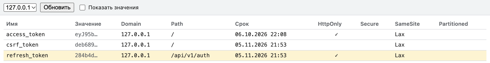

# Расширение «Все cookie»

Вкладка в DevTools, которая показывает все cookie домена и его поддоменов с любым `Path`,
включая `HttpOnly`. Работает в Chrome и браузерах на Chromium (Edge, Яндекс Браузер, Brave).

## Зачем

Application → Cookies в Chrome показывает cookie только для адресов, которые страница уже
загрузила. Refresh-cookie с `Path=/api/v1/auth` не видна, пока страница не сделала запрос на этот
путь, и это легко принять за «cookie пропала» (см. [Частые ошибки](../rk1/pitfalls.md)). Если API
стоит на `api.example.ru`, а фронт на `example.ru`, расширение покажет cookie `example.ru` и
`api.example.ru` в одной таблице.

Расширение показывает всё сразу: cookie `example.ru` и всех его поддоменов, с флагами `HttpOnly`,
`Secure`, `SameSite`, `Path`, сроком жизни. Значения по умолчанию скрыты: полное видно после клика
по ячейке, чтобы токен не оказался на общем экране на защите.

## Скачать

[Скачать cookie-viewer.zip](/cookie-viewer.zip)

Архив собирается из `main` вместе с сайтом, поэтому версия всегда актуальна.

Все версии и описание изменений — в [GitHub Releases](https://github.com/TP-Prepare/technopark-guidelines/releases?q=cookie-viewer&expanded=true).

## Установка

1. Распакуйте `cookie-viewer.zip` в любую постоянную папку: Chrome читает расширение оттуда при
   каждом запуске, поэтому после установки папку не удаляйте.
2. Откройте `chrome://extensions` и включите «Режим разработчика».
3. Нажмите «Загрузить распакованное расширение» и выберите распакованную папку.
4. Откройте DevTools на нужном сайте: появится вкладка «Все cookie».

При установке расширение не получает доступ ни к одному сайту: его запрашивают отдельно, по кнопке.

## Как пользоваться

1. Значок расширения на панели Chrome ничего не открывает: интерфейс только во вкладке DevTools
   «Все cookie». Если её не видно, откройте меню `»` справа от вкладок.
2. Откройте свой сайт (прод или `localhost`) и DevTools (F12), вкладка «Все cookie».
3. Нажмите «Разрешить»: браузер спросит доступ к cookie выбранного домена, например `*.example.ru`.
   Разрешение выдаётся на домен, а не на все сайты. Отказ ничего не ломает: вкладка покажет
   то же сообщение, и запрос можно повторить. В запросе Chrome пишет общими словами «читать и
   изменять ваши данные на сайтах …»: так выглядит любой доступ к сайту. Расширение читает и удаляет
   cookie, но ничего не записывает: в его коде нет `cookies.set`.
4. Выберите домен в списке. По умолчанию это домен второго уровня (`example.ru`); для `localhost`
   и IP-адреса — сам хост. Cookie поддоменов (`api.example.ru`) попадают в тот же список.
5. Значение показывается по клику на ячейку, все сразу — переключателем «Показать значения».
   Строки с `Path` не `/` выделены: именно их обычно «не видно» в Application.
6. Крестик в строке удаляет cookie, «Удалить все» — все cookie выбранного домена и поддоменов.
   Подтверждения нет, как во вкладке Application.

Список обновляется сам после каждого запроса страницы и при изменении cookie, например после
«Войти». Кнопка «Обновить» перечитывает его вручную.

Чтобы отозвать доступ, откройте `chrome://extensions` → «Сведения» → «Доступ к сайтам» или
удалите расширение.

### Почему удалилось больше одной cookie

Chrome удаляет cookie не по строке таблицы, а по адресу и имени: пропадают все cookie с этим
именем, которые браузер отправил бы на адрес выбранной (её домен и `Path`). Пусть у `example.ru`
две cookie `refresh_token`: одна с `Path=/api/v1/auth`, другая с `Path=/`. Крестик у первой удалит
обе, потому что запрос на `/api/v1/auth` получает и cookie с `Path=/`. Крестик у второй удалит
только её: на `/` cookie с `Path=/api/v1/auth` не уходит. Так же вместе с cookie хоста
`api.example.ru` удалится одноимённая cookie родительского домена `.example.ru`, если её `Path`
подходит, даже когда в списке выбран `api.example.ru` и этой cookie нет в таблице. Так ведёт себя
Chrome 156: справочник `chrome.cookies` пишет только «удаляет cookie по имени», поведение проверено
вызовами API.

Расширение сравнивает до и после все cookie, которые Chrome мог удалить, и пишет над таблицей, что
он удалил вместе с выбранной. «Удалить все» так же называет удалённые заодно cookie вне выбранного
домена. Если cookie осталась, расширение тоже об этом скажет.

## Что расширение не делает

- Не создаёт и не меняет cookie: только читает и удаляет.
- Ничего не отправляет по сети и не хранит значения cookie.
- Не работает на страницах не по `http` и `https`, например `chrome://`.
- Не подсказывает, что с cookie не так: по имени не понять, токен это или нет.

## Firefox и Safari

В Firefox расширение не нужно: Storage Inspector показывает все cookie хоста независимо от `Path`.
Web Inspector в Safari ведёт себя как Chrome и показывает только cookie, подходящие к уже
загруженным адресам.

## Источники

- [Chrome for Developers: `chrome.cookies`](https://developer.chrome.com/docs/extensions/reference/api/cookies)
- [Chrome for Developers: `chrome.permissions`](https://developer.chrome.com/docs/extensions/reference/api/permissions)
- [Chrome for Developers: расширения DevTools](https://developer.chrome.com/docs/extensions/how-to/devtools/extend-devtools)
- [MDN: `Set-Cookie`, атрибут `Path`](https://developer.mozilla.org/en-US/docs/Web/HTTP/Reference/Headers/Set-Cookie#pathpath-value)
